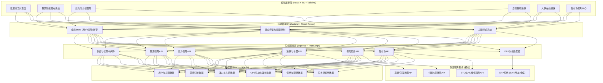
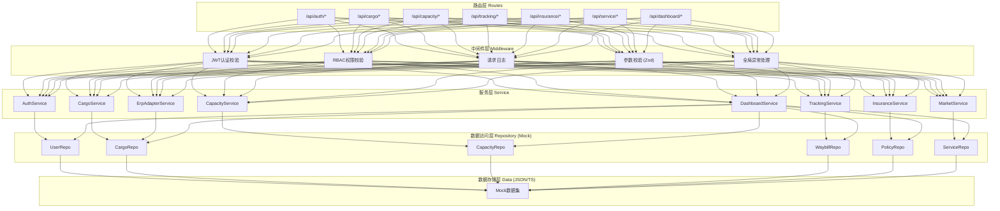
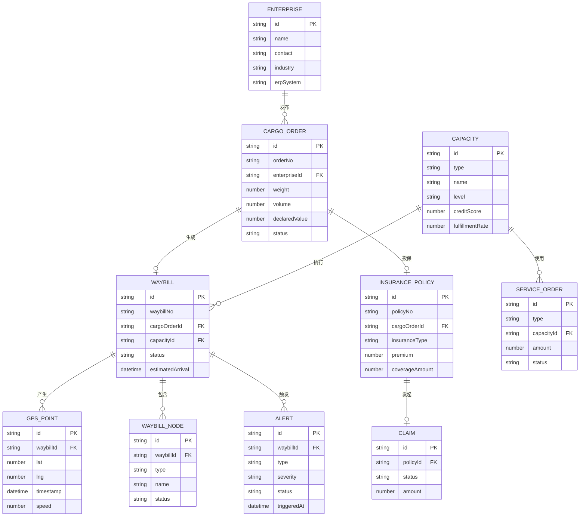

## 1. 架构设计



## 2. 技术说明

- **前端**：React@18 + TypeScript + TailwindCSS@3 + Vite@5
- **路由**：React Router Dom@6 (集中式路由配置)
- **状态管理**：Zustand@4 (轻量级全局状态)
- **UI组件库**：自定义组件 + Lucide React图标 (不使用UI库，保持定制化)
- **图表可视化**：Recharts (KPI趋势、柱状图、饼图)
- **地图组件**：Leaflet + OpenStreetMap (离线可用，无需API Key)
- **后端**：Express@4 + TypeScript (ESM模块化)
- **数据库**：Mock数据 (TypeScript硬编码，便于前端独立演示)
- **初始化工具**：vite-init (react-express-ts模板)

## 3. 路由定义

| 路由路径 | 页面名称 | 说明 |
|----------|----------|------|
| /dashboard | 数据总览仪表盘 | 登录后首页，KPI+地图+告警 |
| /cargo | 货源管理列表 | 所有货源订单，筛选/搜索/批量操作 |
| /cargo/publish | 货源发布 | 手动发布/批量导入表单 |
| /cargo/erp-config | ERP对接配置 | ERP系统API配置向导 |
| /cargo/:id | 货源详情 | 单个订单完整信息与操作 |
| /capacity | 运力池管理 | 分级运力列表与筛选 |
| /capacity/:id | 运力档案 | 司机/车队详情页 |
| /capacity/return | 返程车源 | 空车资源匹配 |
| /tracking | 货物追踪总览 | 所有在途运单地图视图 |
| /tracking/:waybillId | 运单追踪详情 | 单运单轨迹+电子运单+告警 |
| /tracking/alerts | 异常告警中心 | 告警列表与处理 |
| /insurance | 保险服务首页 | 投保入口+保单统计 |
| /insurance/apply | 在线投保 | 保费计算与投保流程 |
| /insurance/policies | 保单管理 | 电子保单列表与下载 |
| /insurance/claims | 理赔中心 | 理赔申请与进度 |
| /service | 后市场服务中心 | ETC/油卡/维保入口 |
| /service/etc | ETC充值管理 | 卡绑定+充值+账单 |
| /service/fuel | 油卡折扣服务 | 油卡品牌+套餐+明细 |
| /service/maintenance | 维保服务 | 预约+工单+评价 |
| /login | 登录页 | 企业/司机/管理员登录 |
| * | 404页 | 未匹配路由 |

## 4. API 定义 (TypeScript类型)

```typescript
// 通用分页响应
interface PagedResponse<T> {
  list: T[]
  total: number
  page: number
  pageSize: number
}

// 货源订单
interface CargoOrder {
  id: string
  orderNo: string
  erpOrderNo?: string
  enterpriseId: string
  enterpriseName: string
  cargoName: string
  cargoType: string
  weight: number
  volume: number
  quantity: number
  declaredValue: number
  temperatureRequired?: { min: number; max: number; unit: string }
  origin: { province: string; city: string; address: string; contact: string; phone: string }
  destination: { province: string; city: string; address: string; contact: string; phone: string }
  pickupTime: string
  deliveryTime: string
  status: 'draft' | 'published' | 'bidding' | 'assigned' | 'in_transit' | 'delivered' | 'completed' | 'cancelled'
  specialRequirements?: string[]
  attachments?: { name: string; url: string }[]
  createdAt: string
  updatedAt: string
}

// 运力 (司机/车队)
interface Capacity {
  id: string
  type: 'driver' | 'fleet'
  name: string
  level: 'gold' | 'silver' | 'normal'
  creditScore: number
  fulfillmentRate: number
  totalOrders: number
  licensePlate?: string
  vehicleType?: string
  vehicleLength?: number
  maxWeight?: number
  maxVolume?: number
  contactPerson: string
  contactPhone: string
  certifications: { type: string; status: 'valid' | 'expired' | 'pending'; expiryDate?: string }[]
  isReturnSource?: boolean
  returnRoute?: { from: string; to: string; availableDate: string }
  rating: number
}

// 运单追踪
interface Waybill {
  id: string
  waybillNo: string
  cargoOrderId: string
  capacityId: string
  driverName: string
  vehiclePlate: string
  status: 'loading' | 'in_transit' | 'unloading' | 'delivered' | 'exception'
  estimatedArrival: string
  actualArrival?: string
  gpsTrajectory: { lat: number; lng: number; timestamp: string; speed: number }[]
  currentLocation?: { lat: number; lng: number }
  nodes: {
    type: 'pickup' | 'transit' | 'stopover' | 'delivery'
    name: string
    location: { lat: number; lng: number }
    plannedTime: string
    actualTime?: string
    status: 'pending' | 'completed' | 'delayed'
    photos?: string[]
    signature?: string
  }[]
  alerts: Alert[]
  insurancePolicyId?: string
}

// 告警
interface Alert {
  id: string
  waybillId: string
  type: 'stay_timeout' | 'temperature' | 'route_deviation' | 'delay' | 'accident'
  severity: 'critical' | 'warning' | 'info'
  title: string
  description: string
  location?: { lat: number; lng: number; address: string }
  triggeredAt: string
  status: 'pending' | 'processing' | 'resolved'
  resolvedAt?: string
  handler?: string
  resolution?: string
}

// 保单
interface InsurancePolicy {
  id: string
  policyNo: string
  cargoOrderId: string
  waybillId: string
  insurer: string
  insuranceType: 'basic' | 'comprehensive' | 'all_risk'
  cargoName: string
  cargoValue: number
  weight: number
  premium: number
  coverageAmount: number
  startDate: string
  endDate: string
  status: 'pending' | 'active' | 'expired' | 'claimed'
  policyUrl: string
  claim?: {
    id: string
    status: 'submitted' | 'reviewing' | 'approved' | 'rejected' | 'paid'
    amount?: number
    submittedAt: string
    paidAt?: string
    documents: { name: string; url: string }[]
  }
}

// 后市场服务
interface ServiceOrder {
  id: string
  serviceType: 'etc' | 'fuel' | 'maintenance'
  capacityId: string
  amount: number
  discount: number
  actualAmount: number
  status: 'pending' | 'processing' | 'completed' | 'cancelled'
  detail: EtcDetail | FuelDetail | MaintenanceDetail
  createdAt: string
}
interface EtcDetail { cardNo: string; rechargeAmount: number }
interface FuelDetail { cardBrand: string; cardNo: string; packageId: string; liters?: number }
interface MaintenanceDetail { serviceType: string; workshop: string; appointmentTime: string; workOrderNo: string }

// KPI指标
interface DashboardKPI {
  totalInTransit: number
  activeAlerts: number
  monthlyFreightCost: number
  insuranceClaimRate: number
  capacityPoolSize: number
  onTimeDeliveryRate: number
  trends: { date: string; value: number }[]
}
```

## 5. 服务器架构图 (后端分层)



## 6. 数据模型 (核心实体关系)


