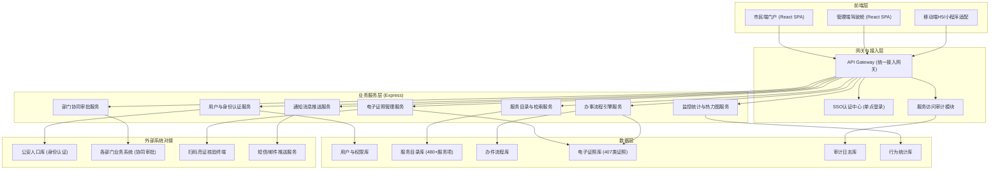
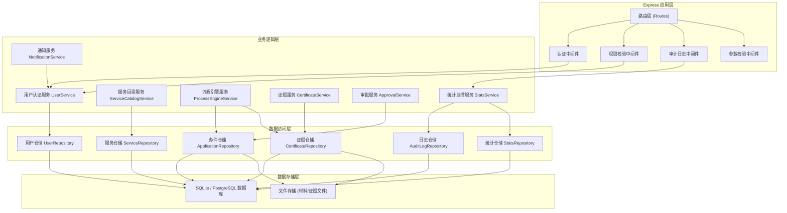
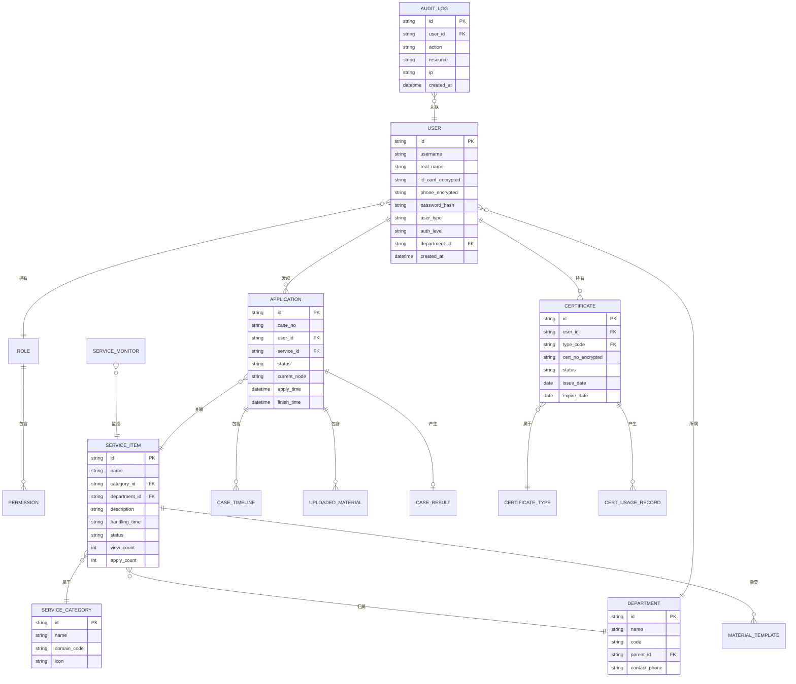

## 1. 架构设计



## 2. 技术说明

- **前端框架**: React@18 + TypeScript + react-router-dom@6
- **构建工具**: Vite@5
- **样式方案**: TailwindCSS@3 + 自定义政务主题
- **状态管理**: Zustand (轻量级全局状态管理)
- **UI组件库**: 基于TailwindCSS定制政务风格组件，图标使用 lucide-react
- **数据可视化**: 热力图、统计图表使用 recharts
- **后端框架**: Express@4 + TypeScript
- **后端模板引擎**: ESM + TypeScript
- **数据库**: SQLite (开发环境Mock数据)，生产环境可切换PostgreSQL
- **接口风格**: RESTful API
- **认证方案**: JWT Token + 单点登录对接

## 3. 路由定义

| 路由路径 | 页面/功能 |
|---------|----------|
| `/` | 市民端首页 |
| `/services` | 服务大厅（分类浏览、检索） |
| `/services/:id` | 服务详情页 |
| `/apply/:serviceId` | 在线申办流程页 |
| `/cases` | 我的办件列表 |
| `/cases/:id` | 办件详情与进度追踪 |
| `/certificates` | 电子证照中心 |
| `/certificates/:id` | 证照详情与亮证 |
| `/profile` | 个人中心 |
| `/login` | 登录页（多种认证方式） |
| `/admin` | 管理端驾驶舱（数据看板） |
| `/admin/dashboard` | 管理端数据概览 |
| `/admin/services` | 服务项管理 |
| `/admin/approvals` | 审批工作台 |
| `/admin/audit` | 访问审计日志 |
| `/admin/heatmap` | 使用行为热力图 |
| `/admin/monitor` | 服务可用性监控 |
| `/admin/users` | 用户与权限管理 |

## 4. API 定义

```typescript
// 用户相关
interface User {
  id: string;
  realName: string;
  idCardMasked: string;
  phoneMasked: string;
  avatar?: string;
  authLevel: 'L1' | 'L2' | 'L3';
  userType: 'citizen' | 'enterprise' | 'admin';
}

// 服务项
interface ServiceItem {
  id: string;
  name: string;
  category: 'livelihood' | 'government' | 'medical' | 'traffic' | 'education' | 'lifestyle';
  department: string;
  departmentId: string;
  description: string;
  handlingTime: string;
  fee?: string;
  materials: MaterialTemplate[];
  processSteps: ProcessStep[];
  onlineAvailable: boolean;
  appointmentAvailable: boolean;
  status: 'online' | 'offline' | 'maintenance';
  viewCount: number;
  applyCount: number;
  satisfactionRate: number;
}

// 办件
interface ApplicationCase {
  id: string;
  caseNo: string;
  serviceId: string;
  serviceName: string;
  applicantId: string;
  applicantName: string;
  status: 'draft' | 'submitted' | 'accepted' | 'processing' | 'pending_material' | 'approved' | 'rejected' | 'completed';
  currentNode: string;
  timeline: CaseTimelineNode[];
  materials: UploadedMaterial[];
  applyTime: string;
  estimatedFinishTime?: string;
  finishTime?: string;
  result?: CaseResult;
}

// 电子证照
interface Certificate {
  id: string;
  type: string;
  typeCode: string;
  certNo: string;
  holderName: string;
  issueDate: string;
  expireDate: string;
  issueAuthority: string;
  status: 'valid' | 'expiring' | 'expired' | 'revoked';
  fields: Record<string, string>;
  usageHistory: CertUsageRecord[];
}

// 办件时间轴节点
interface CaseTimelineNode {
  nodeId: string;
  nodeName: string;
  status: 'pending' | 'processing' | 'completed' | 'rejected';
  handler?: string;
  handlerDept?: string;
  handleTime?: string;
  remark?: string;
}

// 材料模板
interface MaterialTemplate {
  id: string;
  name: string;
  required: boolean;
  format: 'pdf' | 'image' | 'doc';
  description: string;
  sampleUrl?: string;
}
```

### API 端点列表
| 方法 | 路径 | 说明 |
|-----|------|------|
| POST | `/api/auth/login` | 用户登录（多种认证方式） |
| POST | `/api/auth/logout` | 用户登出 |
| GET | `/api/auth/userinfo` | 获取当前用户信息 |
| GET | `/api/services` | 服务列表（支持分类、搜索、筛选） |
| GET | `/api/services/:id` | 服务详情 |
| GET | `/api/services/hot` | 热门服务推荐 |
| POST | `/api/applications` | 创建申办 |
| GET | `/api/applications` | 我的办件列表 |
| GET | `/api/applications/:id` | 办件详情 |
| POST | `/api/applications/:id/materials` | 上传申办材料 |
| POST | `/api/applications/:id/evaluate` | 服务评价 |
| GET | `/api/certificates` | 我的电子证照列表 |
| GET | `/api/certificates/:id` | 证照详情 |
| POST | `/api/certificates/:id/qrcode` | 生成亮证二维码 |
| POST | `/api/certificates/verify` | 扫码核验证照 |
| GET | `/api/admin/stats/overview` | 管理端数据概览 |
| GET | `/api/admin/stats/heatmap` | 热力图数据 |
| GET | `/api/admin/audit/logs` | 访问审计日志 |
| GET | `/api/admin/monitor/services` | 服务可用性监控数据 |
| GET | `/api/admin/approvals/pending` | 待办审批列表 |
| POST | `/api/admin/approvals/:id/approve` | 审批通过 |
| POST | `/api/admin/approvals/:id/reject` | 审批驳回 |

## 5. 服务端架构图



## 6. 数据模型

### 6.1 ER 图


### 6.2 初始化数据要点
- **部门数据**：市公安局、市数据局、市卫健委、市交通局、市教育局、市人社局、市民政局、市住建局等核心部门
- **服务分类数据**：六大服务域（民生服务、办事服务、医疗健康、交通出行、教育在线、生活休闲），每个域下包含5-10个二级分类，共480+服务项
- **证照类型数据**：407类电子证照基础配置（身份证、驾驶证、营业执照、不动产权证等高频证照）
- **角色权限数据**：超级管理员、部门管理员、普通市民、企业用户等角色及对应权限
- **Mock办件数据**：模拟1000+历史办件数据用于统计分析
- **Mock用户行为数据**：生成热力图所需的区域+时段访问数据
