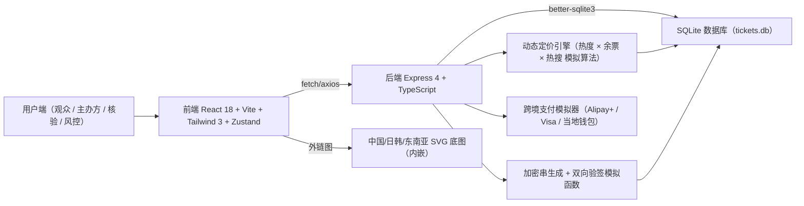
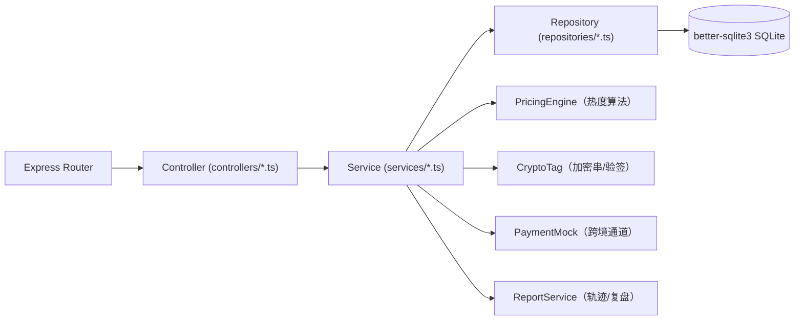
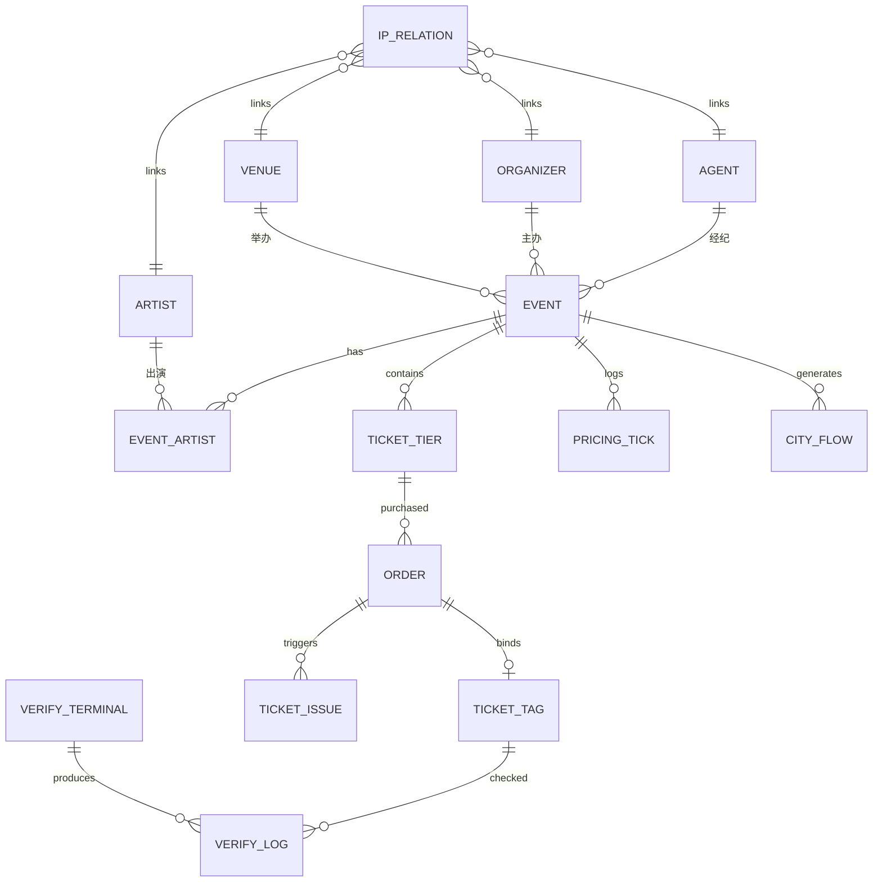

## 1. 架构设计



## 2. 技术描述
- **前端**：React 18 + TypeScript + Vite 6 + Tailwind CSS 3 + Zustand 4 + react-router-dom 6 + recharts 2（图表） + lucide-react（图标）
- **初始化工具**：`vite-init --template react-express-ts`
- **后端**：Express 4 + TypeScript + better-sqlite3（同步驱动，零依赖）+ cors
- **数据库**：SQLite（better-sqlite3），DDL 建表 + 种子数据
- **视觉**：纯 SVG 实现 IP 关系图谱与跨城轨迹弦图，避免引入 d3/echarts 重型库

## 3. 路由定义
| 路由 | 页面 | 用途 |
|-------|------|------|
| `/` | Dashboard | 首页：KPI + 动态定价热力 + 活跃演出 + 跨境 GMV |
| `/events` | EventList | 演出列表：区域/类型/日期/币种筛选 |
| `/events/:id` | EventDetail | 演出详情：多语介绍、票档、跨境支付 |
| `/tickets` | TicketCenter | 工单中心：假票/核验/赔付/支付异常 |
| `/schedule` | ScheduleBoard | 排期与验票：日历、终端、余票监控 |
| `/admin` | AdminConsole | 管理后台：动态定价 + IP 图谱 + 跨城轨迹 + 复盘 |
| `/profile` | ProfileCenter | 个人中心：数字票夹、订单、赔付 |

## 4. API 定义

```ts
// 共享类型
type Language = 'zh' | 'en' | 'ja' | 'ko';
type Currency = 'CNY' | 'HKD' | 'TWD' | 'JPY' | 'KRW' | 'USD' | 'SGD';
type Region = 'mainland' | 'HKMT' | 'JP_KR' | 'SEA';
type TicketStatus = 'for_sale' | 'sold_out' | 'not_started';
type OrderStatus = 'paid' | 'pending' | 'refunded' | 'compensated';
type TicketGrade = 'VIP' | 'A' | 'B' | 'C';
type TicketIssueType = 'fake_trace' | 'verify_error' | 'no_ticket_comp' | 'payment_error';
type IssueStatus = 'open' | 'processing' | 'resolved' | 'closed';

interface Artist { id: string; name: MultiLang; avatar: string; heatIndex: number; genre: string; }
interface Venue { id: string; name: MultiLang; city: MultiLang; region: Region; capacity: number; }
interface Organizer { id: string; name: MultiLang; logo: string; region: Region; }
interface Agent { id: string; name: MultiLang; }

interface EventItem {
  id: string;
  title: MultiLang;
  poster: string;
  artistIds: string[];
  venueId: string;
  organizerId: string;
  agentId?: string;
  region: Region;
  startTime: string;          // ISO
  endTime: string;
  languages: Language[];
  currencies: Currency[];
  type: 'concert' | 'musical' | 'play' | 'festival' | 'exhibition';
  status: 'upcoming' | 'on_sale' | 'ended';
  description: MultiLang;
  notice: MultiLang;
}

interface TicketTier {
  id: string;
  eventId: string;
  grade: TicketGrade;
  basePrice: number;                    // CNY 基准
  currentPrice: number;                 // 动态价
  deltaPct: number;                     // 涨跌幅 %
  totalSeats: number;
  soldSeats: number;
  hotIndex: number;                     // 0-100
}

interface Order {
  id: string;
  userId: string;
  eventId: string;
  tierId: string;
  seats: string[];
  quantity: number;
  currency: Currency;
  channel: 'ALIPAY_PLUS' | 'VISA' | 'MASTERCARD' | 'GCASH' | 'PAYME' | 'LINEPAY';
  status: OrderStatus;
  amountInCurrency: number;
  amountInCny: number;
  cryptoTag: string;                    // 唯一加密串
  createdAt: string;
}

interface TicketIssue {
  id: string;
  type: TicketIssueType;
  orderId?: string;
  eventId?: string;
  cryptoTag?: string;
  title: string;
  description: string;
  priority: 'P0' | 'P1' | 'P2' | 'P3';
  status: IssueStatus;
  owner: string;
  slaDeadline?: string;
  createdAt: string;
}

interface IpRelation { id: string; source: string; target: string; kind: 'A_V'|'A_O'|'A_Agt'|'O_V'; weight: number; }
interface CityFlow { fromCity: string; toCity: string; audienceCount: number; eventId: string; }
interface PricingTick { eventId: string; ts: string; price: number; remaining: number; heat: number; }
```

### REST 端点
| 方法 | 路径 | 说明 |
|------|------|------|
| GET  | `/api/health` | 健康检查 |
| GET  | `/api/dashboard` | 首页 KPI + 活跃演出 Top8 + 跨境 GMV 分币种 + 动态定价指数 |
| GET  | `/api/events` | 演出列表（query: region, type, keyword, currency, sort） |
| GET  | `/api/events/:id` | 演出详情 + 票档 + 多语介绍 |
| GET  | `/api/events/:id/pricing` | 动态定价时间序列 |
| POST | `/api/orders` | 提交订单（跨境支付模拟） |
| GET  | `/api/orders` | 当前用户订单 |
| GET  | `/api/orders/:id` | 订单详情（含加密串） |
| POST | `/api/verify` | 线下验票（双向验签） |
| GET  | `/api/issues` | 工单列表（type, status） |
| POST | `/api/issues` | 新增工单（假票/核验/赔付/支付） |
| PATCH| `/api/issues/:id` | 更新工单 |
| GET  | `/api/schedule` | 月度演出排期 |
| GET  | `/api/verify-terminals` | 核验终端状态 |
| GET  | `/api/admin/ip-graph` | IP 关系图谱节点+边 |
| GET  | `/api/admin/city-flows` | 跨城观演流向 |
| GET  | `/api/admin/review/:organizerId` | 主办方复盘数据 |
| GET  | `/api/profile` | 用户信息、偏好 |
| GET  | `/api/profile/wallet` | 数字票夹 |

## 5. 服务端架构图



目录结构：
```
api/
  src/
    index.ts              # Express 启动
    db.ts                 # better-sqlite3 连接 + DDL/种子
    controllers/
    services/
    repositories/
    middleware/
    shared/types.ts       # 共享类型（前端 symlink）
migrations/
  001_init_schema.sql
src/                   # 前端
  components/
  pages/
  hooks/
  utils/
  store/               # zustand
  shared/ -> ../api/src/shared   # 类型共享
```

## 6. 数据模型

### 6.1 实体关系图



### 6.2 DDL 摘要

```sql
-- 主表
CREATE TABLE artists (id TEXT PK, name_zh TEXT, name_en TEXT, name_ja TEXT, name_ko TEXT, avatar TEXT, heat_index INTEGER, genre TEXT);
CREATE TABLE venues (id TEXT PK, name_zh TEXT, name_en TEXT, name_ja TEXT, name_ko TEXT, city_zh TEXT, city_en TEXT, region TEXT, capacity INTEGER, lng REAL, lat REAL);
CREATE TABLE organizers (id TEXT PK, name_zh TEXT, name_en TEXT, logo TEXT, region TEXT);
CREATE TABLE agents (id TEXT PK, name_zh TEXT, name_en TEXT);

CREATE TABLE events (
  id TEXT PK, title_zh TEXT, title_en TEXT, title_ja TEXT, title_ko TEXT,
  poster TEXT, venue_id TEXT, organizer_id TEXT, agent_id TEXT,
  region TEXT, start_time TEXT, end_time TEXT,
  languages TEXT, currencies TEXT, type TEXT, status TEXT,
  desc_zh TEXT, desc_en TEXT, desc_ja TEXT, desc_ko TEXT,
  notice_zh TEXT, notice_en TEXT, notice_ja TEXT, notice_ko TEXT
);
CREATE TABLE event_artists (event_id TEXT, artist_id TEXT, seq INTEGER, PRIMARY KEY(event_id, artist_id));

CREATE TABLE ticket_tiers (
  id TEXT PK, event_id TEXT, grade TEXT,
  base_price INTEGER, current_price INTEGER, delta_pct REAL,
  total_seats INTEGER, sold_seats INTEGER, hot_index INTEGER
);

CREATE TABLE orders (
  id TEXT PK, user_id TEXT, event_id TEXT, tier_id TEXT,
  seats TEXT, quantity INTEGER, currency TEXT, channel TEXT, status TEXT,
  amount_currency INTEGER, amount_cny INTEGER,
  crypto_tag TEXT UNIQUE, created_at TEXT
);

CREATE TABLE ticket_issues (
  id TEXT PK, type TEXT, order_id TEXT, event_id TEXT, crypto_tag TEXT,
  title TEXT, description TEXT, priority TEXT, status TEXT, owner TEXT,
  sla_deadline TEXT, created_at TEXT
);

CREATE TABLE verify_terminals (id TEXT PK, venue_id TEXT, online INTEGER, verified INTEGER, errors INTEGER);
CREATE TABLE verify_logs (id INTEGER PK AUTO, terminal_id TEXT, crypto_tag TEXT, pass INTEGER, ts TEXT);
CREATE TABLE pricing_ticks (event_id TEXT, tier_id TEXT, ts TEXT, price INTEGER, remaining INTEGER, heat INTEGER);
CREATE TABLE city_flows (event_id TEXT, from_city TEXT, to_city TEXT, audience_count INTEGER);
CREATE TABLE ip_relations (id TEXT PK, source TEXT, target TEXT, kind TEXT, weight INTEGER);

-- 索引
CREATE INDEX idx_events_region ON events(region);
CREATE INDEX idx_tiers_event ON ticket_tiers(event_id);
CREATE INDEX idx_orders_user ON orders(user_id);
CREATE INDEX idx_issues_type ON ticket_issues(type);
```
