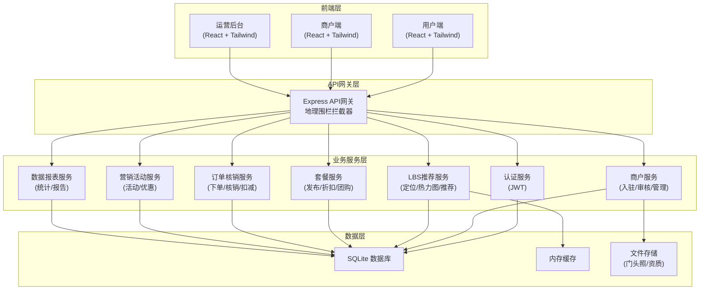
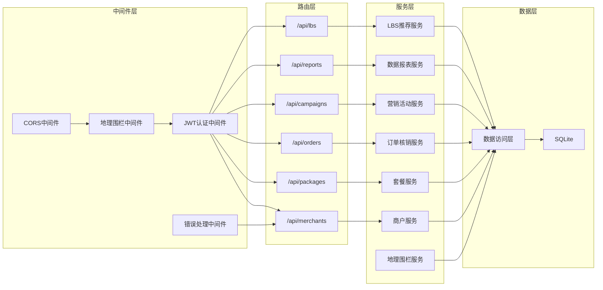
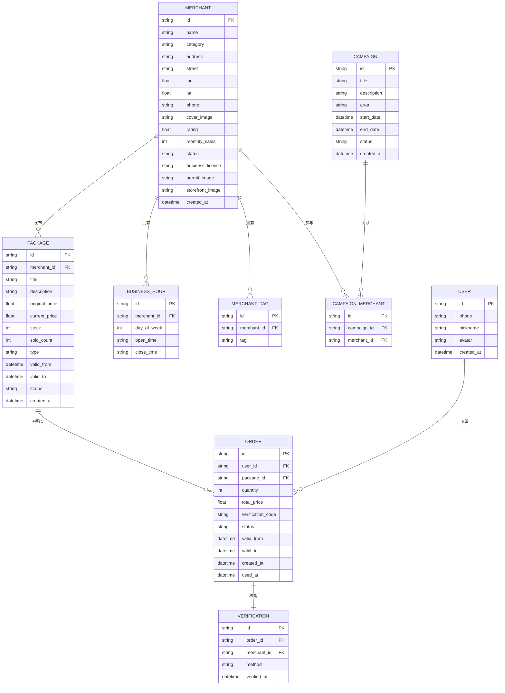

## 1. 架构设计



## 2. 技术说明

- **前端**：React@18 + TailwindCSS@3 + Vite + TypeScript
- **初始化工具**：vite-init (react-express-ts 模板)
- **后端**：Express@4 + TypeScript (ESM)
- **数据库**：SQLite (better-sqlite3)，Mock数据填充
- **状态管理**：Zustand
- **路由**：react-router-dom
- **图标库**：lucide-react
- **图表**：recharts
- **文件上传**：multer
- **地理围栏**：point-in-polygon 算法，松江区边界坐标硬编码

## 3. 路由定义

### 用户端路由
| 路由 | 用途 |
|------|------|
| `/` | 用户端首页（LBS推荐+商圈热力图） |
| `/category/:type` | 分类页（餐饮/娱乐/休闲/商超） |
| `/merchant/:id` | 商户详情页 |
| `/package/:id` | 套餐详情页 |
| `/order/:id` | 订单核销页 |
| `/orders` | 我的订单列表 |
| `/merchant-join` | 商户入驻页 |

### 运营后台路由
| 路由 | 用途 |
|------|------|
| `/admin` | 运营后台首页（数据看板） |
| `/admin/merchants` | 商户管理（多维筛选） |
| `/admin/merchants/:id` | 商户详情/审核 |
| `/admin/campaigns` | 营销活动管理 |
| `/admin/campaigns/create` | 创建营销活动 |
| `/admin/reports` | 消费数据报告 |
| `/admin/geofence` | 地理围栏设置 |

## 4. API定义

### 4.1 通用类型

```typescript
interface ApiResponse<T> {
  code: number;
  message: string;
  data: T;
}

interface PaginatedResponse<T> {
  items: T[];
  total: number;
  page: number;
  pageSize: number;
}

interface GeoPoint {
  lng: number;
  lat: number;
}
```

### 4.2 地理围栏校验

```typescript
// POST /api/geofence/check
interface GeofenceCheckRequest {
  location: GeoPoint;
}

interface GeofenceCheckResponse {
  inside: boolean;
  district: string;
}
```

### 4.3 商户相关

```typescript
// GET /api/merchants?page=1&pageSize=10&category=food&street=中山街道&sort=hot
interface MerchantListQuery {
  page?: number;
  pageSize?: number;
  category?: 'food' | 'entertainment' | 'leisure' | 'shopping';
  street?: string;
  sort?: 'hot' | 'rating' | 'distance';
  lat?: number;
  lng?: number;
}

interface Merchant {
  id: string;
  name: string;
  category: string;
  address: string;
  street: string;
  location: GeoPoint;
  phone: string;
  coverImage: string;
  rating: number;
  monthlySales: number;
  tags: string[];
  businessHours: BusinessHour[];
  status: 'pending' | 'active' | 'rejected' | 'disabled';
}

interface BusinessHour {
  day: number;
  open: string;
  close: string;
}

// POST /api/merchants/apply
interface MerchantApplyRequest {
  name: string;
  category: string;
  address: string;
  phone: string;
  businessLicense: string;
  permitImage: string;
  storefrontImage: string;
  businessHours: BusinessHour[];
  tags: string[];
}

// PUT /api/merchants/:id/review
interface MerchantReviewRequest {
  status: 'approved' | 'rejected';
  reason?: string;
}
```

### 4.4 套餐相关

```typescript
// GET /api/packages?merchantId=xxx&category=food&isDiscount=true
interface PackageListQuery {
  merchantId?: string;
  category?: string;
  isDiscount?: boolean;
  isGroupBuy?: boolean;
  page?: number;
  pageSize?: number;
}

interface Package {
  id: string;
  merchantId: string;
  merchantName: string;
  title: string;
  description: string;
  images: string[];
  originalPrice: number;
  currentPrice: number;
  discount?: number;
  stock: number;
  soldCount: number;
  validFrom: string;
  validTo: string;
  type: 'discount' | 'groupbuy' | 'timeslot';
  timeSlots?: string[];
  tags: string[];
  status: 'active' | 'expired' | 'disabled';
}
```

### 4.5 订单核销

```typescript
// POST /api/orders
interface CreateOrderRequest {
  packageId: string;
  quantity: number;
}

interface Order {
  id: string;
  userId: string;
  packageId: string;
  packageName: string;
  merchantName: string;
  quantity: number;
  totalPrice: number;
  verificationCode: string;
  status: 'pending' | 'used' | 'expired' | 'refunded';
  validFrom: string;
  validTo: string;
  createdAt: string;
  usedAt?: string;
}

// POST /api/orders/verify
interface VerifyOrderRequest {
  code: string;
  merchantId: string;
}

// GET /api/orders/:id/qr
interface QrCodeResponse {
  qrDataUrl: string;
  dynamicCode: string;
  expiresAt: string;
}
```

### 4.6 营销活动

```typescript
// GET /api/campaigns
interface Campaign {
  id: string;
  title: string;
  description: string;
  coverImage: string;
  area: string;
  startDate: string;
  endDate: string;
  merchantIds: string[];
  discountRules: DiscountRule[];
  status: 'draft' | 'active' | 'ended';
}

interface DiscountRule {
  type: 'percentage' | 'fixed' | 'gift';
  value: number;
  condition?: string;
}

// POST /api/campaigns
interface CreateCampaignRequest {
  title: string;
  description: string;
  area: string;
  startDate: string;
  endDate: string;
  merchantIds: string[];
  discountRules: DiscountRule[];
}
```

### 4.7 数据报表

```typescript
// GET /api/reports/overview
interface ReportOverview {
  totalMerchants: number;
  activeMerchants: number;
  totalOrders: number;
  totalRevenue: number;
  verificationRate: number;
  repurchaseRate: number;
  topCategories: CategoryRank[];
  dailyTrend: DailyData[];
}

interface CategoryRank {
  category: string;
  orderCount: number;
  revenue: number;
}

interface DailyData {
  date: string;
  orders: number;
  revenue: number;
  verifications: number;
}
```

### 4.8 LBS推荐

```typescript
// GET /api/lbs/nearby?lat=31.0&lng=121.2&radius=3
interface NearbyQuery {
  lat: number;
  lng: number;
  radius?: number;
  category?: string;
}

// GET /api/lbs/heatmap
interface HeatmapData {
  areas: HeatmapArea[];
}

interface HeatmapArea {
  name: string;
  center: GeoPoint;
  radius: number;
  intensity: number;
  topCategories: string[];
}
```

## 5. 服务器架构



## 6. 数据模型

### 6.1 数据模型定义



### 6.2 数据定义语言

```sql
CREATE TABLE users (
    id TEXT PRIMARY KEY,
    phone TEXT UNIQUE NOT NULL,
    nickname TEXT,
    avatar TEXT,
    role TEXT DEFAULT 'user' CHECK(role IN ('user', 'merchant', 'admin')),
    created_at TEXT DEFAULT (datetime('now'))
);

CREATE TABLE merchants (
    id TEXT PRIMARY KEY,
    user_id TEXT REFERENCES users(id),
    name TEXT NOT NULL,
    category TEXT NOT NULL CHECK(category IN ('food', 'entertainment', 'leisure', 'shopping')),
    address TEXT NOT NULL,
    street TEXT NOT NULL,
    lng REAL NOT NULL,
    lat REAL NOT NULL,
    phone TEXT NOT NULL,
    cover_image TEXT,
    rating REAL DEFAULT 0,
    monthly_sales INTEGER DEFAULT 0,
    status TEXT DEFAULT 'pending' CHECK(status IN ('pending', 'active', 'rejected', 'disabled')),
    business_license TEXT,
    permit_image TEXT,
    storefront_image TEXT,
    created_at TEXT DEFAULT (datetime('now'))
);

CREATE TABLE business_hours (
    id TEXT PRIMARY KEY,
    merchant_id TEXT REFERENCES merchants(id) ON DELETE CASCADE,
    day_of_week INTEGER NOT NULL CHECK(day_of_week BETWEEN 0 AND 6),
    open_time TEXT NOT NULL,
    close_time TEXT NOT NULL
);

CREATE TABLE merchant_tags (
    id TEXT PRIMARY KEY,
    merchant_id TEXT REFERENCES merchants(id) ON DELETE CASCADE,
    tag TEXT NOT NULL
);

CREATE TABLE packages (
    id TEXT PRIMARY KEY,
    merchant_id TEXT REFERENCES merchants(id),
    title TEXT NOT NULL,
    description TEXT,
    images TEXT DEFAULT '[]',
    original_price REAL NOT NULL,
    current_price REAL NOT NULL,
    stock INTEGER NOT NULL,
    sold_count INTEGER DEFAULT 0,
    type TEXT NOT NULL CHECK(type IN ('discount', 'groupbuy', 'timeslot')),
    time_slots TEXT,
    tags TEXT DEFAULT '[]',
    valid_from TEXT NOT NULL,
    valid_to TEXT NOT NULL,
    status TEXT DEFAULT 'active' CHECK(status IN ('active', 'expired', 'disabled')),
    created_at TEXT DEFAULT (datetime('now'))
);

CREATE TABLE orders (
    id TEXT PRIMARY KEY,
    user_id TEXT REFERENCES users(id),
    package_id TEXT REFERENCES packages(id),
    quantity INTEGER NOT NULL,
    total_price REAL NOT NULL,
    verification_code TEXT UNIQUE NOT NULL,
    status TEXT DEFAULT 'pending' CHECK(status IN ('pending', 'used', 'expired', 'refunded')),
    valid_from TEXT NOT NULL,
    valid_to TEXT NOT NULL,
    created_at TEXT DEFAULT (datetime('now')),
    used_at TEXT
);

CREATE TABLE verifications (
    id TEXT PRIMARY KEY,
    order_id TEXT REFERENCES orders(id),
    merchant_id TEXT REFERENCES merchants(id),
    method TEXT NOT NULL CHECK(method IN ('qrcode', 'dynamic_code')),
    verified_at TEXT DEFAULT (datetime('now'))
);

CREATE TABLE campaigns (
    id TEXT PRIMARY KEY,
    title TEXT NOT NULL,
    description TEXT,
    cover_image TEXT,
    area TEXT NOT NULL,
    start_date TEXT NOT NULL,
    end_date TEXT NOT NULL,
    discount_rules TEXT DEFAULT '[]',
    status TEXT DEFAULT 'draft' CHECK(status IN ('draft', 'active', 'ended')),
    created_at TEXT DEFAULT (datetime('now'))
);

CREATE TABLE campaign_merchants (
    id TEXT PRIMARY KEY,
    campaign_id TEXT REFERENCES campaigns(id) ON DELETE CASCADE,
    merchant_id TEXT REFERENCES merchants(id)
);

CREATE INDEX idx_merchants_category ON merchants(category);
CREATE INDEX idx_merchants_street ON merchants(street);
CREATE INDEX idx_merchants_status ON merchants(status);
CREATE INDEX idx_packages_merchant ON packages(merchant_id);
CREATE INDEX idx_packages_type ON packages(type);
CREATE INDEX idx_orders_user ON orders(user_id);
CREATE INDEX idx_orders_package ON orders(package_id);
CREATE INDEX idx_orders_status ON orders(status);
CREATE INDEX idx_orders_code ON orders(verification_code);
CREATE INDEX idx_business_hours_merchant ON business_hours(merchant_id);
CREATE INDEX idx_campaign_merchants_campaign ON campaign_merchants(campaign_id);
CREATE INDEX idx_campaign_merchants_merchant ON campaign_merchants(merchant_id);
```
