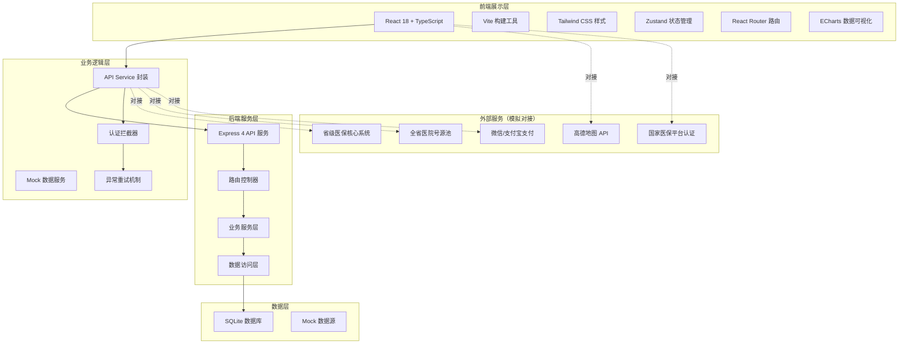
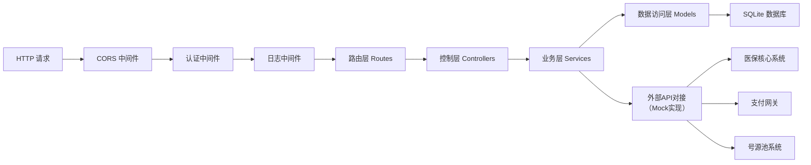
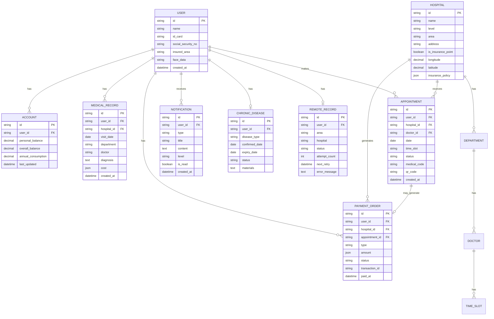

## 1. 架构设计



## 2. 技术选型说明

| 层级 | 技术栈 | 版本 | 说明 |
|------|--------|------|------|
| 前端框架 | React | 18.x | 使用 Hooks + Function Component |
| 开发语言 | TypeScript | 5.x | 类型安全，严格模式 |
| 构建工具 | Vite | 5.x | 快速开发构建，支持 HMR |
| 样式方案 | Tailwind CSS | 3.x | 原子化 CSS，自定义主题 |
| 状态管理 | Zustand | 4.x | 轻量级状态管理，支持持久化 |
| 路由管理 | React Router DOM | 6.x | 嵌套路由，懒加载支持 |
| UI 组件 | Radix UI + 自定义 | - | 无障碍组件库 |
| 图标库 | Lucide React | 0.x | 线性风格图标 |
| 数据可视化 | ECharts | 5.x | 图表展示（柱状图、饼图、环形图） |
| HTTP 客户端 | Axios | 1.x | 请求拦截、响应拦截、自动重试 |
| 后端框架 | Express | 4.x | Node.js API 服务 |
| 数据库 | SQLite | 3.x | 轻量级本地数据库（开发/演示用） |
| 地图服务 | 高德地图 JS API | 2.x | POI搜索、室内地图 |
| 支付对接 | 微信/支付宝沙箱 | - | 模拟混合支付流程 |

## 3. 目录结构

```
may-89308/
├── src/                          # 前端源码
│   ├── components/               # 公共组件
│   │   ├── layout/              # 布局组件
│   │   ├── ui/                  # 基础UI组件
│   │   └── biz/                 # 业务组件
│   ├── pages/                   # 页面组件
│   │   ├── auth/                # 身份认证页
│   │   ├── home/                # 首页
│   │   ├── account/             # 账户查询
│   │   ├── medical/             # 就诊记录
│   │   ├── chronic/             # 慢特病认定
│   │   ├── registration/        # 挂号预约
│   │   ├── payment/             # 医保支付
│   │   ├── navigation/          # 医院导航
│   │   └── notification/        # 异常预警
│   ├── hooks/                   # 自定义Hooks
│   ├── store/                   # Zustand状态管理
│   ├── services/                # API服务层
│   ├── types/                   # TypeScript类型定义
│   ├── utils/                   # 工具函数
│   ├── assets/                  # 静态资源
│   ├── App.tsx
│   ├── main.tsx
│   └── index.css
├── api/                          # 后端源码
│   ├── controllers/             # 控制器
│   ├── services/                # 业务服务
│   ├── models/                  # 数据模型
│   ├── routes/                  # 路由定义
│   ├── middleware/              # 中间件
│   ├── mock/                    # Mock数据生成
│   └── index.ts                 # 服务入口
├── shared/                       # 前后端共享类型
│   └── types.ts
├── migrations/                   # 数据库迁移
│   └── 001_init_schema.sql
├── .trae/documents/             # 项目文档
├── vite.config.ts
├── tailwind.config.js
├── tsconfig.json
├── package.json
└── README.md
```

## 4. 路由定义

| 路由路径 | 页面名称 | 权限要求 | 说明 |
|----------|----------|----------|------|
| `/` | 重定向 | - | 未登录跳 `/auth`，已登录跳 `/home` |
| `/auth` | 身份认证页 | 公开 | 电子医保凭证登录入口 |
| `/home` | 首页 | 需要登录 | 账户概览、快捷入口、政策推送 |
| `/account` | 账户查询页 | 需要登录 | 余额查询、消费明细 |
| `/account/balance` | 账户余额 | 需要登录 | 余额详情、年度统计 |
| `/account/records` | 消费明细 | 需要登录 | 按医院/药店/药品分类 |
| `/medical` | 就诊记录页 | 需要登录 | 近3年就诊记录列表 |
| `/medical/:id` | 就诊详情 | 需要登录 | 诊断、处方、费用详情 |
| `/chronic` | 慢特病认定页 | 需要登录 | 认定状态、申请进度 |
| `/registration` | 挂号预约页 | 需要登录 | 医院、科室、号源选择 |
| `/registration/hospital/:id` | 医院号源 | 需要登录 | 该院科室医生号源 |
| `/registration/confirm` | 预约确认 | 需要登录 | 确认信息并生成就诊码 |
| `/payment` | 医保支付页 | 需要登录 | 待结算列表、混合支付 |
| `/payment/:id` | 支付详情 | 需要登录 | 费用明细、支付方式选择 |
| `/navigation` | 医院导航页 | 需要登录 | 高德地图、POI搜索、室内导航 |
| `/notification` | 异常预警页 | 需要登录 | 备案状态、待遇预警、政策推送 |

## 5. API 接口定义

### 5.1 认证模块

```typescript
// 请求
interface AuthRequest {
  credentialType: 'qrcode' | 'face';
  credentialData: string;
  deviceId: string;
}

// 响应
interface AuthResponse {
  success: boolean;
  token: string;
  userInfo: {
    id: string;
    name: string;
    idCard: string;
    socialSecurityNo: string;
    insuredArea: string;
    avatar?: string;
  };
  expiresAt: number;
}

POST /api/auth/login
POST /api/auth/logout
GET  /api/auth/verify
```

### 5.2 账户模块

```typescript
interface AccountBalance {
  personalAccount: number;
  overallAccount: number;
  annualConsumption: number;
  monthlyConsumption: number;
  lastUpdated: string;
}

interface ConsumptionRecord {
  id: string;
  date: string;
  type: 'hospital' | 'pharmacy' | 'drug';
  merchantName: string;
  amount: number;
  personalPay: number;
  overallPay: number;
  category: string;
  details: ConsumptionDetail[];
}

interface ConsumptionDetail {
  name: string;
  spec: string;
  quantity: number;
  unitPrice: number;
  amount: number;
  insuranceType: string;
}

GET  /api/account/balance
GET  /api/account/records
GET  /api/account/records/:id
GET  /api/account/statistics
```

### 5.3 就诊记录模块

```typescript
interface MedicalRecord {
  id: string;
  visitDate: string;
  hospital: string;
  department: string;
  doctor: string;
  diagnosis: string[];
  symptoms: string;
  prescriptions: Prescription[];
  examinations: Examination[];
  cost: {
    total: number;
    overallPay: number;
    personalPay: number;
    accountPay: number;
    selfPay: number;
  };
}

interface Prescription {
  drugName: string;
  spec: string;
  dosage: string;
  frequency: string;
  quantity: number;
  unitPrice: number;
  amount: number;
  insuranceCoverage: string;
}

GET  /api/medical/records
GET  /api/medical/records/:id
```

### 5.4 挂号预约模块

```typescript
interface Hospital {
  id: string;
  name: string;
  level: string;
  area: string;
  address: string;
  isInsurancePoint: boolean;
  departments: Department[];
  distance?: number;
}

interface Doctor {
  id: string;
  name: string;
  title: string;
  department: string;
  specialty: string;
  avatar?: string;
  registrationFee: number;
}

interface TimeSlot {
  id: string;
  time: string;
  period: 'morning' | 'afternoon' | 'evening';
  available: number;
  total: number;
  status: 'available' | 'limited' | 'full';
}

interface Appointment {
  id: string;
  hospital: string;
  department: string;
  doctor: string;
  date: string;
  timeSlot: string;
  status: 'pending' | 'confirmed' | 'cancelled' | 'completed';
  medicalCode: string;
  qrCode: string;
}

GET  /api/registration/hospitals
GET  /api/registration/hospitals/:id
GET  /api/registration/hospitals/:id/departments
GET  /api/registration/departments/:id/doctors
GET  /api/registration/doctors/:id/slots
POST /api/registration/appointment
GET  /api/registration/appointments
```

### 5.5 支付模块

```typescript
interface SettlementOrder {
  id: string;
  type: 'outpatient' | 'inpatient';
  hospital: string;
  amount: {
    total: number;
    overallPay: number;
    accountPay: number;
    wechatPay?: number;
    alipayPay?: number;
    selfPay: number;
  };
  items: SettlementItem[];
  status: 'pending' | 'paid' | 'cancelled';
  createdAt: string;
}

interface PaymentRequest {
  orderId: string;
  useAccount: boolean;
  additionalMethod: 'wechat' | 'alipay' | 'none';
  amount: number;
}

interface PaymentResponse {
  success: boolean;
  transactionId: string;
  paidAmount: number;
  electronicReceiptUrl: string;
  settlementNoteUrl: string;
}

GET  /api/payment/orders
GET  /api/payment/orders/:id
POST /api/payment/pay
GET  /api/payment/orders/:id/receipt
```

### 5.6 异常通知模块

```typescript
interface Notification {
  id: string;
  type: 'treatment_abnormal' | 'policy' | 'record_failure' | 'system';
  title: string;
  content: string;
  level: 'info' | 'warning' | 'error';
  read: boolean;
  createdAt: string;
  actionUrl?: string;
  retryable?: boolean;
}

interface RemoteRecordStatus {
  id: string;
  status: 'success' | 'failed' | 'pending';
  area: string;
  hospital: string;
  attemptCount: number;
  nextRetryAt?: string;
  errorMessage?: string;
}

GET    /api/notifications
PATCH  /api/notifications/:id/read
POST   /api/notifications/:id/retry
GET    /api/remote-record/status
POST   /api/remote-record/retry
```

## 6. 后端架构



## 7. 数据模型

### 7.1 ER 图



### 7.2 数据库初始化脚本

```sql
-- 用户表
CREATE TABLE users (
  id TEXT PRIMARY KEY,
  name TEXT NOT NULL,
  id_card TEXT UNIQUE NOT NULL,
  social_security_no TEXT UNIQUE NOT NULL,
  insured_area TEXT NOT NULL,
  face_data TEXT,
  created_at DATETIME DEFAULT CURRENT_TIMESTAMP
);

-- 账户表
CREATE TABLE accounts (
  id TEXT PRIMARY KEY,
  user_id TEXT NOT NULL REFERENCES users(id),
  personal_balance DECIMAL(12,2) NOT NULL DEFAULT 0,
  overall_balance DECIMAL(12,2) NOT NULL DEFAULT 0,
  annual_consumption DECIMAL(12,2) NOT NULL DEFAULT 0,
  last_updated DATETIME DEFAULT CURRENT_TIMESTAMP
);

-- 医院表
CREATE TABLE hospitals (
  id TEXT PRIMARY KEY,
  name TEXT NOT NULL,
  level TEXT NOT NULL,
  area TEXT NOT NULL,
  address TEXT NOT NULL,
  is_insurance_point BOOLEAN DEFAULT true,
  longitude DECIMAL(10,6),
  latitude DECIMAL(10,6),
  insurance_policy TEXT
);

-- 科室表
CREATE TABLE departments (
  id TEXT PRIMARY KEY,
  hospital_id TEXT NOT NULL REFERENCES hospitals(id),
  name TEXT NOT NULL,
  description TEXT
);

-- 医生表
CREATE TABLE doctors (
  id TEXT PRIMARY KEY,
  department_id TEXT NOT NULL REFERENCES departments(id),
  name TEXT NOT NULL,
  title TEXT NOT NULL,
  specialty TEXT,
  registration_fee DECIMAL(10,2) NOT NULL
);

-- 号源表
CREATE TABLE time_slots (
  id TEXT PRIMARY KEY,
  doctor_id TEXT NOT NULL REFERENCES doctors(id),
  date DATE NOT NULL,
  time TEXT NOT NULL,
  period TEXT NOT NULL,
  available INTEGER NOT NULL,
  total INTEGER NOT NULL
);

-- 预约表
CREATE TABLE appointments (
  id TEXT PRIMARY KEY,
  user_id TEXT NOT NULL REFERENCES users(id),
  hospital_id TEXT NOT NULL REFERENCES hospitals(id),
  doctor_id TEXT NOT NULL REFERENCES doctors(id),
  date DATE NOT NULL,
  time_slot TEXT NOT NULL,
  status TEXT NOT NULL DEFAULT 'confirmed',
  medical_code TEXT,
  qr_code TEXT,
  created_at DATETIME DEFAULT CURRENT_TIMESTAMP
);

-- 支付订单表
CREATE TABLE payment_orders (
  id TEXT PRIMARY KEY,
  user_id TEXT NOT NULL REFERENCES users(id),
  hospital_id TEXT NOT NULL REFERENCES hospitals(id),
  appointment_id TEXT REFERENCES appointments(id),
  type TEXT NOT NULL,
  amount TEXT NOT NULL,
  status TEXT NOT NULL DEFAULT 'pending',
  transaction_id TEXT,
  paid_at DATETIME,
  created_at DATETIME DEFAULT CURRENT_TIMESTAMP
);

-- 就诊记录表
CREATE TABLE medical_records (
  id TEXT PRIMARY KEY,
  user_id TEXT NOT NULL REFERENCES users(id),
  hospital_id TEXT NOT NULL REFERENCES hospitals(id),
  visit_date DATE NOT NULL,
  department TEXT NOT NULL,
  doctor TEXT NOT NULL,
  diagnosis TEXT NOT NULL,
  cost TEXT NOT NULL,
  created_at DATETIME DEFAULT CURRENT_TIMESTAMP
);

-- 慢特病认定表
CREATE TABLE chronic_diseases (
  id TEXT PRIMARY KEY,
  user_id TEXT NOT NULL REFERENCES users(id),
  disease_type TEXT NOT NULL,
  confirmed_date DATE NOT NULL,
  expiry_date DATE NOT NULL,
  status TEXT NOT NULL DEFAULT 'approved',
  materials TEXT
);

-- 通知消息表
CREATE TABLE notifications (
  id TEXT PRIMARY KEY,
  user_id TEXT NOT NULL REFERENCES users(id),
  type TEXT NOT NULL,
  title TEXT NOT NULL,
  content TEXT NOT NULL,
  level TEXT NOT NULL DEFAULT 'info',
  is_read BOOLEAN DEFAULT false,
  action_url TEXT,
  retryable BOOLEAN DEFAULT false,
  created_at DATETIME DEFAULT CURRENT_TIMESTAMP
);

-- 异地就医备案表
CREATE TABLE remote_records (
  id TEXT PRIMARY KEY,
  user_id TEXT NOT NULL REFERENCES users(id),
  area TEXT NOT NULL,
  hospital TEXT NOT NULL,
  status TEXT NOT NULL DEFAULT 'pending',
  attempt_count INTEGER DEFAULT 0,
  next_retry DATETIME,
  error_message TEXT,
  created_at DATETIME DEFAULT CURRENT_TIMESTAMP
);

-- 消费明细表
CREATE TABLE consumption_records (
  id TEXT PRIMARY KEY,
  user_id TEXT NOT NULL REFERENCES users(id),
  date DATE NOT NULL,
  type TEXT NOT NULL,
  merchant_name TEXT NOT NULL,
  amount DECIMAL(12,2) NOT NULL,
  personal_pay DECIMAL(12,2) NOT NULL,
  overall_pay DECIMAL(12,2) NOT NULL,
  category TEXT NOT NULL,
  details TEXT,
  created_at DATETIME DEFAULT CURRENT_TIMESTAMP
);
```

## 8. 关键技术实现

### 8.1 认证机制
- JWT Token 存储于 HttpOnly Cookie + 内存状态
- 每次请求携带 Token，Axios 拦截器自动注入
- Token 过期自动刷新，无感续期
- 敏感操作二次人脸验证

### 8.2 异常重试机制
```typescript
// Axios 自动重试配置
const axiosInstance = axios.create({
  timeout: 10000,
});

axiosInstance.interceptors.response.use(
  response => response,
  async error => {
    const config = error.config;
    // 异地备案失败自动重试，最多3次
    if (config.url?.includes('/remote-record') && 
        error.response?.status === 503 && 
        config.retryCount < 3) {
      config.retryCount = (config.retryCount || 0) + 1;
      await delay(2000 * config.retryCount); // 指数退避
      return axiosInstance(config);
    }
    return Promise.reject(error);
  }
);
```

### 8.3 实时弹窗预警
- WebSocket 连接后端推送服务
- 订阅用户专属消息通道
- 待遇异常时立即推送，前端 Modal 强制弹窗
- 支持语音播报

### 8.4 医保电子凭证
- 使用动态二维码生成库
- 每 5 分钟自动刷新
- 对接国家医保平台二维码标准规范
- 离线可用缓存机制

### 8.5 性能优化
- 路由级别代码分割
- 列表虚拟滚动（就诊记录、号源列表）
- 图表懒加载
- 接口数据缓存策略
- 图片懒加载 + WebP 格式
