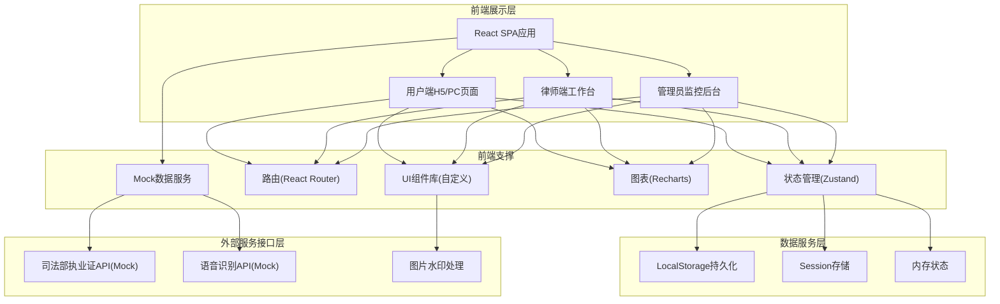
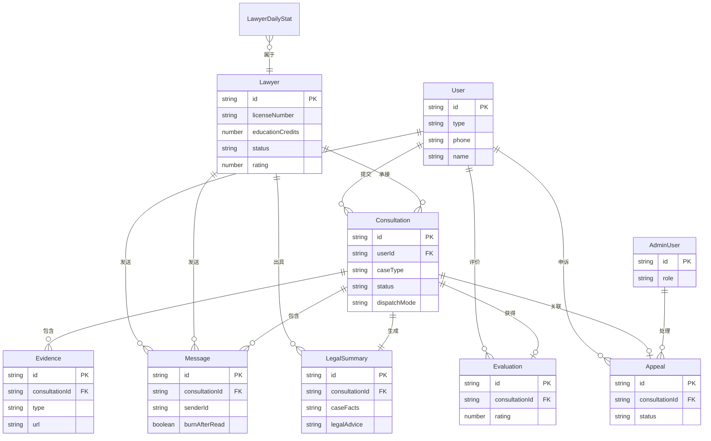

# 法律公益咨询协同平台 - 技术架构文档

## 1. 架构设计



## 2. 技术描述

- **前端框架**: React@18 + TypeScript
- **构建工具**: Vite@5
- **样式方案**: TailwindCSS@3 + CSS Variables
- **状态管理**: Zustand（轻量级，避免Redux的繁琐）
- **路由方案**: React Router@6
- **图表库**: Recharts
- **图标方案**: Lucide React（线性图标，符合设计风格）
- **数据方案**: 前端Mock数据 + LocalStorage持久化（纯前端实现，无需后端）
- **动画方案**: CSS动画 + Framer Motion（页面切换与微交互）

## 3. 路由定义

| 路由 | 页面用途 | 角色权限 |
|------|----------|----------|
| `/` | 平台首页/用户咨询大厅 | 公开访问 |
| `/consult/submit` | 咨询提交页 | 登录用户 |
| `/consult/list` | 我的咨询列表 | 登录用户 |
| `/consult/:id` | 咨询详情/IM会话 | 相关用户与律师 |
| `/consult/:id/summary` | 法律意见摘要 | 相关用户与律师 |
| `/lawyer/desk` | 律师工作台 | 律师 |
| `/lawyer/desk/pool` | 抢单大厅 | 律师 |
| `/lawyer/desk/cases` | 我的案件 | 律师 |
| `/lawyer/qualification` | 资质核验中心 | 律师+管理员 |
| `/dispute/evaluate/:id` | 服务评价 | 结案用户 |
| `/dispute/appeal/:id` | 申诉提交 | 相关用户 |
| `/dispute/arbitrate` | 仲裁处理 | 管理员 |
| `/admin/dashboard` | 监控仪表盘 | 管理员 |
| `/login` | 用户/律师/管理员登录 | 公开 |

## 4. 数据模型（TypeScript类型定义）

### 4.1 用户与律师

```typescript
interface User {
  id: string;
  type: 'user' | 'lawyer' | 'admin';
  phone: string;
  name: string;
  avatar?: string;
  region?: string;
  idCardVerified: boolean;
  createdAt: number;
}

interface Lawyer extends User {
  type: 'lawyer';
  licenseNumber: string;
  licenseVerified: boolean;
  licenseVerifyAt?: number;
  educationCredits: number;
  creditsYear: number;
  specialties: LegalCaseType[];
  rating: number;
  totalCases: number;
  avgResponseTime: number;
  status: 'active' | 'frozen' | 'pending' | 'restricted';
  frozenReason?: string;
  zeroResponseCount: number;
  lastResponseAt?: number;
}

interface AdminUser extends User {
  type: 'admin';
  role: 'super' | 'arbitrator' | 'auditor';
}
```

### 4.2 咨询案件

```typescript
type LegalCaseType = 'marriage' | 'labor' | 'debt' | 'property' | 'criminal' | 'contract' | 'tort' | 'other';

interface Consultation {
  id: string;
  userId: string;
  userRegion: string;
  caseType: LegalCaseType;
  title: string;
  description: string;
  audioUrl?: string;
  evidences: Evidence[];
  status: 'pending' | 'matched' | 'accepted' | 'in_progress' | 'closed' | 'cancelled';
  dispatchMode: 'auto' | 'grab' | 'assign';
  matchedLawyerIds: string[];
  assignedLawyerId?: string;
  acceptedLawyerId?: string;
  createdAt: number;
  acceptedAt?: number;
  closedAt?: number;
  summary?: LegalSummary;
  evaluation?: Evaluation;
  appeal?: Appeal;
}

interface Evidence {
  id: string;
  consultationId: string;
  type: 'image' | 'file' | 'audio';
  url: string;
  fileName: string;
  size: number;
  uploadedAt: number;
  watermarkApplied: boolean;
}
```

### 4.3 IM消息与会话

```typescript
interface Message {
  id: string;
  consultationId: string;
  senderId: string;
  senderType: 'user' | 'lawyer' | 'system';
  content: string;
  messageType: 'text' | 'image' | 'file' | 'system';
  encrypted: boolean;
  burnAfterRead: boolean;
  burnDuration: number;
  readBy: string[];
  readAt: Record<string, number>;
  createdAt: number;
  revoked: boolean;
}
```

### 4.4 法律意见摘要与评价

```typescript
interface LegalSummary {
  id: string;
  consultationId: string;
  lawyerId: string;
  caseFacts: string;
  legalBasis: string;
  legalAdvice: string;
  riskWarning: string;
  disclaimer: string;
  generatedAt: number;
  lawyerConfirmed: boolean;
  archived: boolean;
  archiveNumber: string;
}

interface Evaluation {
  id: string;
  consultationId: string;
  userId: string;
  rating: number;
  professionalism: number;
  responsiveness: number;
  satisfaction: number;
  comment: string;
  createdAt: number;
}

interface Appeal {
  id: string;
  consultationId: string;
  appellantId: string;
  appellantType: 'user' | 'lawyer';
  reason: string;
  evidences: string[];
  status: 'pending' | 'reviewing' | 'rejected' | 'upheld';
  lawyerDefense?: string;
  arbitrationResult?: string;
  createdAt: number;
  handledAt?: number;
  handlerId?: string;
}
```

### 4.5 监控数据

```typescript
interface MonitoringStats {
  date: string;
  totalConsultations: number;
  completedConsultations: number;
  avgResponseTime: number;
  avgConsultationDuration: number;
  activeLawyers: number;
  saturationRate: number;
  lawyerStats: LawyerDailyStat[];
}

interface LawyerDailyStat {
  lawyerId: string;
  date: string;
  consultationCount: number;
  avgResponseTime: number;
  avgRating: number;
}
```

## 5. 数据模型ER图



## 6. 前端目录结构

```
src/
├── assets/              # 静态资源（字体、图片）
├── components/          # 通用组件
│   ├── ui/             # 基础UI组件
│   ├── layout/         # 布局组件
│   └── feature/        # 业务组件
├── pages/              # 页面组件
│   ├── Home/
│   ├── Consultation/
│   ├── LawyerDesk/
│   ├── Qualification/
│   ├── Dispute/
│   ├── Admin/
│   └── Login/
├── store/              # Zustand状态管理
│   ├── useAuthStore.ts
│   ├── useConsultationStore.ts
│   ├── useMessageStore.ts
│   └── useMonitoringStore.ts
├── mock/               # Mock数据与API
│   ├── data/          # Mock数据源
│   └── api.ts         # Mock API接口
├── types/              # TypeScript类型定义
├── utils/              # 工具函数
│   ├── crypto.ts       # 加密工具
│   ├── watermark.ts    # 水印工具
│   ├── format.ts       # 格式化
│   └── dispatch.ts     # 分派算法
├── hooks/              # 自定义Hooks
├── styles/             # 全局样式
├── router/             # 路由配置
└── main.tsx            # 入口文件
```
