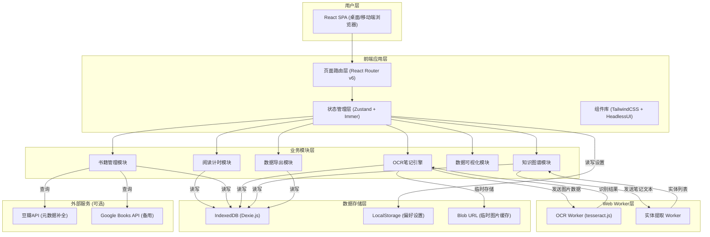
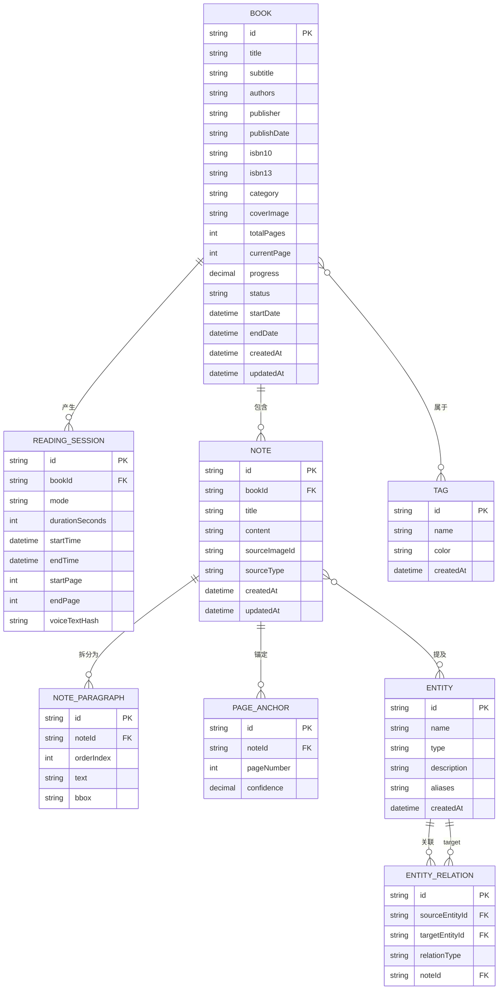
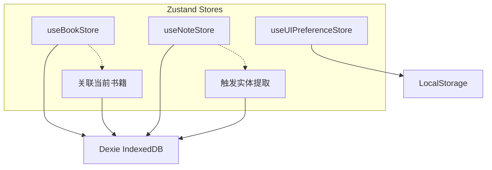

## 1. 架构设计



## 2. 技术描述

- **前端框架**: React@18.3 + TypeScript@5.5 — 类型安全的组件化开发
- **构建工具**: Vite@5.4 — 极速开发体验 + Rollup生产构建
- **样式方案**: TailwindCSS@3.4 + CSS Variables — 原子化样式 + 主题定制
- **路由管理**: React Router v6.26 — 嵌套路由 + 懒加载
- **状态管理**: Zustand@4.5 + Immer — 轻量可预测状态管理，多store拆分
- **本地数据库**: Dexie.js@4.0 — IndexedDB友好封装，支持复杂查询和事务
- **图表可视化**: ECharts@5.5 — 专业级图表库，支持热力图/饼图/折线图/关系图
- **OCR引擎**: tesseract.js@5.1 — 纯前端Web Worker运行，中文简体语言包
- **图谱渲染**: cytoscape@3.30 — 力导向图、多种布局算法、高性能节点渲染
- **文件导出**: JSZip@3.10 (ZIP打包) + Markdown Builder (字符串模板生成)
- **UI组件库**: 自定义Headless组件 + lucide-react@0.441 (图标)
- **动画方案**: Framer Motion@11.3 — 组件过渡动画 + 微交互
- **日期处理**: dayjs@1.11 — 轻量不可变日期库
- **工具库**: lodash-es@4.17 — 防抖/节流/深拷贝等常用工具函数
- **后端**: 无后端（纯前端SaaS，数据完全本地存储）

## 3. 路由定义

| 路由路径 | 页面组件 | 用途说明 |
|----------|----------|----------|
| `/` | `pages/Dashboard.tsx` | 阅读仪表盘 - 今日概览、快速计时器、最近阅读、预警 |
| `/library` | `pages/Library.tsx` | 书籍库 - 书籍网格列表、筛选搜索、添加书籍 |
| `/library/:bookId` | `pages/BookDetail.tsx` | 书籍详情 - 元数据、阅读进度、笔记时间线 |
| `/timer` | `pages/ReadingTimer.tsx` | 专注计时器 - 三模式计时、关联书籍、阅读日志 |
| `/ocr` | `pages/OCRNotes.tsx` | OCR笔记 - 图片上传、识别、编辑、页码绑定 |
| `/graph` | `pages/KnowledgeGraph.tsx` | 知识图谱 - 实体网络、筛选、关联探索 |
| `/review` | `pages/ReviewBoard.tsx` | 复盘看板 - 周期统计、图表分析、预警列表 |
| `/export` | `pages/ExportCenter.tsx` | 数据导出 - 配置、预览、下载 |

## 4. 数据模型

### 4.1 ER关系图



### 4.2 Dexie.js Schema定义

```typescript
// db.ts - IndexedDB Schema
version(1).stores({
  tags: 'id, name, createdAt',
  books: 'id, title, isbn10, isbn13, category, status, progress, createdAt, updatedAt',
  readingSessions: 'id, bookId, mode, startTime, endTime, durationSeconds',
  notes: 'id, bookId, sourceType, createdAt, updatedAt',
  noteParagraphs: 'id, noteId, orderIndex',
  pageAnchors: 'id, noteId, pageNumber',
  entities: 'id, name, type, createdAt',
  entityRelations: 'id, sourceEntityId, targetEntityId, noteId, relationType',
  ocrImages: 'id, noteId, hash, createdAt'
});
```

## 5. Store架构 (Zustand)



| Store名称 | 状态字段 | Actions |
|-----------|----------|---------|
| `useBookStore` | books[], currentBook, filters | addBook, updateBook, deleteBook, searchBooks, fetchMetadata |
| `useTimerStore` | isRunning, mode, currentBookId, elapsed, sessionLog | start/pause/stopTimer, switchMode, syncVoiceProgress, saveSession |
| `useNoteStore` | notes[], ocrQueue, ocrProgress | uploadImage, startOCR, editParagraph, bindPageAnchor, deleteNote |
| `useEntityStore` | entities[], relations[], selectedEntity, graphData | extractEntities, buildRelations, filterGraph, selectEntity |
| `useUIPreferenceStore` | theme, density, language, lastRoute | setTheme, setDensity, persistAll |

## 6. Web Worker通信协议

### 6.1 OCR Worker消息类型

| 消息方向 | 类型 | Payload | 说明 |
|----------|------|---------|------|
| 主线程→Worker | `INIT` | `{lang: 'chi_sim+eng'}` | 初始化OCR引擎，加载语言包 |
| 主线程→Worker | `RECOGNIZE` | `{imageData: ArrayBuffer, imageId: string}` | 发送图片进行识别 |
| Worker→主线程 | `PROGRESS` | `{imageId, progress: 0-1, status: string}` | 识别进度回调 |
| Worker→主线程 | `RESULT` | `{imageId, text: string, paragraphs: Paragraph[], blocks: Block[]}` | 识别完成返回结构化结果 |
| Worker→主线程 | `ERROR` | `{imageId, message: string}` | 识别失败 |

### 6.2 实体提取 Worker消息类型

| 消息方向 | 类型 | Payload | 说明 |
|----------|------|---------|------|
| 主线程→Worker | `EXTRACT` | `{noteId, text, existingEntities[]}` | 发送笔记文本做实体识别 |
| Worker→主线程 | `ENTITIES` | `{noteId, entities: {name, type, context}[]}` | 返回提取到的实体 |
| Worker→主线程 | `RELATIONS` | `{noteId, pairs: [{source, target, relation}]}` | 返回实体关系对 |

## 7. 性能与安全策略

### 7.1 性能优化

- **OCR处理**：图片先在主线程压缩至≤1200px宽度后传入Worker，Worker池化最多2个并行
- **IndexedDB**：大数据查询走Dexie索引分页，每次最多50条，虚拟滚动渲染
- **图谱渲染**：节点>200个时启用聚合模式，局部展开，WebGL加速(cytoscape-canvas)
- **图表**：ECharts用`lazyUpdate`+`progressiveThreshold`，数据变更防抖300ms
- **内存**：OCR完成后释放`createImageBitmap`对象，Blob URL使用后`revokeObjectURL`

### 7.2 隐私安全（关键约束）

- **图像不上传**：OCR 100%在Web Worker中执行，原始图片数据仅存在于内存/IndexedDB
- **数据导出**：ZIP包通过`Blob + URL.createObjectURL`本地生成下载，不经服务器
- **元数据API**：ISBN查询仅发送ISBN字符串，不携带用户笔记内容
- **XSS防护**：笔记内容渲染走React转义，导出Markdown时转义特殊字符
- **CSRF**：纯前端无Cookie会话，无需处理

## 8. Mock数据策略

首访若无数据，展示Mock示例数据集以便体验功能：
- **书籍**：3本样例书（《深入理解计算机系统》《思考，快与慢》《百年孤独》）
- **阅读记录**：最近14天的阅读会话数据，每日1-3次不等
- **笔记**：每本书2-3条示例OCR笔记，含段落和页码锚点
- **实体图谱**：12-15个跨书实体节点，20-25条关系连线
- **复盘数据**：30天的热力图数据、饼图分布、时长曲线
