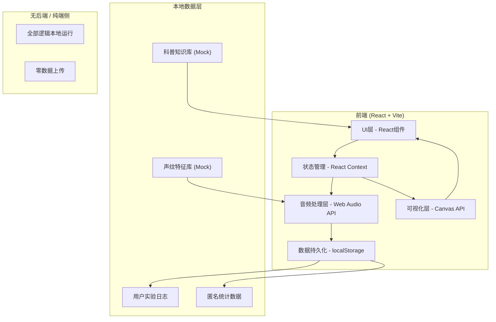
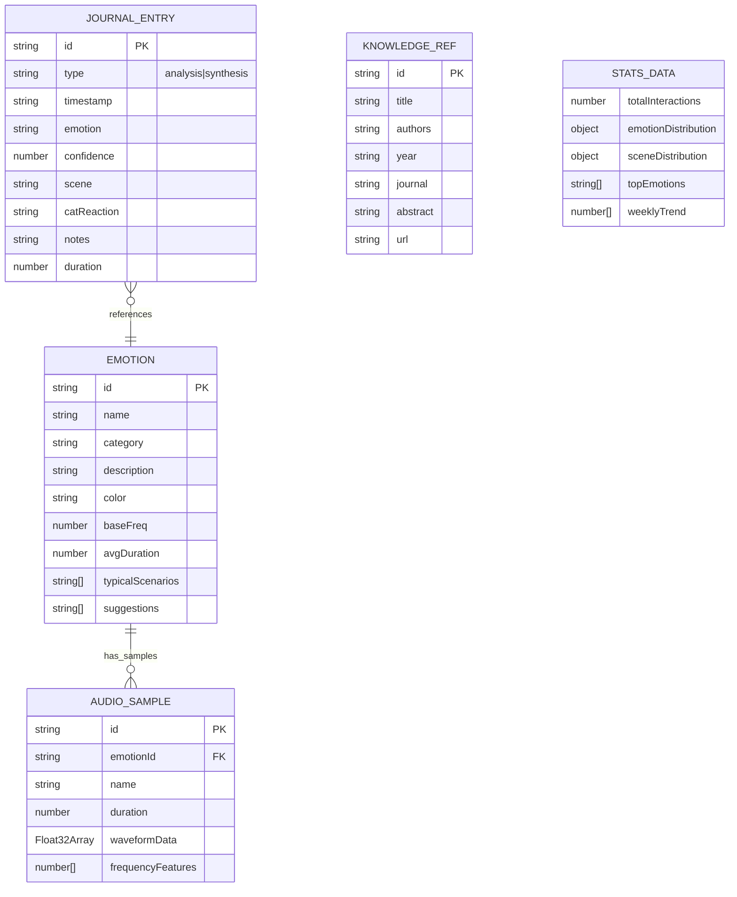

# 技术架构文档：猫语翻译实验平台

## 1. 架构设计



## 2. 技术说明

- **前端框架**: React 18 + TypeScript
- **构建工具**: Vite 5
- **样式方案**: TailwindCSS 3 + CSS变量
- **路由**: React Router v6
- **音频处理**: 原生 Web Audio API（离线运行，零依赖）
- **可视化**: Canvas API + 自定义波形渲染
- **数据存储**: localStorage（用户日志、统计数据）
- **图表**: 自研轻量级Canvas图表（无第三方依赖）
- **图标**: Lucide React
- **后端**: 无后端，纯前端离线应用
- **数据库**: 无服务端数据库，使用本地localStorage + 内置Mock数据

## 3. 路由定义

| 路由路径 | 页面名称 | 说明 |
|----------|----------|------|
| / | 声纹分析页 | 默认首页，音频上传/录制与情绪分析 |
| /synthesize | 语音合成页 | 文字转猫叫音频合成 |
| /vocabulary | 声纹特征库 | 6类情绪标签与样本展示 |
| /knowledge | 科普知识页 | 参考文献与生理图谱 |
| /journal | 实验日志页 | 交互记录与统计看板 |
| /about | 关于页 | 平台介绍与隐私声明 |

## 4. 数据模型

### 4.1 数据模型定义



### 4.2 核心TypeScript类型

```typescript
// 情绪类型
type EmotionCategory = 'positive' | 'negative' | 'neutral' | 'hunger' | 'distress' | 'content';

interface Emotion {
  id: string;
  name: string;
  nameEn: string;
  category: EmotionCategory;
  description: string;
  color: string;
  baseFrequency: number; // Hz
  avgDuration: number; // seconds
  typicalScenarios: string[];
  suggestions: string[];
}

// 实验日志
interface JournalEntry {
  id: string;
  type: 'analysis' | 'synthesis';
  timestamp: string; // ISO
  emotion: string;
  confidence: number; // 0-1
  scene: string;
  catReaction?: string;
  notes?: string;
  duration?: number;
  audioFeatures?: AudioFeatures;
}

// 音频特征
interface AudioFeatures {
  rms: number;
  spectralCentroid: number;
  spectralFlatness: number;
  dominantFrequency: number;
  zeroCrossingRate: number;
}

// 情绪分析结果
interface AnalysisResult {
  emotion: Emotion;
  confidence: number;
  topEmotions: { emotion: Emotion; score: number }[];
  features: AudioFeatures;
  suggestions: string[];
}

// 合成结果
interface SynthesisResult {
  audioBuffer: AudioBuffer;
  targetEmotion: string;
  expectedReactions: { type: string; probability: number }[];
  parameters: SynthesisParams;
}

interface SynthesisParams {
  baseFreq: number;
  vibratoRate: number;
  vibratoDepth: number;
  duration: number;
  harmonics: number[];
}

// 统计数据
interface StatsData {
  totalInteractions: number;
  emotionDistribution: Record<string, number>;
  sceneDistribution: Record<string, number>;
  topEmotions: string[];
  weeklyTrend: number[];
}

// 参考文献
interface KnowledgeRef {
  id: string;
  title: string;
  authors: string;
  year: number;
  journal: string;
  abstract: string;
  url?: string;
}
```

### 4.3 localStorage Schema

```
cat-translator-app /
├── journal: JournalEntry[]       // 实验日志记录
├── stats: StatsData              // 匿名统计数据
└── settings: AppSettings         // 用户设置
```

## 5. 核心模块说明

### 5.1 音频处理模块 (`src/audio/`)

- `audioAnalyzer.ts` - 音频特征提取（RMS、频谱质心、过零率等）
- `emotionClassifier.ts` - 情绪分类器（基于特征匹配的启发式算法）
- `audioSynthesizer.ts` - 猫叫音频合成器（振荡器+调制）
- `audioRecorder.ts` - 麦克风录音封装
- `waveformRenderer.ts` - 波形可视化Canvas渲染

### 5.2 数据模块 (`src/data/`)

- `emotions.ts` - 6类情绪定义与Mock样本数据
- `knowledge.ts` - 科普参考文献与生理知识
- `suggestions.ts` - 行为建议库

### 5.3 组件模块 (`src/components/`)

- `AudioUploader` - 音频上传/录制组件
- `WaveformVisualizer` - 波形可视化组件
- `EmotionBarChart` - 情绪置信度条形图
- `EmotionCard` - 情绪卡片组件
- `SuggestionCard` - 行为建议卡片
- `StatsDashboard` - 统计看板
- `JournalList` - 日志列表
- `SynthesisControls` - 合成控制面板

### 5.4 页面模块 (`src/pages/`)

- `AnalysisPage` - 声纹分析页
- `SynthesisPage` - 语音合成页
- `VocabularyPage` - 声纹特征库
- `KnowledgePage` - 科普知识页
- `JournalPage` - 实验日志页
- `AboutPage` - 关于页

### 5.5 状态管理 (`src/context/`)

- `AudioContext` - 音频处理全局状态
- `JournalContext` - 实验日志状态管理
- `ThemeContext` - 主题状态

## 6. 性能与隐私

### 6.1 性能优化
- 音频处理使用Web Workers避免阻塞主线程
- Canvas使用requestAnimationFrame高效渲染
- 日志数据分页/虚拟滚动
- 本地数据节流写入

### 6.2 隐私保障
- 所有音频处理100%在浏览器本地完成
- 不上传任何原始音频数据
- 实验日志仅存储于用户本地localStorage
- 统计数据完全匿名化，无用户标识
- 无第三方追踪脚本
