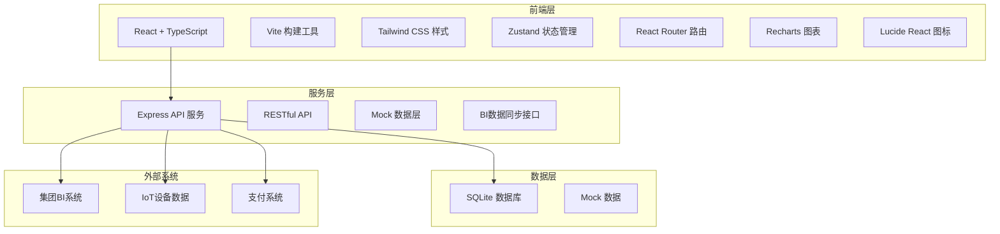
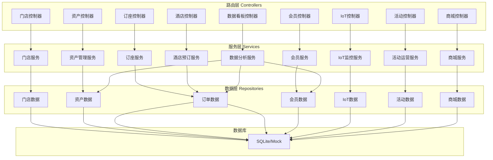
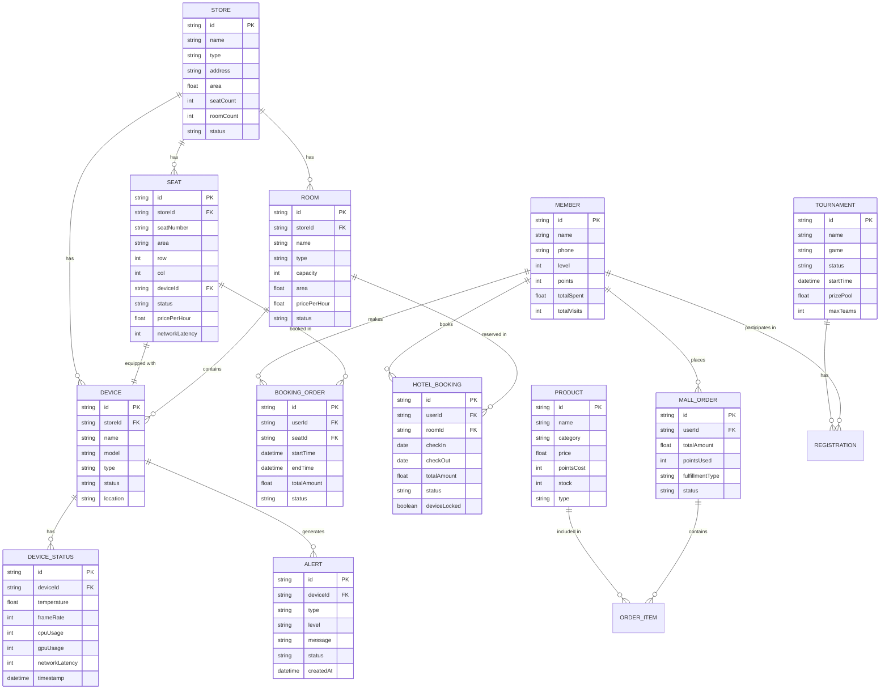

## 1. 架构设计



## 2. 技术描述

- **前端框架**: React 18 + TypeScript 5
- **构建工具**: Vite 5
- **样式方案**: Tailwind CSS 3
- **状态管理**: Zustand
- **路由管理**: React Router DOM 6
- **图表库**: Recharts 2
- **图标库**: Lucide React
- **UI组件**: 自定义组件库（基于Tailwind）
- **后端框架**: Express 4
- **数据库**: SQLite（开发环境使用Mock数据）
- **初始化工具**: vite-init

## 3. 路由定义

| 路由路径 | 页面名称 | 说明 |
|----------|----------|------|
| /login | 登录页 | 账号密码登录 |
| /dashboard | 经营数据看板 | 数据概览、坪效、设备使用率 |
| /assets/seats | 座位管理 | 座位列表、状态、设备配置 |
| /assets/rooms | 包间管理 | 包间列表、设备配置 |
| /assets/devices | 设备管理 | 设备列表、型号、状态 |
| /booking | 智能订座 | 座位筛选、地图、预订 |
| /hotel/rooms | 酒店房型 | 房型管理、设备联动 |
| /hotel/bookings | 酒店预订 | 预订列表、入住管理 |
| /members/list | 会员列表 | 会员信息、等级、积分 |
| /members/levels | 段位等级 | 等级规则、权益配置 |
| /members/exchange | 权益兑换 | 商品兑换、记录 |
| /iot/monitor | IoT监控 | 实时监控大屏 |
| /iot/alerts | 故障预警 | 预警列表、处理记录 |
| /events/tournaments | 赛事管理 | 赛事列表、报名管理 |
| /events/live | 观赛直播 | 直播列表、观看数据 |
| /events/teams | 战队招募 | 战队列表、成员管理 |
| /mall/products | 商品管理 | 商品列表、库存、价格 |
| /mall/orders | 订单履约 | 订单列表、物流跟踪 |
| /settings/stores | 门店管理 | 门店列表、配置 |

## 4. API定义

### 4.1 数据类型定义

```typescript
// 门店
interface Store {
  id: string;
  name: string;
  type: 'esports' | 'hotel' | 'both';
  address: string;
  area: number;
  seatCount: number;
  roomCount: number;
  status: 'open' | 'closed' | 'maintenance';
  createdAt: string;
}

// 座位
interface Seat {
  id: string;
  storeId: string;
  seatNumber: string;
  area: string;
  row: number;
  col: number;
  deviceId: string;
  status: 'available' | 'occupied' | 'reserved' | 'maintenance';
  pricePerHour: number;
  networkLatency: number;
}

// 包间
interface Room {
  id: string;
  storeId: string;
  name: string;
  type: 'standard' | 'deluxe' | 'vip' | 'presidential';
  capacity: number;
  area: number;
  deviceIds: string[];
  pricePerHour: number;
  status: 'available' | 'occupied' | 'reserved' | 'maintenance';
  facilities: string[];
}

// 设备
interface Device {
  id: string;
  storeId: string;
  name: string;
  model: string;
  type: 'pc' | 'monitor' | 'keyboard' | 'mouse' | 'headset' | 'network';
  specs: {
    cpu?: string;
    gpu?: string;
    ram?: string;
    storage?: string;
    monitorSize?: string;
    refreshRate?: number;
  };
  status: 'normal' | 'warning' | 'fault' | 'offline';
  location: string;
  lastMaintenance: string;
  temperature?: number;
  frameRate?: number;
  networkLatency?: number;
}

// 订座订单
interface BookingOrder {
  id: string;
  userId: string;
  storeId: string;
  seatId: string;
  startTime: string;
  endTime: string;
  duration: number;
  totalAmount: number;
  status: 'pending' | 'confirmed' | 'in_progress' | 'completed' | 'cancelled';
  createdAt: string;
}

// 酒店预订
interface HotelBooking {
  id: string;
  userId: string;
  storeId: string;
  roomId: string;
  checkIn: string;
  checkOut: string;
  nights: number;
  totalAmount: number;
  status: 'pending' | 'confirmed' | 'checked_in' | 'checked_out' | 'cancelled';
  guestName: string;
  guestPhone: string;
  deviceLocked: boolean;
  createdAt: string;
}

// 会员
interface Member {
  id: string;
  name: string;
  phone: string;
  avatar: string;
  level: number;
  levelName: string;
  points: number;
  totalSpent: number;
  totalVisits: number;
  rank: string;
  registrationDate: string;
  lastVisit: string;
}

// 会员等级
interface MemberLevel {
  level: number;
  name: string;
  minPoints: number;
  benefits: string[];
  discount: number;
}

// IoT设备状态
interface DeviceStatus {
  deviceId: string;
  temperature: number;
  frameRate: number;
  cpuUsage: number;
  gpuUsage: number;
  memoryUsage: number;
  networkLatency: number;
  uptime: number;
  timestamp: string;
}

// 故障预警
interface Alert {
  id: string;
  deviceId: string;
  storeId: string;
  type: 'temperature' | 'performance' | 'network' | 'hardware';
  level: 'low' | 'medium' | 'high' | 'critical';
  message: string;
  status: 'pending' | 'processing' | 'resolved';
  createdAt: string;
  resolvedAt?: string;
  handler?: string;
}

// 赛事
interface Tournament {
  id: string;
  name: string;
  game: string;
  type: 'online' | 'offline' | 'hybrid';
  status: 'upcoming' | 'registration' | 'ongoing' | 'finished';
  startTime: string;
  endTime: string;
  prizePool: number;
  maxTeams: number;
  registeredTeams: number;
  location?: string;
  coverImage: string;
  description: string;
}

// 商品
interface Product {
  id: string;
  name: string;
  category: string;
  price: number;
  pointsCost: number;
  stock: number;
  image: string;
  description: string;
  type: 'peripheral' | 'time' | 'ticket' | 'food';
}

// 商城订单
interface MallOrder {
  id: string;
  userId: string;
  products: { productId: string; quantity: number; price: number }[];
  totalAmount: number;
  pointsUsed: number;
  fulfillmentType: 'pickup' | 'delivery';
  status: 'pending' | 'processing' | 'shipped' | 'delivered' | 'cancelled';
  address?: string;
  storeId?: string;
  createdAt: string;
}

// 经营数据
interface DashboardData {
  todayRevenue: number;
  todayOrders: number;
  avgOrderValue: number;
  repurchaseRate: number;
  deviceUsageRate: number;
  spaceEfficiency: number;
  activeMembers: number;
  newMembers: number;
}
```

### 4.2 API端点

| 方法 | 路径 | 说明 |
|------|------|------|
| GET | /api/stores | 获取门店列表 |
| GET | /api/stores/:id | 获取门店详情 |
| GET | /api/seats?storeId= | 获取座位列表 |
| PUT | /api/seats/:id/status | 更新座位状态 |
| GET | /api/devices?storeId= | 获取设备列表 |
| GET | /api/devices/:id/status | 获取设备实时状态 |
| POST | /api/bookings | 创建订座订单 |
| GET | /api/bookings | 获取订单列表 |
| PUT | /api/bookings/:id/status | 更新订单状态 |
| POST | /api/hotel/bookings | 创建酒店预订 |
| GET | /api/hotel/bookings | 获取酒店预订列表 |
| PUT | /api/hotel/bookings/:id/checkin | 办理入住 |
| PUT | /api/hotel/bookings/:id/checkout | 办理退房 |
| GET | /api/members | 获取会员列表 |
| GET | /api/members/:id | 获取会员详情 |
| GET | /api/members/levels | 获取会员等级列表 |
| GET | /api/iot/devices/status | 获取IoT设备状态 |
| GET | /api/iot/alerts | 获取故障预警列表 |
| PUT | /api/iot/alerts/:id/resolve | 处理故障预警 |
| GET | /api/tournaments | 获取赛事列表 |
| POST | /api/tournaments/:id/register | 赛事报名 |
| GET | /api/products | 获取商品列表 |
| POST | /api/orders | 创建商城订单 |
| GET | /api/dashboard/overview | 获取经营数据概览 |
| GET | /api/dashboard/revenue-trend | 收入趋势数据 |
| GET | /api/dashboard/device-usage | 设备使用率数据 |

## 5. 服务端架构



## 6. 数据模型

### 6.1 ER图



### 6.2 核心数据表

主要数据表包括：stores（门店）、seats（座位）、rooms（包间）、devices（设备）、members（会员）、booking_orders（订座订单）、hotel_bookings（酒店预订）、products（商品）、mall_orders（商城订单）、device_status（设备状态）、alerts（故障预警）、tournaments（赛事）等。

### 6.3 索引设计

- 所有表主键id建立索引
- 外键字段建立索引
- 常用查询字段建立复合索引（如门店+状态、时间范围+门店等）
