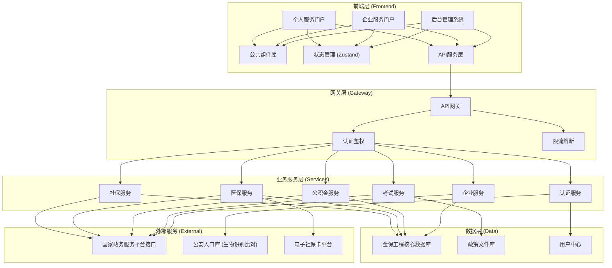
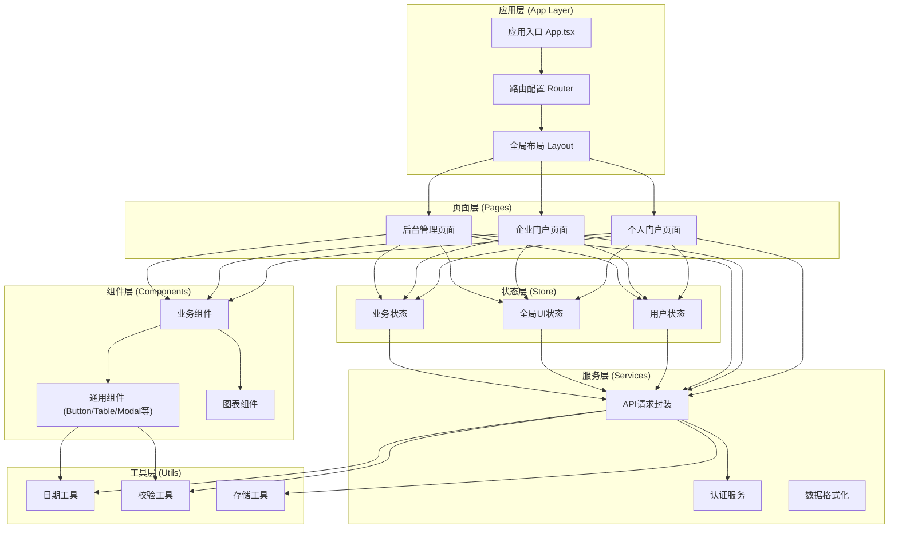
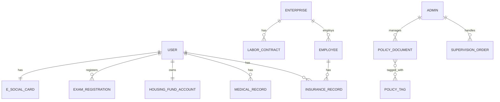

## 1. 架构设计

本项目采用前后端分离架构，前端使用React + TypeScript构建单页应用，后端对接金保工程核心数据库及国家政务服务平台接口。前端采用模块化设计，分为个人服务门户、企业服务门户、后台管理系统三大模块，共享公共组件与服务层。



## 2. 技术描述

### 2.1 前端技术栈

- **框架**: React@18 + TypeScript@5
- **构建工具**: Vite@5
- **样式方案**: TailwindCSS@3 + CSS变量主题系统
- **状态管理**: Zustand@4 (轻量级状态管理)
- **路由**: React Router v6
- **UI组件库**: 基于TailwindCSS自研组件库 + lucide-react图标库
- **图表库**: Recharts@2 (数据可视化)
- **表单处理**: React Hook Form + Zod (表单校验)
- **HTTP客户端**: Axios + 请求拦截器
- **动画**: Framer Motion (页面过渡与微交互)
- **工具库**: dayjs (日期处理)、lodash-es (工具函数)

### 2.2 项目初始化

- 使用Vite官方React TypeScript模板初始化
- 配置TailwindCSS 3.x及相关插件
- 配置ESLint + Prettier代码规范
- 配置路径别名 (@/ 指向 src/)
- 配置环境变量 (.env.development / .env.production)

### 2.3 Mock数据方案

- 使用MSW (Mock Service Worker) 模拟后端接口
- 所有业务数据采用Mock数据模拟，便于前端独立开发
- 模拟金保数据库、公安人口库等外部系统接口

## 3. 路由定义

| 路由路径 | 页面名称 | 模块归属 | 说明 |
|---------|---------|---------|------|
| `/` | 首页门户 | 个人服务 | 服务导航、数据概览、政策公告 |
| `/login` | 登录页 | 公共 | 个人/企业/管理员登录入口 |
| `/personal/social-insurance` | 社保查询 | 个人服务 | 五险缴费明细、账户余额、转移进度 |
| `/personal/housing-fund` | 公积金查询 | 个人服务 | 公积金缴存、贷款、提取业务 |
| `/personal/medical` | 医保服务 | 个人服务 | 就医记录、定点医院、药品目录 |
| `/personal/exam` | 人事考试 | 个人服务 | 考试报名、准考证、成绩查询 |
| `/personal/ecard` | 电子社保卡 | 个人服务 | 卡包管理、NFC闪付、扫码支付 |
| `/personal/profile` | 个人中心 | 个人服务 | 个人信息、实名认证、安全设置 |
| `/enterprise/insurance` | 参保管理 | 企业服务 | 员工参保增减员批量申报 |
| `/enterprise/unemployment` | 失业金预审 | 企业服务 | 失业金申领材料预审 |
| `/enterprise/contract` | 劳动关系 | 企业服务 | 电子合同存证与签署管理 |
| `/enterprise/profile` | 企业中心 | 企业服务 | 企业信息、法人认证 |
| `/admin/dashboard` | 督办仪表盘 | 后台管理 | 业务监控、SLA统计、预警总览 |
| `/admin/supervision` | 业务督办 | 后台管理 | 超时业务督办、工单管理 |
| `/admin/auth-center` | 认证中心 | 后台管理 | 生物识别认证、实名审核 |
| `/admin/policy` | 政策管理 | 后台管理 | 政策文件、智能标签系统 |
| `/messages` | 消息中心 | 公共 | 通知消息、办理进度提醒 |

## 4. API接口定义

### 4.1 接口规范

所有接口严格遵循《国家政务服务平台接口规范》：
- 统一响应格式：`{ code, message, data, timestamp }`
- 统一错误码体系
- 请求签名验证机制
- 接口版本控制 (v1, v2)

### 4.2 核心接口类型定义

```typescript
// 通用响应结构
interface ApiResponse<T = any> {
  code: number;
  message: string;
  data: T;
  timestamp: number;
  requestId: string;
}

// 分页参数
interface PageParams {
  pageNum: number;
  pageSize: number;
}

// 分页结果
interface PageResult<T> {
  list: T[];
  total: number;
  pageNum: number;
  pageSize: number;
}

// 社保缴费记录
interface InsuranceRecord {
  id: string;
  insuranceType: 'pension' | 'medical' | 'unemployment' | 'injury' | 'maternity';
  paymentMonth: string;
  paymentBase: number;
  personalPayment: number;
  companyPayment: number;
  paymentStatus: 'paid' | 'unpaid' | 'refunded';
  companyName: string;
}

// 医保就医记录
interface MedicalRecord {
  id: string;
  hospitalName: string;
  hospitalLevel: string;
  visitDate: string;
  visitType: 'outpatient' | 'inpatient' | 'pharmacy';
  totalAmount: number;
  reimbursementAmount: number;
  personalPayment: number;
  reimbursementRatio: number;
  diagnosis: string;
}

// 企业员工参保信息
interface EmployeeInsurance {
  id: string;
  employeeName: string;
  idCard: string;
  insuranceType: string[];
  paymentBase: number;
  startDate: string;
  status: 'normal' | 'suspended' | 'terminated';
}

// 督办工单
interface SupervisionOrder {
  id: string;
  businessType: string;
  businessNo: string;
  applicantName: string;
  receiveDate: string;
  deadlineDate: string;
  remainingDays: number;
  status: 'normal' | 'warning' | 'overdue' | 'completed';
  currentNode: string;
  handler: string;
}

// 政策文件
interface PolicyDocument {
  id: string;
  title: string;
  documentNo: string;
  issuingAuthority: string;
  publishDate: string;
  effectiveDate: string;
  expiryDate: string;
  tags: PolicyTag[];
  content: string;
  status: 'draft' | 'published' | 'expired';
}

interface PolicyTag {
  id: string;
  name: string;
  category: 'crowd' | 'scene' | 'timeliness';
}
```

### 4.3 主要API列表

| 接口路径 | 方法 | 说明 |
|---------|------|------|
| `/api/auth/login` | POST | 用户登录 |
| `/api/auth/biometric-verify` | POST | 生物识别实名认证 |
| `/api/insurance/list` | GET | 社保缴费记录列表 |
| `/api/insurance/summary` | GET | 社保账户汇总信息 |
| `/api/insurance/transfer-progress` | GET | 社保转移进度 |
| `/api/housing-fund/summary` | GET | 公积金账户汇总 |
| `/api/medical/records` | GET | 医保就医记录 |
| `/api/medical/hospitals` | GET | 定点医院列表 |
| `/api/medical/drugs` | GET | 药品目录 |
| `/api/exam/list` | GET | 考试列表 |
| `/api/exam/register` | POST | 考试报名 |
| `/api/ecard/info` | GET | 电子社保卡信息 |
| `/api/enterprise/employees` | GET | 企业员工列表 |
| `/api/enterprise/batch-add` | POST | 批量参保增员 |
| `/api/enterprise/unemployment-review` | POST | 失业金申领预审 |
| `/api/enterprise/contract/list` | GET | 电子合同列表 |
| `/api/admin/supervision/list` | GET | 督办工单列表 |
| `/api/admin/supervision/statistics` | GET | 督办统计数据 |
| `/api/admin/policy/list` | GET | 政策文件列表 |
| `/api/admin/policy/tags` | GET | 政策标签列表 |
| `/api/messages/list` | GET | 消息列表 |

## 5. 前端架构图



## 6. 数据模型 (Mock数据结构)

### 6.1 实体关系图



### 6.2 目录结构

```
src/
├── assets/              # 静态资源
│   ├── images/
│   └── icons/
├── components/          # 公共组件
│   ├── ui/             # 基础UI组件
│   ├── business/       # 业务组件
│   └── charts/         # 图表组件
├── pages/              # 页面组件
│   ├── personal/       # 个人服务
│   ├── enterprise/     # 企业服务
│   ├── admin/          # 后台管理
│   └── common/         # 公共页面
├── store/              # 状态管理
│   ├── useUserStore.ts
│   ├── useUiStore.ts
│   └── index.ts
├── services/           # API服务
│   ├── request.ts      # axios封装
│   ├── auth.ts
│   ├── insurance.ts
│   ├── medical.ts
│   └── ...
├── types/              # TypeScript类型定义
│   ├── api.ts
│   ├── user.ts
│   ├── insurance.ts
│   └── ...
├── utils/              # 工具函数
│   ├── date.ts
│   ├── validate.ts
│   ├── storage.ts
│   └── format.ts
├── hooks/              # 自定义Hooks
│   ├── useAuth.ts
│   ├── useTable.ts
│   └── ...
├── mock/               # Mock数据
│   ├── handlers/
│   ├── data/
│   └── browser.ts
├── styles/             # 全局样式
│   ├── globals.css
│   └── variables.css
├── router/             # 路由配置
│   └── index.tsx
├── App.tsx
└── main.tsx
```
