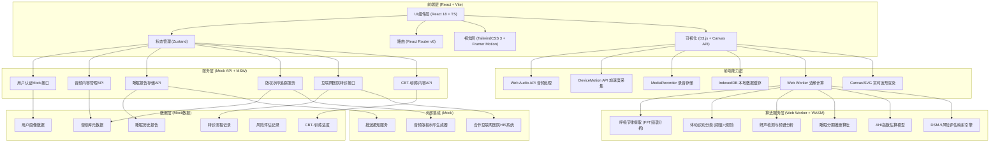
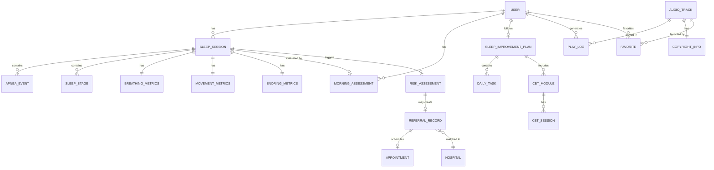

## 1. 架构设计



## 2. 技术栈说明

- **前端框架**：React@18.2 + TypeScript@5 + Vite@5
- **初始化工具**：Vite 官方脚手架 `create-vite`
- **样式方案**：TailwindCSS@3 + 自定义主题配置 + CSS变量
- **状态管理**：Zustand@4（轻量级，避免Redux过度设计）
- **路由方案**：React Router v6（嵌套路由+懒加载）
- **UI动效**：Framer Motion@11（页面过渡、微交互）
- **图表可视化**：D3.js@7 + Recharts@2 + 原生Canvas API
- **日期处理**：dayjs@1（轻量替代moment）
- **图标方案**：Lucide React（线性图标，与设计风格匹配）
- **音频处理**：Web Audio API原生 + DSP.js（FFT计算）
- **数据持久化**：IndexedDB（dexie封装）+ localStorage
- **边缘计算**：Web Workers + comlink封装
- **Mock服务**：MSW@2（Mock Service Worker）
- **代码规范**：ESLint + Prettier + Husky + lint-staged

## 3. 路由定义

| 路由路径 | 页面名称 | 说明 |
|----------|----------|------|
| `/` | 首页仪表盘 | 睡眠概览、今日建议、快捷入口、睡眠趋势 |
| `/monitor` | 睡眠监测页 | 传感器状态、实时波形画布、监测控制 |
| `/report/:date` | 睡眠报告详情 | 睡眠分期、核心指标、异常标记、历史对比 |
| `/reports` | 睡眠报告列表 | 历史报告列表、时间筛选、导出功能 |
| `/audio` | 音频干预库 | 场景分类、音频卡片、搜索收藏 |
| `/plan` | 睡眠改善计划 | 作息日历、CBT-I训练、任务打卡 |
| `/morning` | 晨间自评 | 多维度量表、自评反馈 |
| `/risk` | 风险评估中心 | DSM-5雷达图、呼吸暂停预警、转诊流程 |
| `/referral/:id` | 转诊详情页 | 转诊进度、医院信息、预约入口 |
| `/profile` | 个人中心 | 个人资料、隐私授权、版权追踪、设置 |

## 4. API接口定义

### 4.1 TypeScript 类型定义

```typescript
// 用户相关
interface User {
  id: string;
  nickname: string;
  avatar?: string;
  phone?: string;
  email?: string;
  createdAt: string;
  settings: UserSettings;
}

interface UserSettings {
  micAuthorized: boolean;
  motionAuthorized: boolean;
  dataLocalOnly: boolean;
  medicalShareAllowed: boolean;
  notificationEnabled: boolean;
}

// 睡眠监测
interface SleepSession {
  id: string;
  userId: string;
  startTime: string;
  endTime: string;
  totalDuration: number; // seconds
  sleepEfficiency: number; // 0-100
  sleepLatency: number; // seconds to fall asleep
  sleepStages: SleepStage[];
  breathingMetrics: BreathingMetrics;
  movementMetrics: MovementMetrics;
  snoringMetrics: SnoringMetrics;
  apneaEvents: ApneaEvent[];
  ahiIndex: number;
  environmentNoise: number; // dB avg
}

interface SleepStage {
  stage: 'awake' | 'light' | 'deep' | 'rem';
  startTime: number; // offset seconds
  duration: number; // seconds
  confidence: number;
}

interface BreathingMetrics {
  avgRate: number; // bpm
  minRate: number;
  maxRate: number;
  rateSeries: { time: number; value: number }[];
  regularity: number; // 0-100
}

interface MovementMetrics {
  totalTurns: number;
  movementIntensity: { time: number; value: number }[];
  restlessPeriods: { start: number; end: number; intensity: number }[];
}

interface SnoringMetrics {
  totalEpisodes: number;
  totalDuration: number;
  avgLoudness: number; // dB
  spectrumHeatmap: number[][]; // 2D array [frequency][time]
  frequencyBands: { band: string; energy: number }[];
}

interface ApneaEvent {
  id: string;
  startTime: number; // offset
  duration: number; // seconds
  type: 'obstructive' | 'central' | 'mixed' | 'suspected';
  severity: 'mild' | 'moderate' | 'severe';
  oxygenDrop?: number;
  confidence: number;
}

// 晨间自评
interface MorningAssessment {
  id: string;
  sessionId: string;
  userId: string;
  assessedAt: string;
  alertness: number; // SSS 1-7
  sleepQuality: number; // 1-10
  mood: number; // VAS 0-100
  thoughtInterference: number; // 1-5
  notes?: string;
}

// 音频内容
interface AudioTrack {
  id: string;
  title: string;
  description: string;
  coverImage: string;
  duration: number; // seconds
  category: 'anxiety' | 'stress' | 'insomnia' | 'meditation';
  tags: string[];
  author: string;
  copyrightInfo: CopyrightInfo;
  playCount: number;
  favorited: boolean;
  audioUrl: string;
  watermarkEmbedded: boolean;
}

interface CopyrightInfo {
  contentId: string;
  watermarkId: string;
  licenseType: string;
  copyrightHolder: string;
  royaltyInfo: string;
}

interface WatermarkLog {
  id: string;
  audioId: string;
  userId: string;
  playedAt: string;
  duration: number;
  watermarkId: string;
  deviceFingerprint: string;
}

// 睡眠改善计划
interface SleepImprovementPlan {
  id: string;
  userId: string;
  startDate: string;
  durationWeeks: number;
  status: 'active' | 'completed' | 'paused';
  sleepRestriction: SleepRestrictionConfig;
  cbtModules: CBTModule[];
  tasks: DailyTask[];
}

interface SleepRestrictionConfig {
  currentBedTime: string;
  targetBedTime: string;
  currentWakeTime: string;
  targetWakeTime: string;
  weeklyAdjustMinutes: number;
  sleepEfficiencyThreshold: number;
}

interface CBTModule {
  id: string;
  type: 'sleep_restriction' | 'stimulus_control' | 'cognitive_restructuring' | 'relaxation';
  title: string;
  description: string;
  progress: number;
  sessions: CBTSession[];
}

interface CBTSession {
  id: string;
  title: string;
  content: string;
  completed: boolean;
  exercise?: CBTExercise;
}

interface CBTExercise {
  type: 'thought_record' | 'behavior_checklist' | 'breathing' | 'progressive_relaxation';
  prompts: string[];
  userInput?: Record<string, string>;
}

interface DailyTask {
  id: string;
  date: string;
  type: 'schedule' | 'cbt' | 'audio' | 'assessment' | 'habit';
  title: string;
  description: string;
  completed: boolean;
  completedAt?: string;
  rewardPoints: number;
}

// 风险评估
interface RiskAssessment {
  id: string;
  sessionId?: string;
  userId: string;
  assessedAt: string;
  overallRisk: 'low' | 'moderate' | 'high';
  dsm5Mapping: DSM5Dimension[];
  ahiBasedRisk?: AHIRisk;
  referralTriggered: boolean;
  recommendations: string[];
}

interface DSM5Dimension {
  disorder: 'insomnia' | 'osa' | 'restless_legs' | 'periodic_limb' | 'narcolepsy' | 'circadian_rhythm';
  dsm5Code: string;
  riskLevel: 'low' | 'moderate' | 'high';
  score: number; // 0-100
  threshold: number;
  evidences: string[];
  diagnosticCriteriaMet: string[];
}

interface AHIRisk {
  ahiValue: number;
  eventsCount: number;
  severity: 'normal' | 'mild' | 'moderate' | 'severe';
  threshold: number;
}

// 转诊
interface ReferralRecord {
  id: string;
  userId: string;
  assessmentId: string;
  sessionId: string;
  createdAt: string;
  status: 'pending_auth' | 'data_packaging' | 'report_generated' | 'hospital_matched' | 'appointment_scheduled' | 'consultation_completed';
  consentGiven: boolean;
  consentGivenAt?: string;
  reportId?: string;
  matchedHospital?: HospitalInfo;
  appointment?: AppointmentInfo;
  consultationResult?: string;
}

interface HospitalInfo {
  id: string;
  name: string;
  department: string;
  city: string;
  level: string;
  cooperationType: string;
}

interface AppointmentInfo {
  id: string;
  scheduledAt: string;
  doctorName: string;
  consultationType: 'video' | 'phone' | 'onsite';
  meetingLink?: string;
  status: 'scheduled' | 'completed' | 'cancelled';
}
```

### 4.2 API 接口列表

| 接口路径 | 方法 | 功能 | 请求/响应 |
|----------|------|------|-----------|
| `/api/auth/login` | POST | 用户登录 | `{ phone/password } → { user, token }` |
| `/api/auth/profile` | GET | 获取用户信息 | `→ { User }` |
| `/api/auth/settings` | PUT | 更新用户设置 | `{ UserSettings } → { UserSettings }` |
| `/api/sleep/sessions` | GET | 获取睡眠记录列表 | `?from=&to=&limit= → { SleepSession[] }` |
| `/api/sleep/sessions/:id` | GET | 获取单条睡眠详情 | `→ { SleepSession }` |
| `/api/sleep/sessions` | POST | 上传睡眠会话 | `{ SleepSession } → { id }` |
| `/api/sleep/export` | GET | 导出睡眠报告 | `?format=pdf/csv → Blob` |
| `/api/morning/assessment` | POST | 提交晨间自评 | `{ MorningAssessment } → { id }` |
| `/api/morning/insights` | GET | 获取自评趋势洞察 | `→ { trend, insights }` |
| `/api/audio/tracks` | GET | 获取音频列表 | `?category=&search=&page= → { AudioTrack[], total }` |
| `/api/audio/tracks/:id` | GET | 获取音频详情 | `→ { AudioTrack }` |
| `/api/audio/favorites` | POST/DELETE | 收藏/取消收藏 | `{ trackId } → { status }` |
| `/api/audio/playlog` | POST | 上报播放记录（水印追踪） | `{ WatermarkLog } → { verified }` |
| `/api/audio/watermark/verify` | GET | 校验版权水印 | `?watermarkId= → { CopyrightInfo }` |
| `/api/plan/current` | GET | 获取当前改善计划 | `→ { SleepImprovementPlan }` |
| `/api/plan/generate` | POST | 生成个性化改善计划 | `{ baseline } → { SleepImprovementPlan }` |
| `/api/plan/tasks/:id` | PATCH | 打卡任务 | `{ completed: true } → { points }` |
| `/api/plan/cbt/:sessionId` | POST | 提交CBT练习答案 | `{ exercise } → { progress }` |
| `/api/risk/assess` | POST | 执行风险评估 | `{ sessionId } → { RiskAssessment }` |
| `/api/risk/history` | GET | 风险评估历史 | `→ { RiskAssessment[] }` |
| `/api/referral/create` | POST | 创建转诊申请 | `{ assessmentId, consent } → { ReferralRecord }` |
| `/api/referral/:id` | GET | 获取转诊进度 | `→ { ReferralRecord }` |
| `/api/referral/hospitals` | GET | 获取合作医院列表 | `→ { HospitalInfo[] }` |
| `/api/referral/appointment` | POST | 预约远程初筛 | `{ referralId, hospitalId, slot } → { AppointmentInfo }` |

## 5. 前端内部模块架构

```mermaid
graph TB
    subgraph "页面层 Pages"
        P1["DashboardPage 首页"]
        P2["MonitorPage 监测"]
        P3["ReportPage 报告"]
        P4["AudioPage 音频"]
        P5["PlanPage 计划"]
        P6["MorningPage 自评"]
        P7["RiskPage 风险"]
        P8["ProfilePage 个人"]
    end

    subgraph "组件层 Components"
        C1["SleepOverviewCard 概览卡片"]
        C2["RealtimeWaveformCanvas 实时波形"]
        C3["SleepStagesTimeline 分期时间轴"]
        C4["BreathingBoxplot 呼吸箱线图"]
        C5["SnoringHeatmap 鼾声热力图"]
        C6["AudioPlayer 播放器"]
        C7["ScheduleCalendar 作息日历"]
        C8["CBTModuleCard 训练卡片"]
        C9["DSM5RadarChart DSM雷达图"]
        C10["ReferralStepper 转诊流程条"]
        C11["TaskChecklist 任务清单"]
        C12["AssessmentScale 评量表"]
    end

    subgraph "状态层 Store (Zustand)"
        S1["useAuthStore 用户态"]
        S2["useSleepStore 睡眠数据"]
        S3["useAudioStore 音频播放"]
        S4["usePlanStore 改善计划"]
        S5["useMonitorStore 实时监测"]
        S6["useRiskStore 风险评估"]
    end

    subgraph "能力层 Hooks"
        H1["useMicrophone 麦克风采集"]
        H2["useDeviceMotion 加速度采集"]
        H3["useAudioProcessor 音频DSP"]
        H4["useSleepAnalyzer 睡眠分析"]
        H5["useWatermark 水印嵌入/校验"]
        H6["useIndexedDB 本地存储"]
    end

    subgraph "计算层 Workers"
        W1["dsp.worker.ts FFT/频谱"]
        W2["sleep.worker.ts 睡眠分期"]
        W3["risk.worker.ts 风险评估"]
    end

    P1 & P2 & P3 & P4 & P5 & P6 & P7 & P8 --> C1 & C2 & C3 & C4 & C5 & C6 & C7 & C8 & C9 & C10 & C11 & C12
    C1 --> S2
    C2 --> S5
    C3 & C4 & C5 --> S2
    C6 --> S3
    C7 & C8 & C11 --> S4
    C9 & C10 --> S6
    C12 --> S2
    S5 --> H1 & H2 & H3
    H3 --> W1
    S2 --> H4 --> W2
    S6 --> W3
    S3 --> H5
```



## 6. 数据模型 (Mock数据说明)

### 6.1 实体关系



### 6.2 Mock数据初始数据集

- 用户数据：1个主测试用户 + 完整设置
- 睡眠会话：近14天的模拟数据，包含2天带轻度呼吸暂停异常
- 晨间自评：对应14天的评分数据
- 音频库：32条内容（焦虑8条/压力8条/失眠10条/冥想6条），含完整版权信息
- 睡眠改善计划：激活状态4周计划，第1周进度30%
- 风险评估：2条历史评估，其中1条触发OSA中度风险
- 转诊记录：1条进行中，已完成医院匹配
- 合作医院：5家不同城市三甲医院睡眠中心

## 7. 关键技术实现方案

### 7.1 实时监测技术栈
- **麦克风采集**：`navigator.mediaDevices.getUserMedia` → `AudioContext` → `AnalyserNode` 实时获取时域/频域数据
- **加速度采集**：`DeviceMotionEvent` API，采样率约60Hz，低通滤波分离重力
- **呼吸提取**：FFT分析0.2-0.8Hz频段（对应12-48次/分钟），峰值追踪提取呼吸节律
- **体动识别**：3轴加速度合成向量阈值判断，结合持续时间分类翻身/微动
- **鼾声检测**：频域60-300Hz能量阈值 + 谐波结构特征，事件聚合统计
- **Canvas渲染**：双缓冲离屏画布，requestAnimationFrame驱动，滚动窗口60fps

### 7.2 睡眠分期算法（规则推断版）
- 输入：呼吸变异性、体动强度、时间特征
- 规则：体动少+呼吸稳定→深睡；体动极少+呼吸不规则→REM；体动多→浅睡/清醒
- 输出：30秒epoch为单位的分期序列，含置信度
- 运行位置：Web Worker，结束监测后5秒内完成

### 7.3 DSM-5风险映射引擎
- 维度：失眠/OSA/不宁腿/周期性腿动/发作性睡病/昼夜节律
- 输入：睡眠指标 + 自评数据 + 问卷答案
- 规则：各维度匹配DSM-5诊断条目，满足N条打M分，阈值分层
- 输出：六维雷达图数据 + 严重程度 + 匹配条目

### 7.4 音频版权水印系统
- 嵌入：播放端Web Audio在极高频段（>18kHz）叠加伪随机码序列
- 追踪：上报 watermarkId + 设备指纹 + 播放时长
- 校验：服务端比对 watermarkId 与 contentId 映射表
- 日志：用户可在个人中心查看所有播放记录的版权溯源

### 7.5 转诊系统安全合规
- 授权：用户显式签署电子知情同意
- 脱敏：姓名脱敏、手机号中间4位星号、精确地理位置移除
- 加密：传输TLS1.3 + 报告AES-256加密
- 审计：全流程操作日志留痕，支持合规审查
