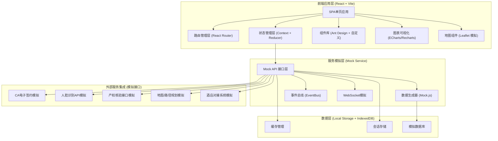

## 1. 架构设计



## 2. 技术说明

- **前端框架**：React 18 + TypeScript (严格模式)
- **构建工具**：Vite 5.x (HMR热更新，按需编译)
- **样式方案**：Tailwind CSS 3.x + SCSS Modules (混合方案)
- **UI组件库**：Ant Design 5.x (企业级组件库) + 自定义主题覆盖
- **状态管理**：React Context + useReducer (轻量级方案，避免过度工程化)
- **路由管理**：React Router v6 (嵌套路由、懒加载、路由守卫)
- **图表可视化**：
  - ECharts 5.x (主力图表库：地图热力图、柱状图、折线图、仪表盘、雷达图)
  - Recharts (辅助：Sparkline迷你趋势线)
- **地图组件**：自定义SVG模拟地图 + Leaflet接口兼容层 (避免外部地图API依赖)
- **网络请求**：Axios + 拦截器 (Mock层通过拦截器实现接口模拟)
- **数据校验**：Zod (运行时类型校验，表单验证)
- **表单处理**：React Hook Form + Ant Design 适配层
- **工具库**：
  - dayjs (日期处理)
  - lodash-es (工具函数，按需引入)
  - uuid (唯一ID生成)
  - classnames (className合并)
- **代码规范**：ESLint + Prettier + Husky + lint-staged

## 3. 路由定义

| 路由路径 | 页面名称 | 说明 |
|----------|----------|------|
| `/dashboard` | 数据看板中心 | 默认首页，核心KPI、趋势图表、地图热力 |
| `/landlord/audit` | 房东准入审核列表 | 待审核房东列表、筛选搜索、状态管理 |
| `/landlord/audit/:id` | 房东审核详情页 | 产权核验、人脸活体比对、审批操作 |
| `/property/list` | 房源管理列表 | 三态标记、房源状态、毫秒级同步演示 |
| `/property/detail/:id` | 房源详情页 | 价格指数、核验信息、历史记录 |
| `/property/search` | 智能房源搜索 | 通勤匹配、骑行热力图、筛选排序 |
| `/contract/list` | 合同管理列表 | 合同状态、签约进度、到期预警 |
| `/contract/detail/:id` | 合同详情页 | CA签约流程、分账计划、备案信息 |
| `/credit/manage` | 信用分管理 | 租客信用分、评分维度、押金减免规则 |
| `/service/workorder` | 维修工单中心 | GPS派单地图、工单列表、超时升级管理 |
| `/service/emergency` | 应急安置中心 | 不可抗力判定、协议调用、酒店对接 |
| `/audit/logs` | 操作审计日志 | 全链路操作留痕、筛选导出、合规溯源 |

## 4. API 接口定义 (TypeScript类型)

```typescript
// ========== 通用响应结构 ==========
interface ApiResponse<T = any> {
  code: number;
  message: string;
  data: T;
  timestamp: number;
  requestId: string;
}

interface PagedResponse<T> {
  list: T[];
  total: number;
  page: number;
  pageSize: number;
}

// ========== 房东准入模块 ==========
interface LandlordApplication {
  id: string;
  applyNo: string;
  name: string;
  idCardNo: string;
  phone: string;
  avatarUrl: string;
  idCardFrontUrl: string;
  idCardBackUrl: string;
  propertyCertUrl: string[];
  propertyCertNo: string;
  propertyAddress: string;
  submitTime: string;
  auditStatus: 'pending' | 'auto_checking' | 'reviewing' | 'approved' | 'rejected';
  priority: 'high' | 'medium' | 'low';
  
  realNameVerify?: VerifyResult;
  propertyVerify?: PropertyVerifyResult;
  faceVerify?: FaceVerifyResult;
  
  auditorId?: string;
  auditorName?: string;
  auditTime?: string;
  auditRemark?: string;
}

interface VerifyResult {
  passed: boolean;
  score: number;
  verifyTime: string;
  details: Record<string, any>;
}

interface PropertyVerifyResult extends VerifyResult {
  certNoValid: boolean;
  ownerMatched: boolean;
  propertyExists: boolean;
  noMortgage: boolean;
}

interface FaceVerifyResult extends VerifyResult {
  matchScore: number;
  livenessScore: number;
  antiSpoofingPassed: boolean;
  faceCompareUrl: string;
}

// ========== 房源管理模块 ==========
interface Property {
  id: string;
  propertyNo: string;
  title: string;
  address: string;
  district: string;
  community: string;
  buildingNo: string;
  roomNo: string;
  area: number;
  layout: string;
  floor: string;
  orientation: string;
  decoration: string;
  monthlyRent: number;
  depositMonth: number;
  landlordId: string;
  landlordName: string;
  
  videoVerify: VerifyState;
  vrVerify: VerifyState;
  onSiteVerify: VerifyState;
  authenticityScore: number;
  
  status: 'draft' | 'verifying' | 'listed' | 'rented' | 'offline' | 'removed';
  listTime?: string;
  rentTime?: string;
  offlineTime?: string;
  
  priceIndex?: PriceIndexData;
  commuteInfo?: CommuteInfo;
  images: string[];
  vrTourUrl?: string;
  videoUrl?: string;
  
  geoLocation: { lat: number; lng: number };
}

interface VerifyState {
  status: 'unverified' | 'pending' | 'passed' | 'failed';
  verifyTime?: string;
  verifyBy?: string;
  remark?: string;
  attachments?: string[];
}

interface PriceIndexData {
  communityAvgPrice: number;
  districtAvgPrice: number;
  cityAvgPrice: number;
  priceRange: [number, number];
  yoyChange: number;
  momChange: number;
  historyData: { month: string; avgPrice: number }[];
}

interface CommuteInfo {
  workplace?: string;
  metroWalkTime?: number;
  metroStation?: string;
  bikeTime?: number;
  bikeDistance?: number;
  driveTime?: number;
  totalScore: number;
}

// ========== 合同管理模块 ==========
interface Contract {
  id: string;
  contractNo: string;
  propertyId: string;
  propertyTitle: string;
  landlordId: string;
  landlordName: string;
  tenantId: string;
  tenantName: string;
  tenantCreditScore: number;
  depositReductionRate: number;
  
  startDate: string;
  endDate: string;
  rentPeriod: 'monthly' | 'quarterly' | 'yearly';
  monthlyRent: number;
  depositAmount: number;
  actualDepositAmount: number;
  serviceFeeRate: number;
  
  includesGovClause: boolean;
  govClauseVersion: string;
  
  status: 'draft' | 'pending_tenant_sign' | 'pending_landlord_sign' | 'signed' | 'performing' | 'expiring' | 'expired' | 'breached';
  
  tenantSignInfo?: CASignInfo;
  landlordSignInfo?: CASignInfo;
  timestampHash?: string;
  govRecordNo?: string;
  
  escrowAccount: string;
  settlementPlan: SettlementPlanItem[];
  settlementRecords: SettlementRecord[];
  
  createTime: string;
  signTime?: string;
}

interface CASignInfo {
  signerId: string;
  signerName: string;
  signTime: string;
  certSerialNo: string;
  certIssuer: string;
  signatureValue: string;
  signedPdfUrl: string;
}

interface SettlementPlanItem {
  periodNo: number;
  dueDate: string;
  rentAmount: number;
  serviceFee: number;
  transferAmount: number;
  status: 'pending' | 'paid_to_escrow' | 'transferred' | 'overdue';
  paidDate?: string;
  transferDate?: string;
}

interface SettlementRecord {
  id: string;
  periodNo: number;
  amount: number;
  type: 'rent_in' | 'service_fee' | 'transfer_out' | 'refund';
  transactionNo: string;
  bankFlowUrl?: string;
  createTime: string;
}

// ========== 信用分模块 ==========
interface CreditProfile {
  tenantId: string;
  tenantName: string;
  score: number;
  level: 'excellent' | 'good' | 'normal' | 'poor';
  lastUpdate: string;
  
  dimensionScores: {
    paymentHistory: number;
    contractCompliance: number;
    propertyCare: number;
    socialBehavior: number;
    identityVerification: number;
  };
  
  depositReductionRate: number;
  maxReductionRate: number;
  
  historyEvents: CreditEvent[];
}

interface CreditEvent {
  id: string;
  type: 'positive' | 'negative';
  category: string;
  description: string;
  scoreChange: number;
  relatedContractNo?: string;
  createTime: string;
}

// ========== 租后服务模块 ==========
interface ServiceWorkOrder {
  id: string;
  orderNo: string;
  type: 'repair' | 'consult' | 'complaint' | 'emergency';
  priority: 'urgent' | 'high' | 'medium' | 'low';
  status: 'pending_response' | 'responding' | 'assigned' | 'processing' | 'completed' | 'escalated' | 'closed';
  
  tenantId: string;
  tenantName: string;
  tenantPhone: string;
  propertyId: string;
  propertyAddress: string;
  geoLocation: { lat: number; lng: number };
  
  title: string;
  description: string;
  category: string;
  images: string[];
  
  createTime: string;
  responseDeadline: string;
  responseTime?: string;
  completeTime?: string;
  actualCompleteTime?: string;
  
  responderId?: string;
  responderName?: string;
  assigneeId?: string;
  assigneeName?: string;
  assigneeLocation?: { lat: number; lng: number };
  etaMinutes?: number;
  distanceKm?: number;
  
  escalated: boolean;
  escalateTime?: string;
  escalateReason?: string;
  
  timeline: OrderTimelineItem[];
  rating?: number;
  ratingComment?: string;
}

interface OrderTimelineItem {
  id: string;
  action: string;
  operatorName: string;
  operatorRole: string;
  remark?: string;
  createTime: string;
}

interface EmergencyPlacement {
  id: string;
  workOrderId: string;
  triggerType: 'fire' | 'flood' | 'earthquake' | 'structural' | 'epidemic' | 'other';
  forceMajeureConfirmed: boolean;
  protocolTemplateId: string;
  protocolTemplateName: string;
  
  tenantIds: string[];
  affectedPropertyIds: string[];
  
  hotelPartnerId: string;
  hotelName: string;
  hotelAddress: string;
  roomCount: number;
  checkInDate: string;
  checkOutDate: string;
  estimatedCost: number;
  actualCost?: number;
  
  status: 'triggered' | 'protocol_signed' | 'hotel_booked' | 'checked_in' | 'completed' | 'settled';
  protocolSignStatus: 'pending' | 'tenant_signed' | 'all_signed';
  
  createTime: string;
  timeline: EmergencyTimelineItem[];
}

interface EmergencyTimelineItem {
  id: string;
  action: string;
  operatorName: string;
  remark?: string;
  createTime: string;
}

// ========== 审计日志模块 ==========
interface AuditLog {
  id: string;
  logId: string;
  timestamp: string;
  
  userId: string;
  userName: string;
  userRole: string;
  
  module: string;
  action: string;
  targetType: string;
  targetId: string;
  targetName: string;
  
  ipAddress: string;
  userAgent: string;
  
  requestParams?: Record<string, any>;
  responseSnapshot?: Record<string, any>;
  changes?: DataChangeItem[];
  
  result: 'success' | 'failed';
  failReason?: string;
  
  sessionId: string;
  correlationId?: string;
}

interface DataChangeItem {
  field: string;
  oldValue: any;
  newValue: any;
}

// ========== 数据看板指标 ==========
interface DashboardMetrics {
  activeListings: MetricCard;
  pendingAudits: MetricCard;
  contractConversionRate: MetricCard;
  performanceRate: MetricCard;
  avgResponseTime: MetricCard;
  complaintRate: MetricCard;
  revenueTotal: MetricCard;
  creditExcellentCount: MetricCard;
}

interface MetricCard {
  value: number;
  unit?: string;
  prefix?: string;
  trend: number;
  trendType: 'up' | 'down' | 'flat';
  comparedTo: 'last_week' | 'last_month' | 'last_quarter';
  sparkline: number[];
  targetValue?: number;
}

interface MapHeatmapPoint {
  id: string;
  lat: number;
  lng: number;
  value: number;
  type: 'listing' | 'transaction' | 'price';
  label: string;
}

// ========== 地图与路径规划 ==========
interface BikeHeatmapCell {
  gridX: number;
  gridY: number;
  lat: number;
  lng: number;
  convenienceScore: number;
  avgBikeTime: number;
  trafficDensity: number;
}

interface IsolinePoint {
  lat: number;
  lng: number;
}

interface CommuteIsoline {
  timeMinutes: number;
  transportMode: 'walk' | 'bike' | 'drive' | 'metro';
  boundary: IsolinePoint[];
}
```

## 5. 前端组件层次结构

```mermaid
graph TD
    subgraph "布局层 Layout"
        L1["App 根组件"]
        L2["MainLayout 主布局"]
        L3["Sidebar 侧边导航"]
        L4["Topbar 顶部栏"]
        L5["Breadcrumb 面包屑"]
    end

    subgraph "通用组件层 Common"
        C1["DataCard 数据指标卡"]
        C2["StatusBadge 状态徽章"]
        C3["ProgressRing 进度圆环"]
        C4["Timeline 时间轴"]
        C5["Sparkline 迷你趋势线"]
        C6["TableAdvanced 高级表格"]
        C7["Drawer 抽屉面板"]
        C8["ConfirmDialog 确认弹窗"]
        C9["Toast 通知"]
    end

    subgraph "数据看板 Dashboard"
        D1["MetricsGrid 指标网格"]
        D2["HeatmapMap 热力地图"]
        D3["ChartsPanel 图表面板"]
        D4["ActivityFeed 实时动态流"]
    end

    subgraph "房东审核 Landlord"
        LA1["AuditList 审核列表"]
        LA2["AuditFilterBar 筛选栏"]
        LA3["PropertyVerifyPanel 产权核验面板"]
        LA4["FaceVerifyPanel 人脸比对面板"]
        LA5["AuditActions 审批操作组"]
    end

    subgraph "房源管理 Property"
        P1["PropertyList 房源列表"]
        P2["TriVerifyTag 三态核验标签"]
        P3["PriceIndexChart 价格指数图"]
        P4["CommuteMapPanel 通勤地图"]
        P5["BikeHeatmapOverlay 骑行热力图层"]
    end

    subgraph "合同管理 Contract"
        CT1["ContractList 合同列表"]
        CT2["SignTimeline 签约时间轴"]
        CT3["CASignPanel CA签约面板"]
        CT4["SettlementTable 分账计划表"]
        CT5["CreditGauge 信用仪表盘"]
    end

    subgraph "租后服务 Service"
        S1["WorkOrderBoard 工单看板"]
        S2["DispatchMap 派单地图"]
        S3["EngineerMarker 工程师标记"]
        S4["EmergencyTrigger 应急触发面板"]
        S5["HotelProgress 酒店对接进度"]
    end

    subgraph "审计日志 Audit"
        AU1["LogFilterPanel 日志筛选"]
        AU2["LogTable 日志表格"]
        AU3["LogDetailDrawer 日志详情"]
    end

    L1 --> L2
    L2 --> L3
    L2 --> L4
    L2 --> L5
    
    L5 --> D1
    D1 --> D2
    D1 --> D3
    D1 --> D4
    
    L5 --> LA1
    LA1 --> LA2
    LA1 --> LA3
    LA1 --> LA4
    LA1 --> LA5
    
    L5 --> P1
    P1 --> P2
    P1 --> P3
    P1 --> P4
    P4 --> P5
    
    L5 --> CT1
    CT1 --> CT2
    CT1 --> CT3
    CT1 --> CT4
    CT1 --> CT5
    
    L5 --> S1
    S1 --> S2
    S2 --> S3
    S1 --> S4
    S4 --> S5
    
    L5 --> AU1
    AU1 --> AU2
    AU2 --> AU3
    
    C1 -.-> D1
    C2 -.-> LA1
    C2 -.-> P1
    C2 -.-> CT1
    C3 -.-> CT5
    C4 -.-> CT2
    C4 -.-> S4
    C5 -.-> C1
    C6 -.-> LA1
    C6 -.-> CT4
    C6 -.-> AU2
    C7 -.-> LA3
    C8 -.-> LA5
```



## 6. 数据模型与Mock数据生成策略

### 6.1 Mock数据生成

使用 Mock.js + 自定义工厂函数生成高质量模拟数据：

- **房东申请数据**：每次生成50-100条，状态分布：待审核30%、自动审核中20%、人工复核25%、通过20%、驳回5%
- **房源数据**：生成200-300条房源，覆盖3个行政区15个小区，租金价格围绕均价±30%正态分布
- **合同数据**：生成100-150份合同，履约周期3/6/12个月，分账计划按月份/季度生成
- **工单数据**：生成80-120条工单，维修类占60%、咨询20%、投诉10%、应急10%
- **审计日志**：每个操作自动写入，支持分页查询，每页50条

### 6.2 关键算法模拟实现

1. **通勤距离算法**：基于经纬度Haversine公式计算直线距离，结合城市平均速度(步行5km/h、骑行15km/h、地铁30km/h)换算时间，叠加随机±20%扰动模拟真实路况
2. **租金价格指数**：小区基准价 × 楼层系数 × 朝向系数 × 装修系数 × 面积系数，生成合理的价格区间[基准价×0.85, 基准价×1.15]
3. **信用分计算**：身份核验(15%)+ 支付历史(35%)+ 合同履约(25%)+ 房屋维护(15%)+ 社会行为(10%)，总分线性加权求和
4. **GPS就近派单**：计算工单位置与所有在线工程师的Haversine距离，取最近3名，按在线时长加权排序，优先派给距离最近且空闲时长最长的工程师
