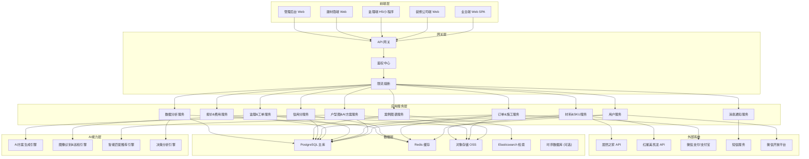
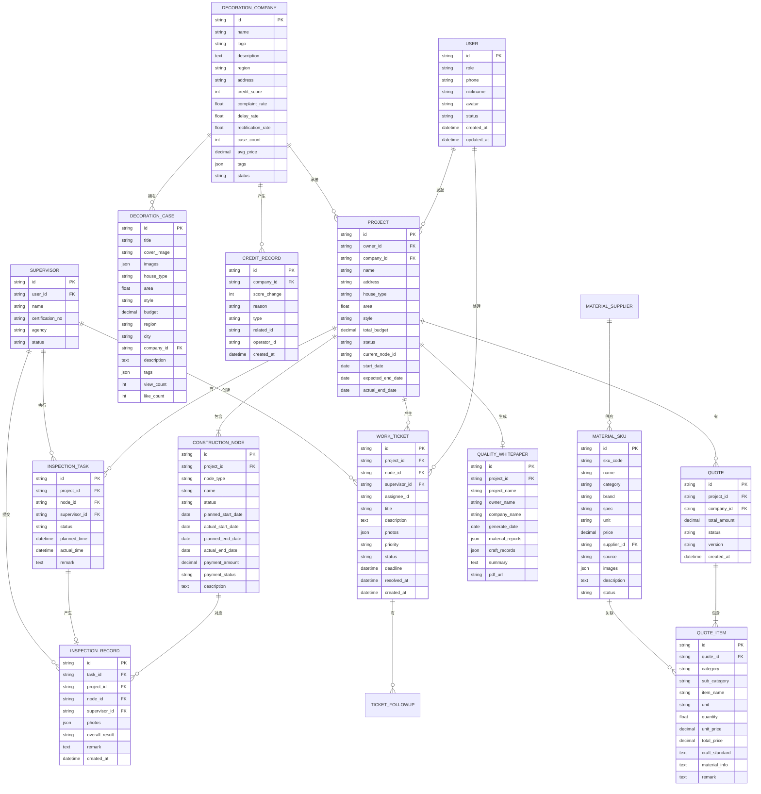

# 装修服务全链路管控平台 技术架构文档

## 1. 架构设计



## 2. 技术选型

### 2.1 前端技术栈

| 类别 | 技术选型 | 版本 | 说明 |
|------|----------|------|------|
| 框架 | React | 18.x | 组件化开发，生态丰富 |
| 语言 | TypeScript | 5.x | 类型安全，提升可维护性 |
| 构建工具 | Vite | 5.x | 极速开发体验，构建快 |
| 样式方案 | Tailwind CSS | 3.x | 原子化CSS，开发效率高 |
| 状态管理 | Zustand | 4.x | 轻量级，API简洁 |
| 路由 | React Router | 6.x | 声明式路由 |
| UI 组件库 | Ant Design | 5.x | 企业级组件库，后台管理 |
| 图表库 | ECharts | 5.x | 数据可视化，图表丰富 |
| 3D/全景 | Photo Sphere Viewer | 5.x | 全景图浏览 |
| HTTP 客户端 | Axios | 1.x | 网络请求，拦截器支持 |
| 表单校验 | React Hook Form | 7.x | 高性能表单 |
| 日期处理 | dayjs | 1.x | 轻量级日期库 |
| 图片预览 | react-photo-view | 1.x | 图片灯箱预览 |

### 2.2 后端技术栈

| 类别 | 技术选型 | 版本 | 说明 |
|------|----------|------|------|
| 运行环境 | Node.js | 20.x LTS | 与前端同语言，全栈JS |
| Web框架 | Express | 4.x | 成熟稳定，中间件丰富 |
| ORM | Prisma | 5.x | 类型安全，迁移管理 |
| 数据库 | PostgreSQL | 15.x | 关系型数据库，支持JSON |
| 缓存 | Redis | 7.x | 会话、缓存、限流 |
| 认证 | JWT | - | 无状态认证 |
| 文件存储 | 本地存储/MinIO | - | 对象存储服务 |
| 搜索引擎 | Elasticsearch | 8.x | 案例全文检索 |
| 任务队列 | Bull + Redis | - | 异步任务处理 |
| API文档 | Swagger/OpenAPI | - | 接口文档自动生成 |
| 日志 | Winston | - | 结构化日志 |
| 测试 | Jest + Supertest | - | 单元测试和集成测试 |

### 2.3 开发规范与工具

- **代码规范**：ESLint + Prettier
- **Git 工作流**：GitFlow 分支管理
- **提交规范**：Conventional Commits
- **环境变量**：dotenv，按环境区分配置
- **API 设计**：RESTful API 风格，统一响应格式

## 3. 项目目录结构

```
may-89248/
├── frontend/                     # 前端项目
│   ├── src/
│   │   ├── pages/                # 页面组件
│   │   │   ├── owner/            # 业主端
│   │   │   ├── company/          # 装修公司端
│   │   │   ├── supervisor/       # 监理端
│   │   │   ├── supplier/         # 建材商端
│   │   │   └── admin/            # 管理后台
│   │   ├── components/           # 公共组件
│   │   ├── hooks/                # 自定义 Hooks
│   │   ├── stores/               # 状态管理 (Zustand)
│   │   ├── services/             # API 服务
│   │   ├── types/                # TypeScript 类型定义
│   │   ├── utils/                # 工具函数
│   │   ├── constants/            # 常量配置
│   │   ├── assets/               # 静态资源
│   │   ├── layouts/              # 布局组件
│   │   ├── router/               # 路由配置
│   │   └── App.tsx
│   ├── public/
│   ├── package.json
│   ├── vite.config.ts
│   ├── tailwind.config.js
│   └── tsconfig.json
├── backend/                      # 后端项目
│   ├── src/
│   │   ├── controllers/          # 控制器层
│   │   ├── services/             # 业务逻辑层
│   │   ├── repositories/         # 数据访问层
│   │   ├── routes/               # 路由定义
│   │   ├── middleware/           # 中间件
│   │   ├── models/               # Prisma Schema
│   │   ├── utils/                # 工具函数
│   │   ├── config/               # 配置
│   │   ├── jobs/                 # 定时任务/队列任务
│   │   └── app.js
│   ├── prisma/
│   │   ├── schema.prisma         # 数据模型
│   │   └── migrations/           # 数据库迁移
│   ├── package.json
│   └── .env.example
├── .trae/
│   └── documents/                # 项目文档
└── README.md
```

## 4. 路由定义

### 4.1 业主端路由

| 路由路径 | 页面名称 | 说明 |
|----------|----------|------|
| / | 首页 | 平台首页，案例展示、快速入口 |
| /cases | 案例图谱 | 100万+案例检索，图谱化展示 |
| /cases/:id | 案例详情 | 单个装修案例详细信息 |
| /floorplan | 户型图提交 | 上传户型图，AI生成方案 |
| /plans | AI方案列表 | 3套方案对比展示 |
| /plans/:id | 方案详情 | 方案3D预览、预算、材料 |
| /companies | 装修公司列表 | 公司筛选、信用分展示 |
| /companies/:id | 公司详情 | 公司介绍、案例、评价 |
| /my/projects | 我的装修 | 业主订单列表 |
| /my/projects/:id | 施工进度 | 施工时间轴、监理日志 |
| /my/projects/:id/payment | 付款管理 | 节点付款、支付记录 |
| /my/projects/:id/whitepaper | 质量白皮书 | 竣工质量报告 |
| /my/supervisor | 监理服务 | 监理预约、巡检记录 |

### 4.2 装修公司端路由

| 路由路径 | 页面名称 | 说明 |
|----------|----------|------|
| /company/dashboard | 工作台 | 数据概览、待办事项 |
| /company/orders | 订单管理 | 订单列表、状态管理 |
| /company/orders/:id | 订单详情 | 施工管理、进度更新 |
| /company/orders/:id/quote | 报价管理 | 96项费用明细报价 |
| /company/teams | 施工队管理 | 施工队长、工人管理 |
| /company/materials | 材料管理 | 材料下单、库存查询 |
| /company/credit | 信用分看板 | 信用分详情、历史趋势 |
| /company/profile | 企业资料 | 公司信息维护 |

### 4.3 监理端路由

| 路由路径 | 页面名称 | 说明 |
|----------|----------|------|
| /supervisor/tasks | 巡检任务 | 今日任务、待办列表 |
| /supervisor/tasks/:id | 巡检详情 | 巡检项、拍照上传 |
| /supervisor/tickets | 工单列表 | 问题工单管理 |
| /supervisor/tickets/:id | 工单详情 | 工单跟进、整改复核 |
| /supervisor/records | 巡检记录 | 历史巡检记录 |
| /supervisor/profile | 个人中心 | 个人信息、资质管理 |

### 4.4 建材商端路由

| 路由路径 | 页面名称 | 说明 |
|----------|----------|------|
| /supplier/dashboard | 工作台 | 销售数据、订单概览 |
| /supplier/sku | SKU管理 | 商品SKU维护、价格 |
| /supplier/orders | 订单处理 | 订单列表、发货管理 |
| /supplier/inventory | 库存管理 | 库存同步、预警 |
| /supplier/api | API对接 | 接口配置、对接状态 |

### 4.5 管理后台路由

| 路由路径 | 页面名称 | 说明 |
|----------|----------|------|
| /admin/dashboard | 数据看板 | 平台运营数据总览 |
| /admin/users | 用户管理 | 所有角色用户管理 |
| /admin/companies | 公司管理 | 装修公司审核、管理 |
| /admin/credit | 信用分管理 | 评分模型、动态计算 |
| /admin/ai-inspection | AI巡检配置 | 识别模型、阈值设置 |
| /admin/decision-analysis | 决策分析 | 业主决策路径分析 |
| /admin/cases | 案例管理 | 案例审核、标签管理 |
| /admin/materials | 材料管理 | SKU主数据、API配置 |
| /admin/system | 系统设置 | 参数配置、权限管理 |

## 5. API 定义

### 5.1 统一响应格式

```typescript
interface ApiResponse<T> {
  code: number;
  message: string;
  data: T;
  timestamp: number;
}

interface PageResult<T> {
  list: T[];
  total: number;
  page: number;
  pageSize: number;
}
```

### 5.2 核心接口列表

| 模块 | 接口 | 方法 | 说明 |
|------|------|------|------|
| 认证 | /api/auth/login | POST | 登录 |
| 认证 | /api/auth/register | POST | 注册 |
| 认证 | /api/auth/logout | POST | 登出 |
| 用户 | /api/user/profile | GET | 获取用户信息 |
| 用户 | /api/user/profile | PUT | 更新用户信息 |
| 户型图 | /api/floorplan/upload | POST | 上传户型图 |
| 户型图 | /api/floorplan/analyze | POST | AI分析户型图 |
| AI方案 | /api/plans/generate | POST | 生成3套装修方案 |
| AI方案 | /api/plans/:id | GET | 获取方案详情 |
| AI方案 | /api/plans/compare | GET | 多方案对比 |
| 装修公司 | /api/companies | GET | 公司列表(分页+筛选) |
| 装修公司 | /api/companies/:id | GET | 公司详情 |
| 订单/施工 | /api/projects | GET | 项目列表 |
| 订单/施工 | /api/projects/:id | GET | 项目详情 |
| 订单/施工 | /api/projects/:id/nodes | GET | 施工节点列表 |
| 订单/施工 | /api/projects/:id/nodes/:nodeId/complete | POST | 完成施工节点 |
| 监理 | /api/inspection-tasks | GET | 巡检任务列表 |
| 监理 | /api/inspection-tasks/:id | GET | 巡检任务详情 |
| 监理 | /api/inspection-tasks/:id/submit | POST | 提交巡检结果 |
| 工单 | /api/tickets | GET | 工单列表 |
| 工单 | /api/tickets | POST | 创建工单 |
| 工单 | /api/tickets/:id | GET | 工单详情 |
| 工单 | /api/tickets/:id/resolve | POST | 处理工单 |
| 报价 | /api/quotes | POST | 创建报价 |
| 报价 | /api/quotes/:id | GET | 报价详情(96项) |
| 报价 | /api/quotes/:id/items | GET | 报价明细列表 |
| 材料SKU | /api/sku | GET | SKU列表 |
| 材料SKU | /api/sku/:id | GET | SKU详情 |
| 材料SKU | /api/sku/sync | POST | 同步外部API |
| 案例 | /api/cases | GET | 案例列表(支持图谱检索) |
| 案例 | /api/cases/:id | GET | 案例详情 |
| 信用分 | /api/credit/:companyId | GET | 信用分详情 |
| 信用分 | /api/credit/:companyId/history | GET | 信用分历史 |
| 质量白皮书 | /api/whitepaper/:projectId | GET | 获取白皮书 |
| 质量白皮书 | /api/whitepaper/:projectId/generate | POST | 生成白皮书 |
| 数据分析 | /api/analytics/overview | GET | 数据概览 |
| 数据分析 | /api/analytics/decision-path | GET | 业主决策路径分析 |

### 5.3 核心数据类型定义

```typescript
// 用户
interface User {
  id: string;
  role: 'owner' | 'company' | 'supervisor' | 'supplier' | 'admin';
  phone: string;
  nickname: string;
  avatar: string;
  status: 'active' | 'disabled';
  createdAt: string;
  updatedAt: string;
}

// 装修公司
interface DecorationCompany {
  id: string;
  name: string;
  logo: string;
  description: string;
  region: string;
  address: string;
  creditScore: number;
  complaintRate: number;
  delayRate: number;
  rectificationRate: number;
  caseCount: number;
  avgPrice: number;
  tags: string[];
  status: 'pending' | 'approved' | 'rejected';
}

// 装修项目
interface Project {
  id: string;
  ownerId: string;
  companyId: string;
  name: string;
  address: string;
  houseType: string;
  area: number;
  style: string;
  totalBudget: number;
  status: 'planning' | 'constructing' | 'completed' | 'cancelled';
  currentNodeId: string;
  startDate: string;
  expectedEndDate: string;
  actualEndDate: string;
}

// 施工节点
interface ConstructionNode {
  id: string;
  projectId: string;
  nodeType: 'water_electric_brief' | 'material_inspection' | 'water_electric_accept' | 'mud_wood_construct' | 'mud_wood_accept' | 'paint_construct' | 'paint_accept' | 'final_accept';
  name: string;
  status: 'pending' | 'in_progress' | 'completed' | 'delayed';
  plannedStartDate: string;
  actualStartDate: string;
  plannedEndDate: string;
  actualEndDate: string;
  paymentAmount: number;
  paymentStatus: 'unpaid' | 'paid';
  description: string;
}

// 巡检记录
interface InspectionRecord {
  id: string;
  taskId: string;
  projectId: string;
  nodeId: string;
  supervisorId: string;
  photos: string[];
  items: InspectionItem[];
  overallResult: 'pass' | 'fail' | 'partial';
  remark: string;
  createdAt: string;
}

// 巡检项
interface InspectionItem {
  id: string;
  name: string;
  standard: string;
  result: 'pass' | 'fail' | 'pending';
  photos: string[];
  aiDetected: boolean;
  deviationLevel?: 'minor' | 'medium' | 'major';
  remark: string;
}

// 问题工单
interface WorkTicket {
  id: string;
  projectId: string;
  nodeId: string;
  supervisorId: string;
  assigneeId: string;
  title: string;
  description: string;
  photos: string[];
  priority: 'low' | 'medium' | 'high' | 'urgent';
  status: 'open' | 'in_progress' | 'resolved' | 'closed' | 'escalated';
  deadline: string;
  resolvedAt: string;
  createdAt: string;
  followUps: TicketFollowUp[];
}

// 报价项
interface QuoteItem {
  id: string;
  quoteId: string;
  category: string;
  subCategory: string;
  itemName: string;
  unit: string;
  quantity: number;
  unitPrice: number;
  totalPrice: number;
  craftStandard: string;
  materialInfo: string;
  remark: string;
}

// 材料SKU
interface MaterialSKU {
  id: string;
  skuCode: string;
  name: string;
  category: string;
  brand: string;
  spec: string;
  unit: string;
  price: number;
  supplierId: string;
  source: 'platform' | 'juran' | 'hongxing';
  images: string[];
  description: string;
  status: 'active' | 'inactive';
}

// 装修案例
interface DecorationCase {
  id: string;
  title: string;
  coverImage: string;
  images: string[];
  houseType: string;
  area: number;
  style: string;
  budget: number;
  region: string;
  city: string;
  companyId: string;
  description: string;
  tags: string[];
  viewCount: number;
  likeCount: number;
}

// 信用分记录
interface CreditRecord {
  id: string;
  companyId: string;
  scoreChange: number;
  reason: string;
  type: 'complaint' | 'delay' | 'rectification' | 'praise' | 'manual';
  relatedId: string;
  operatorId: string;
  createdAt: string;
}

// 质量白皮书
interface QualityWhitepaper {
  id: string;
  projectId: string;
  projectName: string;
  ownerName: string;
  companyName: string;
  generateDate: string;
  materialReports: MaterialReport[];
  craftRecords: CraftRecord[];
  inspectionRecords: InspectionRecord[];
  acceptanceReports: AcceptanceReport[];
  summary: string;
}
```

## 6. 数据模型

### 6.1 ER图



### 6.2 核心表设计要点

1. **用户表**：采用单表多角色设计，通过 role 字段区分，使用 JWT 进行认证
2. **项目表**：核心业务主表，关联所有施工相关数据，状态机驱动
3. **施工节点**：标准化8大节点，每个节点有计划/实际时间、付款金额、状态
4. **巡检记录**：存储监理照片和巡检结果，支持 AI 辅助识别
5. **工单系统**：问题闭环管理，影响信用分计算
6. **报价项**：96项费用明细，关联国标工艺说明和材料SKU
7. **材料SKU**：多来源（平台/居然之家/红星美凯龙）统一管理
8. **信用分**：动态计算，历史可追溯，多维度指标

## 7. 关键技术方案

### 7.1 AI 方案生成

- 流程：户型图上传 → 图像识别提取户型参数 → 结合风格偏好 → 生成3套方案（平面布局+效果图+预算）
- 前端：展示3D全景图、热点交互、方案对比
- 数据：方案数据存储在后端，包含布局参数、材料清单、预算明细

### 7.2 施工流程引擎

- 基于状态机的节点流转
- 每个节点触发条件：上一节点验收通过 + 节点款支付
- 自动生成监理任务、材料订单
- 延期自动预警，影响信用分

### 7.3 AI 巡检识别

- 监理拍照后，AI 自动比对设计图与现场照片
- 识别偏差类型和等级（轻微/中等/严重）
- 自动生成问题工单建议
- 偏差数据积累优化识别模型

### 7.4 信用分动态计算

- 评分维度：投诉率(30%)、工期延误率(25%)、监理问题整改率(25%)、业主评价(20%)
- 计算方式：实时计算 + 每日定时校准
- 影响因素：工单超时、整改不通过、投诉成立等扣分；提前竣工、好评等加分
- 等级划分：S/A/B/C/D 五级，对应不同权益

### 7.5 案例图谱化检索

- Elasticsearch 全文检索 + 向量相似度检索
- 多维度聚类：户型、预算、风格、地域
- 图谱化展示：可视化节点网络，支持点击钻取
- 推荐算法：基于用户行为和画像的个性化推荐

### 7.6 第三方集成

- **建材API**：对接居然之家、红星美凯龙开放平台，SKU同步、库存查询、订单推送
- **支付**：微信支付、支付宝，节点付款
- **消息通知**：短信、微信模板消息、站内信
- **文件存储**：对象存储，监理照片、户型图、白皮书PDF
