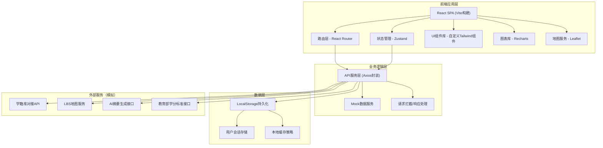
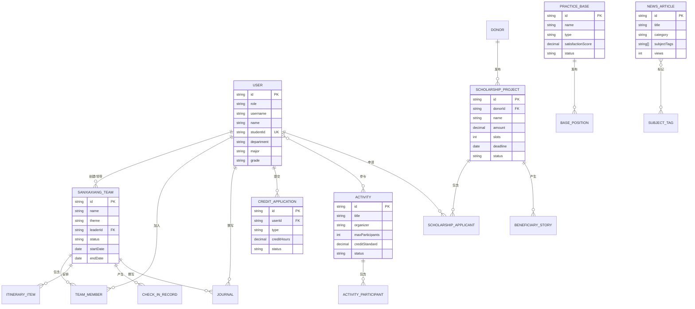

## 1. 架构设计



## 2. 技术说明

- **前端框架**：React@18 + TypeScript@5
- **构建工具**：Vite@5
- **样式方案**：TailwindCSS@3 + PostCSS + Autoprefixer
- **路由管理**：React Router DOM@6
- **状态管理**：Zustand@4（轻量级状态管理，替代Redux）
- **数据请求**：Axios@1（请求拦截、统一错误处理）
- **图表可视化**：Recharts@2（React生态图表库）
- **图标方案**：Lucide React@0.400
- **地图服务**：Leaflet@1.9 + react-leaflet@4
- **富文本编辑**：React Quill@2
- **动画库**：Framer Motion@11
- **表单处理**：React Hook Form@7 + Zod@3（验证）
- **日期处理**：dayjs@1
- **Mock数据**：本地JSON + MSW（可选，当前使用内置mock service）

## 3. 路由定义

| 路由路径 | 页面名称 | 权限角色 | 说明 |
|----------|----------|----------|------|
| `/login` | 登录页 | 公开 | 多角色统一登录入口 |
| `/` | 首页仪表盘 | 所有已登录用户 | 数据概览、快捷入口、通知中心 |
| `/sanxiaxiang/teams` | 三下乡-团队列表 | 学生/管理员 | 我的团队、全部团队列表 |
| `/sanxiaxiang/teams/create` | 三下乡-创建团队 | 学生 | 团队申报表单 |
| `/sanxiaxiang/teams/:id` | 三下乡-团队详情 | 学生/管理员 | 团队信息、成员、行程 |
| `/sanxiaxiang/checkin` | 三下乡-轨迹打卡 | 学生 | 地图打卡、照片上传 |
| `/sanxiaxiang/journals` | 三下乡-日志管理 | 学生/管理员 | 日志列表、撰写、AI摘要 |
| `/scholarship/projects` | 奖学金-项目列表 | 学生/捐赠方 | 资助项目浏览、申请 |
| `/scholarship/projects/:id` | 奖学金-项目详情 | 学生/捐赠方 | 项目信息、申请入口 |
| `/scholarship/stories` | 奖学金-受助故事 | 所有已登录用户 | 匿名故事墙 |
| `/scholarship/donor/publish` | 奖学金-发布项目 | 捐赠方 | 资助项目发布表单 |
| `/news` | 资讯引擎 | 所有已登录用户 | 新闻聚合、标签筛选 |
| `/news/:id` | 资讯详情 | 所有已登录用户 | 文章详情页 |
| `/activities` | 实践活动 | 学生/管理员 | 活动列表、发布、报名 |
| `/activities/:id` | 活动详情 | 学生/管理员 | 活动详情、报名管理 |
| `/bases` | 实践基地 | 所有已登录用户 | 基地列表、岗位信息 |
| `/bases/apply` | 基地入驻申请 | 企业/乡村/社区 | 入驻申请表单 |
| `/credits/apply` | 学分申请 | 学生 | 学分认定申请 |
| `/credits/audit` | 学分审核 | 管理员 | 学分审核列表 |
| `/credits/transcript` | 第二课堂成绩单 | 学生 | 成绩单生成、导出 |
| `/dashboard` | 校级数据看板 | 校级管理员 | 全校统计、多维分析 |
| `/settings` | 系统设置 | 管理员 | 标准配置、用户管理 |

## 4. 类型定义（核心数据模型）

```typescript
// 用户相关类型
interface User {
  id: string;
  role: 'student' | 'department_admin' | 'school_admin' | 'base' | 'donor';
  username: string;
  name: string;
  avatar?: string;
  email?: string;
  phone?: string;
  department?: string;
  studentId?: string;
  major?: string;
  grade?: string;
}

// 三下乡团队
interface SanxiaxiangTeam {
  id: string;
  name: string;
  theme: string;
  leaderId: string;
  members: TeamMember[];
  practiceBase?: string;
  startDate: string;
  endDate: string;
  status: 'draft' | 'pending' | 'approved' | 'rejected' | 'ongoing' | 'completed';
  itinerary: ItineraryItem[];
  checkIns: CheckInRecord[];
  journals: Journal[];
  createdAt: string;
}

interface TeamMember {
  userId: string;
  studentId: string;
  name: string;
  major: string;
  grade: string;
  role: 'leader' | 'member';
}

interface ItineraryItem {
  id: string;
  date: string;
  title: string;
  description: string;
  location: string;
  coordinates?: [number, number];
}

interface CheckInRecord {
  id: string;
  teamId: string;
  userId: string;
  timestamp: string;
  location: string;
  coordinates: [number, number];
  photos: string[];
  remark?: string;
}

interface Journal {
  id: string;
  teamId: string;
  userId: string;
  date: string;
  title: string;
  content: string;
  aiSummary?: string;
  keywords: string[];
  serviceTags: string[];
  createdAt: string;
}

// 奖学金相关
interface ScholarshipProject {
  id: string;
  donorId: string;
  donorName: string;
  donorLogo?: string;
  name: string;
  amount: number;
  slots: number;
  description: string;
  eligibility: string;
  applicationDeadline: string;
  status: 'recruiting' | 'reviewing' | 'closed' | 'completed';
  applicants: ScholarshipApplicant[];
  createdAt: string;
}

interface ScholarshipApplicant {
  userId: string;
  projectId: string;
  studentId: string;
  name: string;
  applicationMaterials: string;
  status: 'pending' | 'shortlisted' | 'approved' | 'rejected';
  appliedAt: string;
}

interface BeneficiaryStory {
  id: string;
  projectId?: string;
  anonymousName: string;
  content: string;
  likes: number;
  createdAt: string;
}

// 资讯相关
interface NewsArticle {
  id: string;
  title: string;
  summary: string;
  content: string;
  coverImage?: string;
  category: 'policy' | 'case' | 'notice' | 'activity';
  subjectTags: string[];
  author: string;
  publishedAt: string;
  views: number;
}

// 活动相关
interface Activity {
  id: string;
  title: string;
  description: string;
  coverImage?: string;
  organizer: string;
  location: string;
  startTime: string;
  endTime: string;
  maxParticipants: number;
  registeredCount: number;
  creditStandard: number;
  registrationDeadline: string;
  status: 'draft' | 'open' | 'closed' | 'ongoing' | 'completed';
  participants: ActivityParticipant[];
  createdAt: string;
}

interface ActivityParticipant {
  userId: string;
  activityId: string;
  status: 'registered' | 'approved' | 'rejected' | 'completed';
  registeredAt: string;
}

// 基地相关
interface PracticeBase {
  id: string;
  name: string;
  type: 'enterprise' | 'village' | 'community';
  contactPerson: string;
  contactPhone: string;
  address: string;
  description: string;
  logo?: string;
  satisfactionScore: number;
  positions: BasePosition[];
  status: 'pending' | 'approved' | 'rejected' | 'suspended';
  createdAt: string;
}

interface BasePosition {
  id: string;
  baseId: string;
  title: string;
  description: string;
  requirements: string;
  slots: number;
  subsidy?: string;
  status: 'open' | 'closed';
}

// 学分相关
interface CreditApplication {
  id: string;
  userId: string;
  studentId: string;
  type: 'sanxiaxiang' | 'activity' | 'volunteer' | 'other';
  relatedId: string;
  relatedName: string;
  creditHours: number;
  proofMaterials: string[];
  status: 'pending' | 'approved' | 'rejected';
  applicantRemark?: string;
  reviewerRemark?: string;
  reviewedBy?: string;
  reviewedAt?: string;
  appliedAt: string;
}

interface Transcript {
  userId: string;
  studentId: string;
  name: string;
  department: string;
  major: string;
  grade: string;
  totalCredits: number;
  records: CreditRecord[];
}

interface CreditRecord {
  id: string;
  type: string;
  name: string;
  creditHours: number;
  date: string;
  status: string;
}

// 看板统计
interface DashboardStats {
  totalStudents: number;
  totalActivities: number;
  participationRate: number;
  totalServiceHours: number;
  averageCreditsPerStudent: number;
  departmentRank: DepartmentRank[];
  baseSatisfaction: BaseSatisfaction[];
  monthlyTrend: MonthlyData[];
}

interface DepartmentRank {
  department: string;
  participationRate: number;
  serviceHours: number;
  teams: number;
}

interface BaseSatisfaction {
  baseName: string;
  score: number;
  reviews: number;
}

interface MonthlyData {
  month: string;
  activities: number;
  participants: number;
  hours: number;
}
```

## 5. 前端项目结构

```
src/
├── assets/                 # 静态资源
│   ├── images/
│   └── styles/
├── components/             # 公共组件
│   ├── layout/            # 布局组件（Sidebar, Header, Footer）
│   ├── ui/                # 基础UI组件（Button, Card, Input, Modal等）
│   ├── charts/            # 图表组件
│   └── forms/             # 表单组件
├── pages/                  # 页面组件
│   ├── Login/
│   ├── Dashboard/
│   ├── Sanxiaxiang/
│   ├── Scholarship/
│   ├── News/
│   ├── Activities/
│   ├── Bases/
│   ├── Credits/
│   ├── Admin/
│   └── Settings/
├── store/                  # Zustand状态管理
│   ├── useAuthStore.ts
│   ├── useUserStore.ts
│   └── index.ts
├── services/               # API服务层
│   ├── api.ts             # Axios实例配置
│   ├── auth.service.ts
│   ├── sanxiaxiang.service.ts
│   ├── scholarship.service.ts
│   ├── news.service.ts
│   ├── activity.service.ts
│   ├── base.service.ts
│   ├── credit.service.ts
│   └── dashboard.service.ts
├── mock/                   # Mock数据
│   ├── users.ts
│   ├── teams.ts
│   ├── scholarships.ts
│   ├── news.ts
│   ├── activities.ts
│   ├── bases.ts
│   ├── credits.ts
│   └── dashboard.ts
├── hooks/                  # 自定义Hooks
│   ├── useAuth.ts
│   ├── usePermission.ts
│   └── useRequest.ts
├── utils/                  # 工具函数
│   ├── storage.ts
│   ├── format.ts
│   ├── date.ts
│   └── ai.ts              # AI摘要模拟
├── types/                  # TypeScript类型定义
│   └── index.ts
├── router/                 # 路由配置
│   └── index.tsx
├── constants/              # 常量配置
│   ├── config.ts
│   └── enums.ts
├── App.tsx
├── main.tsx
└── vite-env.d.ts
```

## 6. 数据模型ER图


