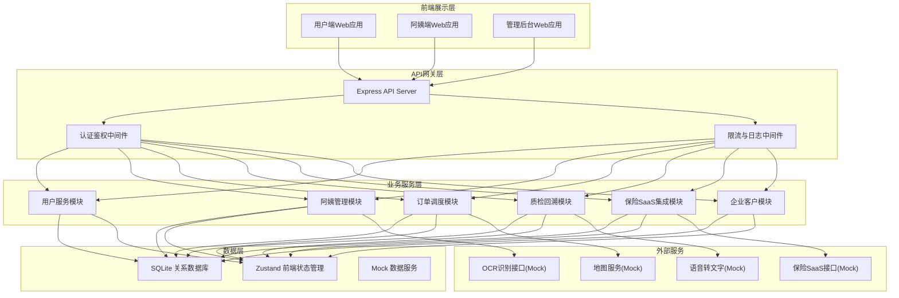
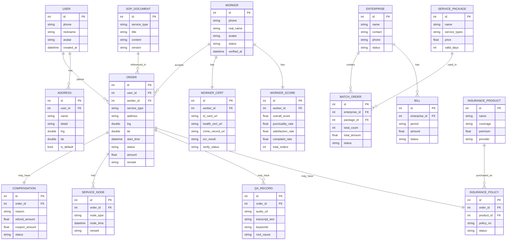

## 1. 架构设计

## 2. 技术说明

- **前端框架**：React 18 + TypeScript + Vite
- **UI样式**：TailwindCSS 3.x
- **状态管理**：Zustand
- **路由管理**：React Router DOM
- **图标库**：Lucide React
- **后端框架**：Express 4.x + TypeScript
- **数据库**：SQLite（开发环境使用，内嵌零配置）
- **图表可视化**：Recharts
- **地图展示**：自定义Canvas热力图组件（Mock地图服务）

## 3. 路由定义

### 前端路由

| 路由 | 用途 |
|------|------|
| / | 用户端首页-快速下单 |
| /orders | 用户端订单列表 |
| /orders/:id | 用户端订单详情 |
| /worker | 阿姨端工作台-订单调度 |
| /worker/profile | 阿姨端资质管理 |
| /worker/scoring | 阿姨端评分看板 |
| /admin | 管理后台首页-数据概览 |
| /admin/workers | 管理后台-阿姨资质审核 |
| /admin/dispatch | 管理后台-调度中心 |
| /admin/sop | 管理后台-SOP文档库 |
| /admin/insurance | 管理后台-保险配置 |
| /admin/qa | 管理后台-质检分析 |
| /enterprise | 企业客户中心-批量采购 |
| /enterprise/billing | 企业客户中心-账单管理 |

### 后端API路由

| 方法 | 路由 | 用途 |
|------|------|------|
| POST | /api/auth/login | 登录认证 |
| POST | /api/auth/register | 用户注册 |
| GET | /api/users/profile | 获取用户信息 |
| GET | /api/orders | 获取订单列表 |
| POST | /api/orders | 创建订单 |
| GET | /api/orders/:id | 获取订单详情 |
| PUT | /api/orders/:id/status | 更新订单状态 |
| POST | /api/orders/:id/compensation | 申请赔付 |
| GET | /api/workers | 获取阿姨列表 |
| POST | /api/workers/:id/verify | 审核阿姨资质 |
| POST | /api/workers/ocr | 上传证件OCR识别 |
| GET | /api/workers/:id/scoring | 获取阿姨评分 |
| GET | /api/dispatch/map | 获取调度地图数据 |
| POST | /api/dispatch/assign | 人工派单 |
| GET | /api/sop/documents | 获取SOP文档列表 |
| POST | /api/qa/transcripts | 上传录音转文字 |
| GET | /api/qa/analysis | 获取差评聚类分析 |
| GET | /api/insurance/products | 获取保险产品 |
| POST | /api/insurance/purchase | 投保下单 |
| GET | /api/enterprise/packages | 获取企业服务包 |
| POST | /api/enterprise/batch-order | 批量下单 |
| GET | /api/enterprise/billing | 获取企业账单 |

## 4. 数据模型

### 4.1 实体关系图

### 4.2 初始化数据

- 预置3名已审核通过的阿姨（含评分数据）
- 预置5条历史订单（含完整服务节点）
- 预置3种服务类型SOP文档
- 预置2个保险产品
- 预置2个企业服务包
- 预置1个企业客户（含账单数据）
- 预置3条差评质检记录（含根因聚类数据）

## 5. 前端状态管理

使用 Zustand 创建以下 Store：

| Store名称 | 管理数据 |
|-----------|----------|
| useUserStore | 当前登录用户信息、地址列表、登录状态 |
| useOrderStore | 订单列表、当前订单详情、订单状态更新 |
| useWorkerStore | 阿姨信息、资质状态、评分数据 |
| useDispatchStore | 地图调度数据、派单操作 |
| useAdminStore | 后台统计数据、阿姨审核队列 |
| useEnterpriseStore | 企业客户信息、服务包、账单数据 |
