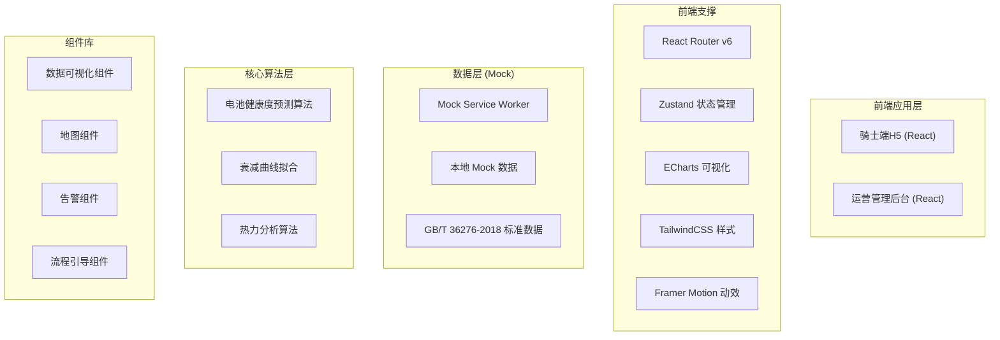
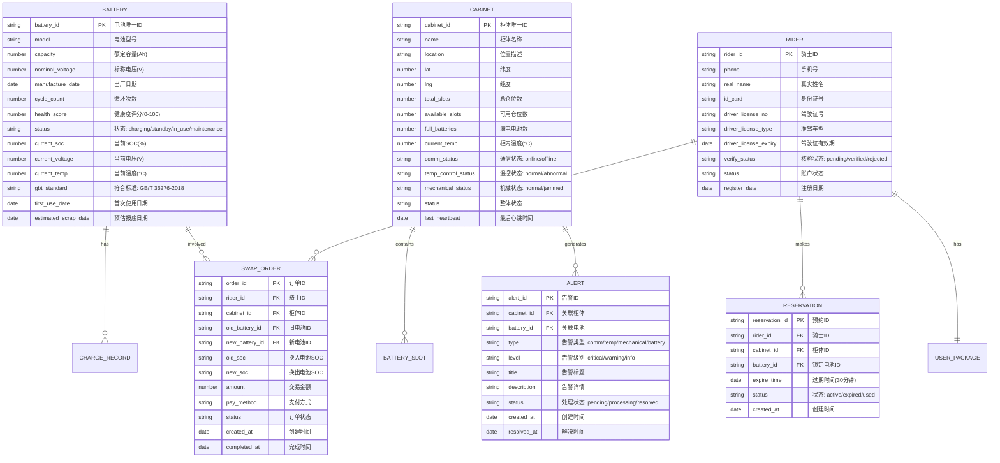

# 两轮电动车换电能源网络运营平台 - 技术架构文档

## 1. 架构设计



## 2. 技术选型说明

| 类别 | 技术方案 | 说明 |
|------|---------|------|
| 前端框架 | React 18 + TypeScript | 组件化开发，类型安全 |
| 构建工具 | Vite 5 | 极速开发体验，HMR 热更新 |
| 状态管理 | Zustand | 轻量级，支持中间件 |
| 样式方案 | TailwindCSS 3 + CSS Variables | 原子化CSS，主题定制 |
| 路由管理 | React Router v6 | 嵌套路由，代码分割 |
| 数据可视化 | ECharts 5 | 丰富图表，热力图支持 |
| 动效库 | Framer Motion | 流畅动画，交互反馈 |
| 图标库 | Lucide React + 自定义SVG | 线性风格，科技感 |
| 数据模拟 | Mock Service Worker + 本地JSON | 前端独立开发 |
| 代码规范 | ESLint + Prettier | 统一代码风格 |

## 3. 目录结构

```
src/
├── apps/
│   ├── rider/                 # 骑士端H5
│   │   ├── pages/
│   │   ├── components/
│   │   └── routes.tsx
│   └── admin/                 # 运营管理后台
│       ├── pages/
│       ├── components/
│       └── routes.tsx
├── shared/                    # 共享模块
│   ├── components/
│   ├── hooks/
│   ├── stores/
│   ├── types/
│   ├── utils/
│   └── constants/
├── mock/                      # Mock数据
│   ├── data/
│   └── handlers/
├── styles/                    # 全局样式
│   ├── index.css
│   └── themes/
└── App.tsx
```

## 4. 路由定义

### 4.1 骑士端路由

| 路由路径 | 页面名称 | 说明 |
|---------|---------|------|
| /rider | 首页地图 | 周边换电柜展示、距离排序 |
| /rider/scan | 扫码换电 | QR扫描、换电流程引导 |
| /rider/reserve | 预约锁电 | 选择柜体、预约满电电池 |
| /rider/payment | 支付页面 | 套餐余额、混合支付 |
| /rider/profile | 个人中心 | 实名信息、驾驶证、换电记录 |
| /rider/battery | 我的电池 | 当前电池状态、历史记录 |
| /rider/package | 套餐中心 | 套餐列表、购买管理 |

### 4.2 管理后台路由

| 路由路径 | 页面名称 | 说明 |
|---------|---------|------|
| /admin | 数据总览 | 核心指标看板、趋势图表 |
| /admin/cabinets | 换电柜管理 | 柜体列表、状态监控、详情 |
| /admin/batteries | 电池管理 | 电池档案、健康度、生命周期 |
| /admin/riders | 骑士管理 | 用户列表、实名核验、驾驶证 |
| /admin/orders | 订单管理 | 换电订单、交易记录 |
| /admin/alerts | 告警中心 | 故障告警、工单处理 |
| /admin/heatmap | 热力分析 | 区域热力、轨迹数据、布点优化 |
| /admin/settings | 系统设置 | 参数配置、告警阈值 |

## 5. 数据模型

### 5.1 ER图



### 5.2 GB/T 36276-2018 标准数据项

根据国家标准，电池数据采集需包含以下参数：

| 参数名称 | 单位 | 采集频率 | 说明 |
|---------|------|---------|------|
| 总电压 | V | 1s | 电池组总电压 |
| 总电流 | A | 1s | 充放电电流 |
| SOC | % | 1s | 荷电状态 |
| 单体电压 | V | 10s | 各单体电池电压 |
| 温度 | °C | 10s | 各温度测点数据 |
| 循环次数 | 次 | 1次/充放循环 | 完整充放电循环计数 |
| 充电容量 | Ah | 1次/充电 | 单次充电容量 |
| 放电容量 | Ah | 1次/放电 | 单次放电容量 |
| 内阻 | mΩ | 1次/天 | 直流内阻测量值 |
| 故障码 | - | 事件触发 | 电池管理系统故障代码 |

### 5.3 健康度预测算法模型

```
健康度评分 SOH = f(循环次数, 电压衰减率, 内阻增长率, 温度历史)

核心公式：
SOH = 100 × (1 - α × N - β × (ΔV/V₀) - γ × (ΔR/R₀))

其中：
- N: 循环次数
- ΔV/V₀: 标称电压衰减率
- ΔR/R₀: 内阻增长率
- α, β, γ: 权重系数 (基于GB/T 36276-2018标定)

衰减曲线拟合：
V(t) = V₀ × exp(-k × t)
其中k为衰减速率常数
```

## 6. 核心组件设计

### 6.1 数据可视化组件

| 组件名 | 用途 | 关键属性 |
|-------|------|---------|
| BatteryGauge | 电池SOC仪表 | value, size, color |
| HealthRadar | 健康度雷达图 | scores, size |
| DecayChart | 衰减曲线 | cycles, voltages, prediction |
| AlertList | 告警列表 | alerts, levels, filters |
| HeatMap | 热力地图 | dataPoints, mapStyle |

### 6.2 业务组件

| 组件名 | 用途 | 关键属性 |
|-------|------|---------|
| CabinetCard | 柜体状态卡片 | cabinet, onClick |
| BatterySlot | 电池仓位组件 | slot, status, animation |
| SwapFlow | 换电流程引导 | steps, currentStep |
| CountdownTimer | 预约倒计时 | expireTime, onExpire |

## 7. 状态管理设计

```typescript
// 全局状态分片
interface AppState {
  user: UserState;          // 用户信息
  cabinet: CabinetState;    // 柜体数据
  battery: BatteryState;    // 电池数据
  alert: AlertState;        // 告警数据
  order: OrderState;        // 订单数据
  ui: UIState;              // UI状态
}
```

## 8. 性能与安全

- **代码分割**：基于路由的懒加载，减少首屏加载时间
- **虚拟列表**：电池记录、告警列表等长列表使用虚拟滚动
- **Web Worker**：健康度预测算法在Worker线程中执行
- **数据缓存**：使用SWR/React Query进行数据缓存与刷新
- **类型安全**：全量TypeScript，严格模式
- **Mock隔离**：MSW拦截API请求，前端独立开发
