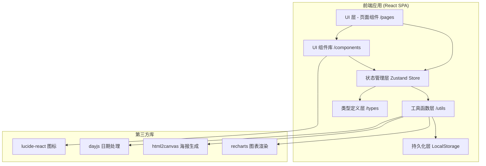
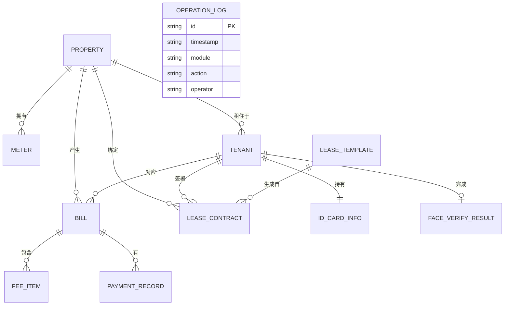

# 房产资产管理 SaaS 系统 - 技术架构文档

## 1. 架构设计

本系统为纯前端轻量化 SaaS，采用 React 单页应用架构，数据层使用 Zustand 管理全局状态，结合 LocalStorage 实现持久化存储（模拟后端）。图表可视化使用 recharts，海报生成使用 Canvas API。



---

## 2. 技术栈说明

| 层级 | 技术选型 | 版本要求 | 用途说明 |
|------|----------|----------|----------|
| 前端框架 | React | 18.x | 构建用户界面 |
| 开发语言 | TypeScript | 5.x | 类型安全开发 |
| 构建工具 | Vite | 5.x | 极速开发与构建 |
| 路由管理 | react-router-dom | 6.x | 单页路由切换 |
| 状态管理 | zustand | 4.x | 全局状态 + 持久化 |
| UI 样式 | Tailwind CSS | 3.x | 原子化 CSS 框架 |
| 图表库 | recharts | 2.x | 各类统计图表渲染 |
| 日期工具 | dayjs | 1.x | 日期格式化与计算 |
| 图标库 | lucide-react | 0.x | 线性图标组件 |
| 海报生成 | html2canvas | 1.x | DOM 转图片用于海报导出 |

- **初始化工具**：vite-init 脚手架，选用 `react-ts` 模板（纯前端，无需后端）
- **后端服务**：无（纯前端 Demo，LocalStorage 模拟数据库；若需后端可后续扩展 Express + SQLite）
- **数据库**：LocalStorage（前端持久化） + 内置 Mock 初始数据

---

## 3. 路由定义

| 路由路径 | 页面组件 | 功能用途 |
|----------|----------|----------|
| `/` | Dashboard | 收支仪表盘首页 |
| `/properties` | PropertyList | 房源列表 |
| `/properties/new` | PropertyForm | 新增房源 |
| `/properties/:id` | PropertyDetail | 房源详情（含表计、关联租客） |
| `/properties/:id/edit` | PropertyForm | 编辑房源 |
| `/tenants` | TenantList | 租客列表 |
| `/tenants/new` | TenantForm | 新增租客（含身份核验流程） |
| `/tenants/:id` | TenantDetail | 租客详情 |
| `/meter-reading` | MeterReading | 集中抄表界面 |
| `/bills` | BillList | 账单列表 |
| `/bills/:id` | BillDetail | 账单详情 |
| `/calendar` | RentCalendar | 收租日历视图 |
| `/lease` | LeaseCenter | 租约中心（模板库+编辑器） |
| `/lease/poster/:propertyId` | RentalPoster | 招租海报生成与导出 |
| `/logs` | OperationLog | 操作日志审计 |
| `*` | NotFound | 404 页面 |

---

## 4. 类型定义（核心数据模型）

```typescript
// ========== 房源 ==========
export type PropertyStatus = 'rented' | 'vacant' | 'maintenance' | 'sold';
export type MeterType = 'water' | 'electricity' | 'gas';

export interface Meter {
  id: string;
  type: MeterType;
  meterNo: string;           // 表号
  unitPrice: number;         // 基础单价
  tieredPricing?: Tier[];    // 阶梯费率
  lastReading: number;       // 上次读数
  lastReadingDate: string;   // 上次抄表日
  shareRule?: ShareRule;     // 分摊规则（多租客共享时）
}

export interface Tier {
  from: number;              // 起始用量（含）
  to?: number;               // 结束用量（不含），空表示不限
  price: number;             // 阶梯单价
}

export interface ShareRule {
  mode: 'equal' | 'area' | 'headcount';
  participants: string[];    // 参与分摊的租客 ID
}

export interface Property {
  id: string;
  title: string;             // 房源名称/标题
  address: string;           // 详细地址
  area: number;              // 建筑面积（㎡）
  layout: string;            // 户型，如 "3室2厅"
  floor: string;             // 楼层，如 "15/28"
  decoration: string;        // 装修情况
  monthlyRent: number;       // 月租金标准
  status: PropertyStatus;
  coverImage?: string;       // 封面图
  meters: Meter[];           // 表计列表
  createdAt: string;
  updatedAt: string;
}

// ========== 租客 ==========
export type TenantStatus = 'living' | 'moved' | 'pending';
export type VerifyStatus = 'unverified' | 'ocr_done' | 'face_done' | 'verified' | 'failed';

export interface IDCardInfo {
  name: string;
  gender: string;
  nation: string;
  birth: string;
  address: string;
  idNo: string;
  issuingAuthority: string;
  validPeriod: string;
  frontImage?: string;       // 身份证正面 base64
  backImage?: string;        // 身份证反面 base64
}

export interface FaceVerifyResult {
  passed: boolean;
  score: number;             // 活体检测分数 0-1
  timestamp: string;
  image?: string;            // 人脸快照
}

export interface Tenant {
  id: string;
  name: string;
  phone: string;
  idCard: IDCardInfo;
  faceVerify: FaceVerifyResult;
  verifyStatus: VerifyStatus;
  status: TenantStatus;
  propertyId?: string;       // 绑定房源
  moveInDate?: string;
  moveOutDate?: string;
  emergencyContact?: string;
  remark?: string;
  createdAt: string;
  updatedAt: string;
}

// ========== 费用项 & 账单 ==========
export type BillingCycleType = 'monthly' | 'fixed_day' | 'custom';
export type FeeType = 'rent' | 'water' | 'electricity' | 'gas' | 'property' | 'deposit' | 'penalty' | 'other';
export type BillStatus = 'pending' | 'partial' | 'paid' | 'overdue' | 'cancelled';

export interface FeeItem {
  id: string;
  type: FeeType;
  name: string;              // 费用项名称，支持自定义
  amount: number;            // 金额
  calculation?: string;      // 计算说明，如 "(120-100)*5.0"
  meterId?: string;          // 关联表计
  readingStart?: number;
  readingEnd?: number;
  usage?: number;            // 用量
}

export interface Bill {
  id: string;
  billNo: string;            // 账单编号
  propertyId: string;
  tenantId: string;
  periodStart: string;       // 账期起始
  periodEnd: string;         // 账期结束
  dueDate: string;           // 最迟缴费日
  cycleType: BillingCycleType;
  autoRenew: boolean;        // 自动续期
  items: FeeItem[];
  totalAmount: number;
  paidAmount: number;
  status: BillStatus;
  payments: PaymentRecord[];
  createdAt: string;
  updatedAt: string;
}

export interface PaymentRecord {
  id: string;
  amount: number;
  method: 'cash' | 'transfer' | 'wechat' | 'alipay' | 'other';
  paidAt: string;
  remark?: string;
  operator: string;
}

// ========== 租约 ==========
export interface LeaseTemplate {
  id: string;
  name: string;               // 模板名称
  description: string;
  content: string;            // 模板正文（含 {{变量}} 占位符）
  variables: string[];        // 变量名列表
  category: 'standard' | 'simple' | 'shared';
  createdAt: string;
}

export interface LeaseContract {
  id: string;
  templateId: string;
  propertyId: string;
  tenantId: string;
  startDate: string;
  endDate: string;
  monthlyRent: number;
  deposit: number;
  content: string;            // 渲染后的最终文本
  signedAt?: string;
  status: 'draft' | 'signed' | 'terminated';
}

// ========== 操作日志 ==========
export type LogModule = 'property' | 'tenant' | 'bill' | 'meter' | 'lease' | 'system';
export type LogAction = 'create' | 'update' | 'delete' | 'sign' | 'pay' | 'verify' | 'export' | 'login';

export interface OperationLogEntry {
  id: string;
  timestamp: string;
  module: LogModule;
  action: LogAction;
  operator: string;           // 操作人
  targetId?: string;          // 操作对象 ID
  targetName?: string;        // 操作对象名称
  summary: string;            // 简要描述
  diff?: Record<string, { before: any; after: any }>;  // 字段变更对比
  ip?: string;
  userAgent?: string;
}
```

---

## 5. 数据模型 ER 图



---

## 6. 状态管理结构（Zustand Store）

```
usePropertyStore
  ├─ properties: Property[]
  ├─ addProperty(p) → void
  ├─ updateProperty(id, data) → void
  ├─ deleteProperty(id) → void
  └─ setMeterReading(propertyId, meterId, reading, date) → void

useTenantStore
  ├─ tenants: Tenant[]
  ├─ addTenant(t) → void
  ├─ updateTenant(id, data) → void
  ├─ setIDCardOCR(tenantId, info) → void
  └─ setFaceVerify(tenantId, result) → void

useBillStore
  ├─ bills: Bill[]
  ├─ generateBill(period, propertyId, tenantId) → Bill
  ├─ autoRenewBills() → Bill[]      // 扫描到期账单并生成新周期
  ├─ calculateUtility(billId, readings) → FeeItem[]  // 阶梯+分摊计算
  ├─ recordPayment(billId, record) → void
  └─ getBillStatusByDate(billId, today) → BillStatus  // 逾期/临近判断

useLeaseStore
  ├─ templates: LeaseTemplate[]
  ├─ contracts: LeaseContract[]
  └─ renderTemplate(templateId, variables) → string

useLogStore
  ├─ logs: OperationLogEntry[]
  └─ log(entry) → void

useConfigStore
  └─ currentUser, theme, language
```

---

## 7. 项目目录结构

```
may-89319/
├── .trae/documents/
│   ├── PRD-房产资产管理SaaS.md
│   └── 技术架构文档.md
├── src/
│   ├── types/
│   │   └── index.ts              # 全部类型定义
│   ├── store/
│   │   ├── property.ts
│   │   ├── tenant.ts
│   │   ├── bill.ts
│   │   ├── lease.ts
│   │   └── log.ts
│   ├── utils/
│   │   ├── calculator.ts         # 水电费计算引擎（阶梯+分摊）
│   │   ├── billEngine.ts         # 账单生成/续期引擎
│   │   ├── ocrMock.ts            # 身份证 OCR 模拟
│   │   ├── faceMock.ts           # 活体检测模拟
│   │   ├── poster.ts             # 海报生成（Canvas）
│   │   ├── logger.ts             # 操作日志封装
│   │   └── formatters.ts         # 日期/金额格式化
│   ├── components/
│   │   ├── layout/
│   │   │   ├── Sidebar.tsx
│   │   │   ├── Topbar.tsx
│   │   │   └── Layout.tsx
│   │   ├── common/
│   │   │   ├── StatCard.tsx
│   │   │   ├── StatusBadge.tsx
│   │   │   ├── ConfirmModal.tsx
│   │   │   └── EmptyState.tsx
│   │   ├── dashboard/
│   │   │   ├── TrendChart.tsx
│   │   │   ├── PropertyRankChart.tsx
│   │   │   ├── FeePieChart.tsx
│   │   │   └── OverdueList.tsx
│   │   ├── property/
│   │   │   ├── PropertyCard.tsx
│   │   │   ├── PropertyForm.tsx
│   │   │   └── MeterConfigPanel.tsx
│   │   ├── tenant/
│   │   │   ├── TenantTable.tsx
│   │   │   ├── VerifyFlow.tsx       # OCR+活体三步流程
│   │   │   └── IDCardReader.tsx
│   │   ├── meter/
│   │   │   ├── ReadingRow.tsx
│   │   │   └── MeterReadingForm.tsx
│   │   ├── bill/
│   │   │   ├── BillTable.tsx
│   │   │   ├── BillItemList.tsx
│   │   │   └── PaymentModal.tsx
│   │   ├── calendar/
│   │   │   ├── CalendarGrid.tsx
│   │   │   └── DayCell.tsx
│   │   ├── lease/
│   │   │   ├── TemplateCard.tsx
│   │   │   ├── LeaseEditor.tsx
│   │   │   └── PosterPreview.tsx
│   │   └── log/
│   │       ├── LogTimeline.tsx
│   │       └── LogFilters.tsx
│   ├── pages/
│   │   ├── Dashboard.tsx
│   │   ├── PropertyList.tsx
│   │   ├── PropertyDetail.tsx
│   │   ├── PropertyForm.tsx
│   │   ├── TenantList.tsx
│   │   ├── TenantDetail.tsx
│   │   ├── TenantForm.tsx
│   │   ├── MeterReading.tsx
│   │   ├── BillList.tsx
│   │   ├── BillDetail.tsx
│   │   ├── RentCalendar.tsx
│   │   ├── LeaseCenter.tsx
│   │   ├── RentalPoster.tsx
│   │   ├── OperationLog.tsx
│   │   └── NotFound.tsx
│   ├── data/
│   │   └── mockData.ts           # 初始模拟数据
│   ├── App.tsx
│   ├── main.tsx
│   └── index.css
├── index.html
├── package.json
├── vite.config.ts
├── tsconfig.json
├── tailwind.config.js
└── postcss.config.js
```
