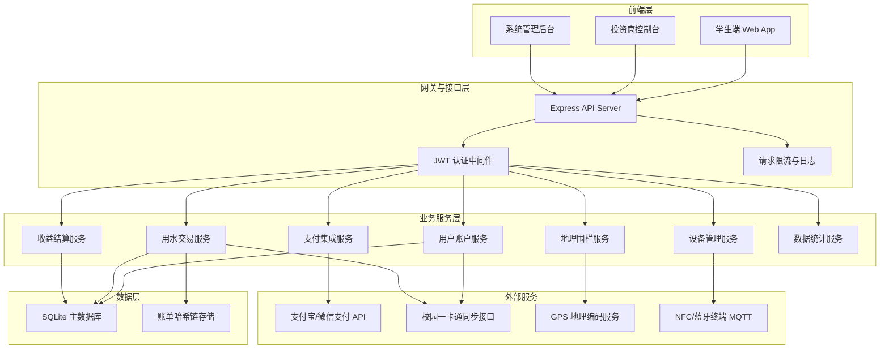
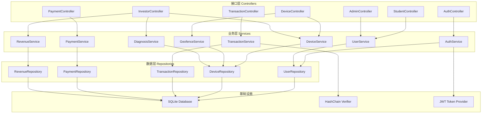
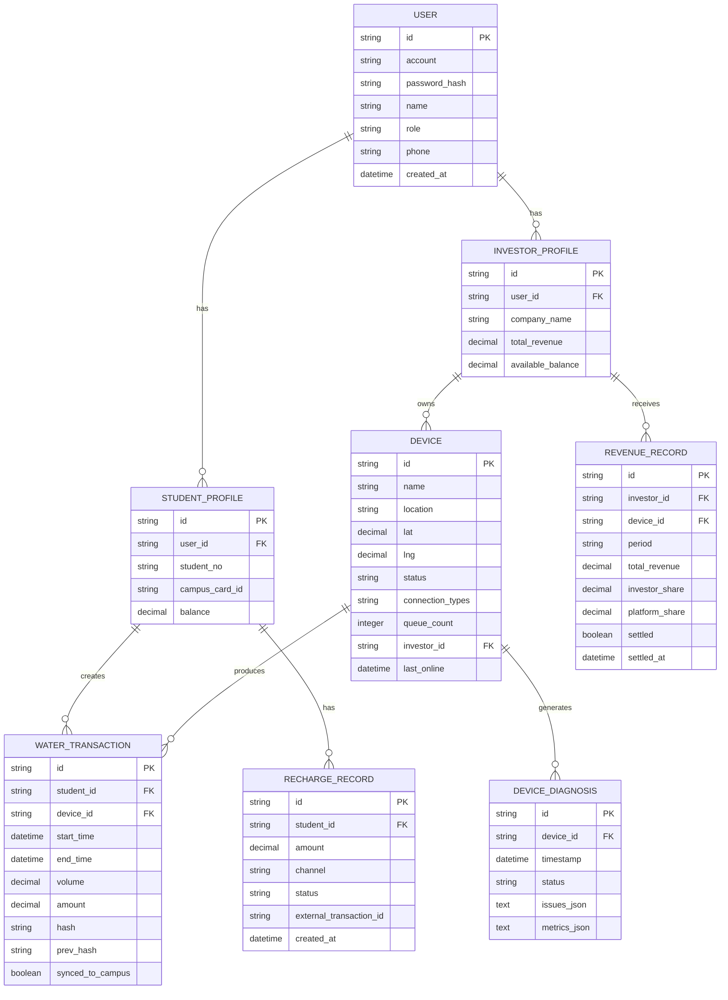

## 1. 架构设计



## 2. 技术说明

- **前端**：React@18 + TypeScript + Vite@6 + TailwindCSS@3 + Zustand@4 + React Router@6 + Recharts@2 + Lucide React
- **后端**：Express@4 + TypeScript + better-sqlite3 + jsonwebtoken + bcryptjs
- **初始化工具**：vite-init (react-express-ts 模板)
- **数据库**：SQLite（本地开发与演示），账单数据采用 SHA-256 哈希链保证不可篡改
- **模拟数据**：内置 Mock 数据服务，模拟支付接口、一卡通同步、设备 MQTT 消息

## 3. 路由定义

| 路由路径 | 页面用途 |
|----------|----------|
| /login | 用户登录与角色选择 |
| /student | 学生端首页 - 账户概览与快速入口 |
| /student/devices | 附近设备地图搜索 |
| /student/watering/:deviceId | 用水操作与实时计量 |
| /student/bills | 账单中心与消费汇总 |
| /student/recharge | 账户充值与支付 |
| /investor | 投资商控制台仪表盘 |
| /investor/devices | 设备列表与状态监控 |
| /investor/analytics | 能耗分析与故障诊断 |
| /investor/revenue | 收益分成与结算 |
| /admin | 系统管理首页 |
| /admin/users | 用户与角色管理 |
| /admin/system | 系统配置与日志 |

## 4. API 接口定义

```typescript
// 通用响应类型
interface ApiResponse<T> {
  code: number;
  message: string;
  data: T;
}

// ===== 用户认证 =====
interface LoginRequest {
  account: string;
  password: string;
  role: 'student' | 'investor' | 'admin';
}
interface LoginResponse {
  token: string;
  user: {
    id: string;
    name: string;
    role: string;
    avatar?: string;
  };
}

// ===== 学生账户 =====
interface StudentAccount {
  id: string;
  studentNo: string;
  name: string;
  balance: number;
  campusCardId: string;
  phone: string;
}

// ===== 设备 =====
interface Device {
  id: string;
  name: string;
  location: string;
  lat: number;
  lng: number;
  status: 'online' | 'offline' | 'fault';
  connectionType: ('nfc' | 'bluetooth' | 'qr')[];
  queueCount: number;
  todayWaterUsage: number;
  todayRevenue: number;
  investorId: string;
}

// ===== 用水交易 =====
interface WaterTransaction {
  id: string;
  studentId: string;
  deviceId: string;
  startTime: number;
  endTime?: number;
  volume: number;
  amount: number;
  hash: string;
  prevHash: string;
  syncedToCampus: boolean;
}

// ===== 充值记录 =====
interface RechargeRecord {
  id: string;
  studentId: string;
  amount: number;
  channel: 'alipay' | 'wechat';
  status: 'pending' | 'success' | 'failed';
  createdAt: number;
  transactionId: string;
}

// ===== 投资商收益 =====
interface RevenueRecord {
  id: string;
  investorId: string;
  deviceId: string;
  period: string;
  totalRevenue: number;
  platformShare: number;
  investorShare: number;
  settled: boolean;
}

// ===== 故障诊断 =====
interface DeviceDiagnosis {
  deviceId: string;
  timestamp: number;
  status: 'normal' | 'warning' | 'critical';
  issues: {
    code: string;
    description: string;
    suggestion: string;
  }[];
  metrics: {
    waterPressure: number;
    temperature: number;
    batteryLevel: number;
    signalStrength: number;
  };
}
```

## 5. 后端服务架构图



## 6. 数据模型

### 6.1 实体关系图



### 6.2 数据库初始化 DDL

```sql
-- 用户表
CREATE TABLE IF NOT EXISTS users (
  id TEXT PRIMARY KEY,
  account TEXT UNIQUE NOT NULL,
  password_hash TEXT NOT NULL,
  name TEXT NOT NULL,
  role TEXT NOT NULL CHECK (role IN ('student', 'investor', 'admin')),
  phone TEXT,
  avatar TEXT,
  created_at INTEGER NOT NULL
);

-- 学生档案表
CREATE TABLE IF NOT EXISTS student_profiles (
  id TEXT PRIMARY KEY,
  user_id TEXT UNIQUE NOT NULL REFERENCES users(id),
  student_no TEXT UNIQUE NOT NULL,
  campus_card_id TEXT UNIQUE,
  balance REAL NOT NULL DEFAULT 0,
  FOREIGN KEY (user_id) REFERENCES users(id)
);

-- 投资商档案表
CREATE TABLE IF NOT EXISTS investor_profiles (
  id TEXT PRIMARY KEY,
  user_id TEXT UNIQUE NOT NULL REFERENCES users(id),
  company_name TEXT NOT NULL,
  total_revenue REAL NOT NULL DEFAULT 0,
  available_balance REAL NOT NULL DEFAULT 0,
  share_ratio REAL NOT NULL DEFAULT 0.7,
  FOREIGN KEY (user_id) REFERENCES users(id)
);

-- 设备表
CREATE TABLE IF NOT EXISTS devices (
  id TEXT PRIMARY KEY,
  name TEXT NOT NULL,
  location TEXT NOT NULL,
  lat REAL NOT NULL,
  lng REAL NOT NULL,
  status TEXT NOT NULL DEFAULT 'online' CHECK (status IN ('online', 'offline', 'fault')),
  connection_types TEXT NOT NULL,
  queue_count INTEGER NOT NULL DEFAULT 0,
  today_water_usage REAL NOT NULL DEFAULT 0,
  today_revenue REAL NOT NULL DEFAULT 0,
  total_water_usage REAL NOT NULL DEFAULT 0,
  total_revenue REAL NOT NULL DEFAULT 0,
  investor_id TEXT NOT NULL REFERENCES investor_profiles(id),
  last_online INTEGER NOT NULL,
  created_at INTEGER NOT NULL
);
CREATE INDEX IF NOT EXISTS idx_devices_location ON devices(lat, lng);
CREATE INDEX IF NOT EXISTS idx_devices_investor ON devices(investor_id);

-- 用水交易表（哈希链）
CREATE TABLE IF NOT EXISTS water_transactions (
  id TEXT PRIMARY KEY,
  student_id TEXT NOT NULL REFERENCES student_profiles(id),
  device_id TEXT NOT NULL REFERENCES devices(id),
  start_time INTEGER NOT NULL,
  end_time INTEGER,
  volume REAL NOT NULL DEFAULT 0,
  amount REAL NOT NULL DEFAULT 0,
  hash TEXT NOT NULL,
  prev_hash TEXT,
  synced_to_campus INTEGER NOT NULL DEFAULT 0,
  created_at INTEGER NOT NULL
);
CREATE INDEX IF NOT EXISTS idx_transactions_student ON water_transactions(student_id);
CREATE INDEX IF NOT EXISTS idx_transactions_device ON water_transactions(device_id);
CREATE INDEX IF NOT EXISTS idx_transactions_time ON water_transactions(start_time);

-- 充值记录表
CREATE TABLE IF NOT EXISTS recharge_records (
  id TEXT PRIMARY KEY,
  student_id TEXT NOT NULL REFERENCES student_profiles(id),
  amount REAL NOT NULL,
  channel TEXT NOT NULL CHECK (channel IN ('alipay', 'wechat')),
  status TEXT NOT NULL DEFAULT 'pending' CHECK (status IN ('pending', 'success', 'failed')),
  external_transaction_id TEXT,
  created_at INTEGER NOT NULL,
  paid_at INTEGER
);

-- 收益记录表
CREATE TABLE IF NOT EXISTS revenue_records (
  id TEXT PRIMARY KEY,
  investor_id TEXT NOT NULL REFERENCES investor_profiles(id),
  device_id TEXT NOT NULL REFERENCES devices(id),
  period TEXT NOT NULL,
  total_revenue REAL NOT NULL DEFAULT 0,
  investor_share REAL NOT NULL DEFAULT 0,
  platform_share REAL NOT NULL DEFAULT 0,
  settled INTEGER NOT NULL DEFAULT 0,
  settled_at INTEGER,
  created_at INTEGER NOT NULL
);
CREATE INDEX IF NOT EXISTS idx_revenue_investor_period ON revenue_records(investor_id, period);

-- 设备诊断表
CREATE TABLE IF NOT EXISTS device_diagnoses (
  id TEXT PRIMARY KEY,
  device_id TEXT NOT NULL REFERENCES devices(id),
  timestamp INTEGER NOT NULL,
  status TEXT NOT NULL CHECK (status IN ('normal', 'warning', 'critical')),
  issues_json TEXT,
  metrics_json TEXT
);
CREATE INDEX IF NOT EXISTS idx_diagnosis_device_time ON device_diagnoses(device_id, timestamp);
```
