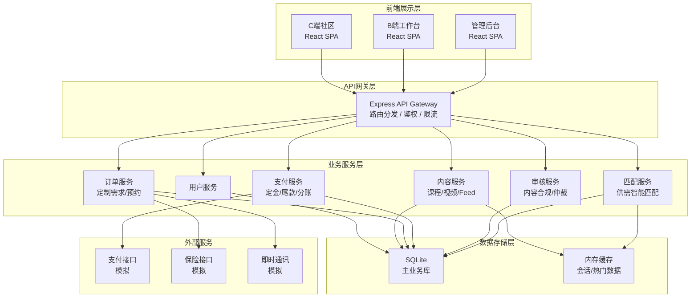
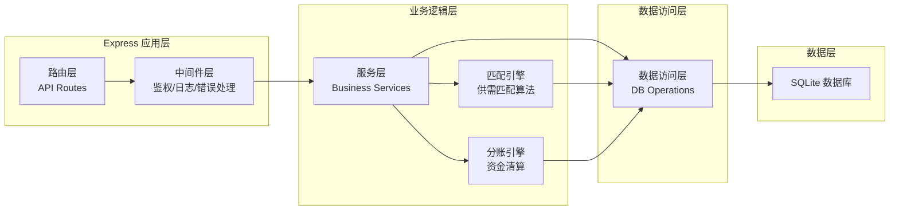
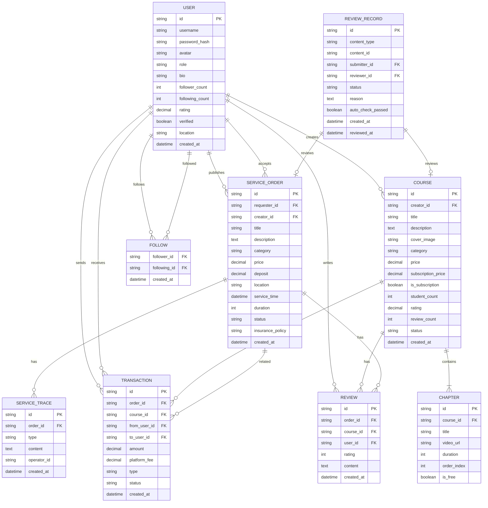

## 1. 架构设计



## 2. 技术描述

- **前端框架**：React@18 + TypeScript + Vite
- **UI框架**：TailwindCSS@3 + Lucide React 图标
- **状态管理**：Zustand
- **路由**：React Router DOM
- **后端框架**：Express@4 + TypeScript
- **数据库**：SQLite（开发/演示用，可迁移至PostgreSQL）
- **ORM**：无原生ORM，使用参数化SQL直接操作
- **接口风格**：RESTful API + JSON
- **鉴权方式**：JWT Token
- **数据Mock**：内置种子数据，模拟完整业务流程

## 3. 路由定义

### 前端路由（C端）
| 路由 | 用途 |
|------|------|
| / | 首页Feed流 |
| /feed | 视频社区（分类筛选） |
| /course/:id | 课程详情页 |
| /creator/:id | 创作者主页 |
| /orders | 定制订单广场 |
| /orders/:id | 订单详情 |
| /search | 搜索结果页 |
| /login | 登录页 |
| /register | 注册页 |

### 前端路由（B端创作者工作台）
| 路由 | 用途 |
|------|------|
| /workspace | 工作台数据概览 |
| /workspace/courses | 课程管理 |
| /workspace/courses/new | 新建课程 |
| /workspace/orders | 服务订单管理 |
| /workspace/earnings | 收入结算 |
| /workspace/analytics | 数据分析 |
| /workspace/settings | 账号设置 |

### 前端路由（管理后台）
| 路由 | 用途 |
|------|------|
| /admin | 管理后台首页 |
| /admin/review | 内容审核中心 |
| /admin/orders | 订单管理/仲裁 |
| /admin/finance | 财务分账 |
| /admin/users | 用户管理 |
| /admin/match | 匹配算法配置 |

### 后端API路由
| 路由前缀 | 用途 |
|----------|------|
| /api/auth | 认证相关（登录/注册/Token刷新） |
| /api/users | 用户信息/资料/关注 |
| /api/courses | 课程CRUD/章节/评价 |
| /api/feed | Feed流/推荐/互动 |
| /api/orders | 定制订单/预约/服务 |
| /api/payment | 支付/分账/提现 |
| /api/review | 内容审核/仲裁 |
| /api/match | 供需匹配 |
| /api/admin | 管理后台接口 |

## 4. API 定义

### 4.1 通用响应结构
```typescript
interface ApiResponse<T> {
  code: number;
  message: string;
  data: T;
}

interface PaginatedResponse<T> {
  items: T[];
  total: number;
  page: number;
  pageSize: number;
}
```

### 4.2 核心数据类型
```typescript
// 用户
interface User {
  id: string;
  username: string;
  avatar: string;
  role: 'user' | 'creator' | 'admin';
  bio?: string;
  followerCount: number;
  followingCount: number;
  rating: number; // 信用评分
  verified: boolean;
  createdAt: string;
}

// 课程
interface Course {
  id: string;
  creatorId: string;
  creator?: User;
  title: string;
  description: string;
  coverImage: string;
  category: string;
  price: number; // 单课价格
  subscriptionPrice?: number; // 订阅价格（月）
  isSubscription: boolean;
  chapters: Chapter[];
  studentCount: number;
  rating: number;
  reviewCount: number;
  status: 'draft' | 'reviewing' | 'published' | 'rejected';
  createdAt: string;
}

// 章节
interface Chapter {
  id: string;
  courseId: string;
  title: string;
  videoUrl: string;
  duration: number; // 秒
  order: number;
  isFree: boolean;
}

// 定制订单
interface ServiceOrder {
  id: string;
  requesterId: string;
  creatorId?: string;
  title: string;
  description: string;
  category: string;
  price: number;
  deposit: number; // 定金
  location: string;
  serviceTime: string;
  duration: number; // 服务时长（分钟）
  status: 'published' | 'matched' | 'confirmed' | 'deposit_paid' | 'in_progress' | 'completed' | 'cancelled' | 'disputed';
  requirements?: string;
  createdAt: string;
}

// 评价
interface Review {
  id: string;
  orderId?: string;
  courseId?: string;
  userId: string;
  user?: User;
  rating: number;
  content: string;
  images?: string[];
  createdAt: string;
}

// 交易记录
interface Transaction {
  id: string;
  orderId?: string;
  courseId?: string;
  fromUserId: string;
  toUserId: string;
  amount: number;
  platformFee: number;
  type: 'course_purchase' | 'service_deposit' | 'service_final' | 'subscription' | 'settlement';
  status: 'pending' | 'success' | 'failed';
  createdAt: string;
}

// 审核记录
interface ReviewRecord {
  id: string;
  contentType: 'course' | 'video' | 'profile' | 'service';
  contentId: string;
  submitterId: string;
  reviewerId?: string;
  status: 'pending' | 'approved' | 'rejected';
  reason?: string;
  autoCheckPassed: boolean;
  createdAt: string;
  reviewedAt?: string;
}
```

## 5. 服务端架构图



## 6. 数据模型

### 6.1 ER图



### 6.2 DDL 语句

```sql
-- 用户表
CREATE TABLE users (
  id TEXT PRIMARY KEY,
  username TEXT UNIQUE NOT NULL,
  password_hash TEXT NOT NULL,
  avatar TEXT,
  role TEXT NOT NULL DEFAULT 'user',
  bio TEXT,
  follower_count INTEGER NOT NULL DEFAULT 0,
  following_count INTEGER NOT NULL DEFAULT 0,
  rating REAL NOT NULL DEFAULT 5.0,
  verified INTEGER NOT NULL DEFAULT 0,
  location TEXT,
  created_at DATETIME NOT NULL DEFAULT CURRENT_TIMESTAMP
);

-- 关注表
CREATE TABLE follows (
  follower_id TEXT NOT NULL,
  following_id TEXT NOT NULL,
  created_at DATETIME NOT NULL DEFAULT CURRENT_TIMESTAMP,
  PRIMARY KEY (follower_id, following_id),
  FOREIGN KEY (follower_id) REFERENCES users(id),
  FOREIGN KEY (following_id) REFERENCES users(id)
);

-- 课程表
CREATE TABLE courses (
  id TEXT PRIMARY KEY,
  creator_id TEXT NOT NULL,
  title TEXT NOT NULL,
  description TEXT,
  cover_image TEXT,
  category TEXT,
  price REAL NOT NULL DEFAULT 0,
  subscription_price REAL,
  is_subscription INTEGER NOT NULL DEFAULT 0,
  student_count INTEGER NOT NULL DEFAULT 0,
  rating REAL NOT NULL DEFAULT 5.0,
  review_count INTEGER NOT NULL DEFAULT 0,
  status TEXT NOT NULL DEFAULT 'draft',
  created_at DATETIME NOT NULL DEFAULT CURRENT_TIMESTAMP,
  FOREIGN KEY (creator_id) REFERENCES users(id)
);

-- 章节表
CREATE TABLE chapters (
  id TEXT PRIMARY KEY,
  course_id TEXT NOT NULL,
  title TEXT NOT NULL,
  video_url TEXT,
  duration INTEGER NOT NULL DEFAULT 0,
  order_index INTEGER NOT NULL DEFAULT 0,
  is_free INTEGER NOT NULL DEFAULT 0,
  FOREIGN KEY (course_id) REFERENCES courses(id)
);

-- 服务订单表
CREATE TABLE service_orders (
  id TEXT PRIMARY KEY,
  requester_id TEXT NOT NULL,
  creator_id TEXT,
  title TEXT NOT NULL,
  description TEXT,
  category TEXT,
  price REAL NOT NULL DEFAULT 0,
  deposit REAL NOT NULL DEFAULT 0,
  location TEXT,
  service_time DATETIME,
  duration INTEGER NOT NULL DEFAULT 60,
  status TEXT NOT NULL DEFAULT 'published',
  insurance_policy TEXT,
  requirements TEXT,
  created_at DATETIME NOT NULL DEFAULT CURRENT_TIMESTAMP,
  FOREIGN KEY (requester_id) REFERENCES users(id),
  FOREIGN KEY (creator_id) REFERENCES users(id)
);

-- 服务留痕表
CREATE TABLE service_traces (
  id TEXT PRIMARY KEY,
  order_id TEXT NOT NULL,
  type TEXT NOT NULL,
  content TEXT,
  operator_id TEXT,
  created_at DATETIME NOT NULL DEFAULT CURRENT_TIMESTAMP,
  FOREIGN KEY (order_id) REFERENCES service_orders(id)
);

-- 评价表
CREATE TABLE reviews (
  id TEXT PRIMARY KEY,
  order_id TEXT,
  course_id TEXT,
  user_id TEXT NOT NULL,
  rating INTEGER NOT NULL,
  content TEXT,
  created_at DATETIME NOT NULL DEFAULT CURRENT_TIMESTAMP,
  FOREIGN KEY (order_id) REFERENCES service_orders(id),
  FOREIGN KEY (course_id) REFERENCES courses(id),
  FOREIGN KEY (user_id) REFERENCES users(id)
);

-- 交易记录表
CREATE TABLE transactions (
  id TEXT PRIMARY KEY,
  order_id TEXT,
  course_id TEXT,
  from_user_id TEXT NOT NULL,
  to_user_id TEXT NOT NULL,
  amount REAL NOT NULL,
  platform_fee REAL NOT NULL DEFAULT 0,
  type TEXT NOT NULL,
  status TEXT NOT NULL DEFAULT 'pending',
  created_at DATETIME NOT NULL DEFAULT CURRENT_TIMESTAMP,
  FOREIGN KEY (from_user_id) REFERENCES users(id),
  FOREIGN KEY (to_user_id) REFERENCES users(id)
);

-- 审核记录表
CREATE TABLE review_records (
  id TEXT PRIMARY KEY,
  content_type TEXT NOT NULL,
  content_id TEXT NOT NULL,
  submitter_id TEXT NOT NULL,
  reviewer_id TEXT,
  status TEXT NOT NULL DEFAULT 'pending',
  reason TEXT,
  auto_check_passed INTEGER NOT NULL DEFAULT 1,
  created_at DATETIME NOT NULL DEFAULT CURRENT_TIMESTAMP,
  reviewed_at DATETIME,
  FOREIGN KEY (submitter_id) REFERENCES users(id),
  FOREIGN KEY (reviewer_id) REFERENCES users(id)
);

-- 索引
CREATE INDEX idx_courses_creator ON courses(creator_id);
CREATE INDEX idx_courses_category ON courses(category);
CREATE INDEX idx_courses_status ON courses(status);
CREATE INDEX idx_service_orders_requester ON service_orders(requester_id);
CREATE INDEX idx_service_orders_creator ON service_orders(creator_id);
CREATE INDEX idx_service_orders_status ON service_orders(status);
CREATE INDEX idx_service_orders_category ON service_orders(category);
CREATE INDEX idx_service_traces_order ON service_traces(order_id);
CREATE INDEX idx_transactions_from ON transactions(from_user_id);
CREATE INDEX idx_transactions_to ON transactions(to_user_id);
CREATE INDEX idx_review_records_status ON review_records(status);
CREATE INDEX idx_reviews_course ON reviews(course_id);
CREATE INDEX idx_reviews_order ON reviews(order_id);
```
