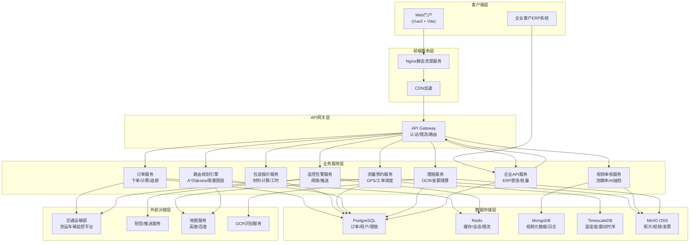
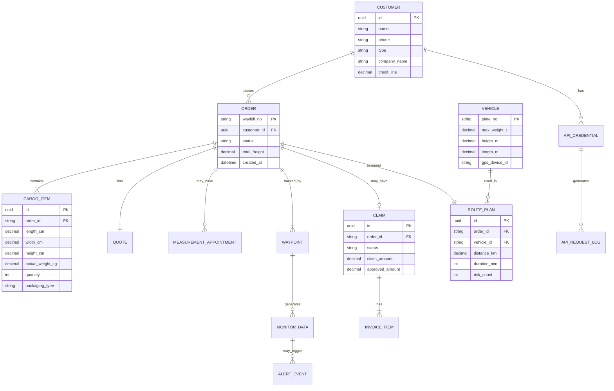

## 1. 架构设计



## 2. 技术选型说明

- **前端框架**: Vue 3.4 + TypeScript 5.3 + Vite 5.0
- **UI组件库**: Element Plus 2.5
- **状态管理**: Pinia 2.1
- **路由**: Vue Router 4.2
- **图表可视化**: ECharts 5.4
- **地图组件**: 高德地图 JS API 2.0
- **视频播放**: DPlayer 1.27 (HLS支持)
- **图标**: 自定义SVG Sprite + @element-plus/icons-vue
- **HTTP客户端**: Axios 1.6 (拦截器/取消请求/重试)
- **工具库**: Lodash-es + Dayjs + FileSavers
- **代码规范**: ESLint + Prettier + Husky + Commitlint
- **CSS方案**: SCSS 7.3 + CSS Variables主题系统
- **动画**: 原生CSS Transition/Animation + Vue Transition

## 3. 路由定义

| 路由路径 | 页面名称 | 权限 | 说明 |
|----------|----------|------|------|
| / | 门户首页 | 公开 | 服务入口、特色展示、快捷询价 |
| /order/create | 在线下单 | 登录用户 | 大件货物下单、体积重换算 |
| /packaging/quote | 包装报价 | 登录用户 | 特殊包装材料及费用预估 |
| /measurement/book | 上门测量预约 | 登录用户 | GPS定位、照片上传 |
| /tracking/:waybillNo | 运单追踪监控 | 登录用户 | 温湿度曲线、震动告警、轨迹 |
| /admin/login | 后台登录 | 公开 | 运营管理员登录 |
| /admin/dashboard | 数据概览 | 运营/管理员 | 核心指标看板 |
| /admin/routing | 路由规划引擎 | 运营/调度 | 限高限重图层、路线对比 |
| /admin/video-review | 装卸视频审核 | 审核员 | 视频列表、播放、抽检 |
| /admin/claims | 理赔中心 | 理赔员 | OCR识别、理算、审核 |
| /admin/vehicles | 车辆监控对接 | 管理员 | 交通部平台对接、车辆列表 |
| /enterprise/api-docs | 企业API文档 | 企业客户 | 接口列表、在线调试、SDK |
| /enterprise/api-apply | API对接申请 | 企业客户 | 申请表单、资质上传 |

## 4. API接口定义（前端Mock数据类型）

```typescript
// 订单相关
interface CargoItem {
  id: string;
  name: string;
  length: number;   // cm
  width: number;    // cm
  height: number;   // cm
  actualWeight: number;  // kg
  volumeWeight: number;  // kg, 自动计算 = L*W*H/6000
  chargeWeight: number;  // kg, = max(actualWeight, volumeWeight)
  quantity: number;
  packaging: 'none' | 'wooden_box' | 'wooden_pallet' | 'wooden_frame' | 'iron_frame';
  value: number;     // 货值(元)
}

interface OrderCreateRequest {
  sender: AddressInfo;
  receiver: AddressInfo;
  cargoList: CargoItem[];
  services: {
    pickup: boolean;
    delivery: boolean;
    upstairs: boolean;
    insurance: boolean;
    temperatureControl: boolean;
  };
  pickupTime: string;
  remark: string;
}

interface OrderQuoteResponse {
  baseFreight: number;
  pickupFee: number;
  deliveryFee: number;
  upstairsFee: number;
  packagingFee: number;
  insuranceFee: number;
  temperatureFee: number;
  total: number;
  estimatedDays: number;
}

// 包装报价
interface PackagingQuote {
  type: string;
  material: string;
  specs: string;
  unitPrice: number;
  quantity: number;
  materialCost: number;
  laborCost: number;
  fumigationCost: number;
  reinforceCost: number;
  subtotal: number;
}

// 运输监控
interface MonitorData {
  timestamp: string;
  temperature: number;   // ℃
  humidity: number;      // %RH
  vibration: number;     // g
  latitude: number;
  longitude: number;
  speed: number;         // km/h
}

interface AlertEvent {
  id: string;
  type: 'temperature' | 'humidity' | 'vibration' | 'geo';
  level: 'warning' | 'critical';
  value: number;
  threshold: number;
  timestamp: string;
  location: string;
  acknowledged: boolean;
}

// 路由规划
interface RoutePlan {
  id: string;
  name: string;
  distance: number;      // km
  duration: number;      // min
  tollCost: number;
  fuelCost: number;
  totalCost: number;
  heightRiskCount: number;
  weightRiskCount: number;
  restrictionCount: number;
  waypoints: Waypoint[];
  geometry: string;      // GeoJSON
}

// 理赔
interface ClaimOCRResult {
  waybillNo: string;
  senderName: string;
  senderPhone: string;
  receiverName: string;
  receiverPhone: string;
  cargoName: string;
  cargoQuantity: number;
  declaredValue: number;
  freight: number;
  confidence: number;
}

interface ClaimRequest {
  waybillNo: string;
  damageType: string;
  damageDescription: string;
  damagePhotos: string[];
  repairInvoices: InvoiceItem[];
  claimAmount: number;
  ocrResult?: ClaimOCRResult;
}

// 企业API
interface ApiEndpoint {
  method: 'GET' | 'POST' | 'PUT' | 'DELETE';
  path: string;
  name: string;
  description: string;
  params: ApiParam[];
  responseExample: any;
}
```

## 5. 前端工程结构

```
deppon-logistics/
├── public/
│   └── favicon.ico
├── src/
│   ├── assets/
│   │   ├── images/          # 图片资源
│   │   ├── icons/           # SVG图标
│   │   └── styles/          # 全局SCSS
│   ├── components/
│   │   ├── common/          # 通用组件(按钮、表单等)
│   │   ├── business/        # 业务组件(体积重换算、仪表盘等)
│   │   └── layout/          # 布局组件
│   ├── views/
│   │   ├── portal/          # 门户端页面
│   │   ├── admin/           # 后台管理页面
│   │   └── enterprise/      # 企业客户页面
│   ├── router/
│   ├── stores/              # Pinia stores
│   ├── api/                 # API接口封装
│   ├── utils/               # 工具函数(体积重换算等)
│   ├── hooks/               # 组合式函数
│   ├── mock/                # Mock数据
│   ├── types/               # TypeScript类型
│   ├── App.vue
│   └── main.ts
├── .env.development
├── .env.production
├── index.html
├── package.json
├── tsconfig.json
├── vite.config.ts
└── README.md
```

## 6. 数据模型（核心Mock数据结构）

### 6.1 数据实体关系


### 6.2 体积重换算工具函数规范
```
公式：体积重(kg) = 长(cm) × 宽(cm) × 高(cm) ÷ 6000
计费重量 = max(实际重量, 体积重)
大件货物判定：单票实际重量 > 50kg 或 单边长度 > 1.8m
超重附加费：单票重量 > 300kg 加收 15% 基础运费
超长附加费：单边长度 > 3m 加收 20% 基础运费
```

### 6.3 运输阈值配置
```
温度告警：
  - 标准件：0℃ ~ 40℃，超范围 warning
  - 冷链件：2℃ ~ 8℃，超范围 critical
湿度告警：
  - 正常范围：30%RH ~ 80%RH
  - 纸质/木质货物：40%RH ~ 60%RH
震动告警：
  - 普通货物：> 5g 触发 warning
  - 精密仪器：> 2g 触发 critical
```
