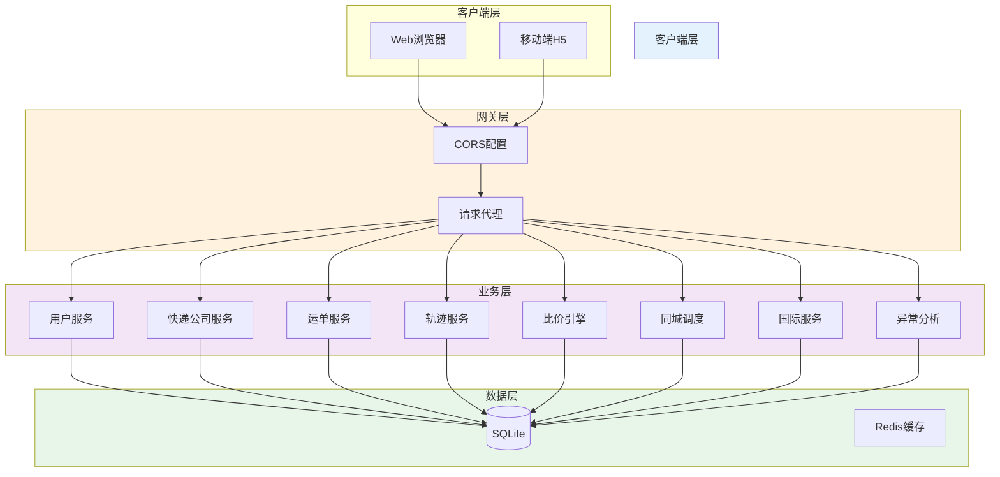
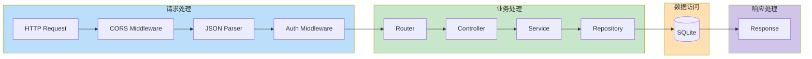

# 快递物流全链路数智化服务平台 - 技术架构文档

## 1. 架构设计



## 2. 技术栈说明

### 2.1 前端技术栈

| 技术 | 版本 | 用途 |
|------|------|------|
| React | 18.x | UI框架 |
| TypeScript | 5.x | 类型系统 |
| Vite | 5.x | 构建工具 |
| TailwindCSS | 3.x | 样式框架 |
| React Router | 6.x | 路由管理 |
| Axios | 1.x | HTTP客户端 |

**依赖原因**：
- React 18：成熟稳定，生态丰富
- Vite：极速冷启动，优化开发体验
- TailwindCSS：原子化CSS，提升开发效率

### 2.2 后端技术栈

| 技术 | 版本 | 用途 |
|------|------|------|
| Node.js | 18.x | 运行时 |
| Express | 4.x | Web框架 |
| better-sqlite3 | 9.x | SQLite驱动 |
| multer | 1.x | 文件上传 |

**依赖原因**：
- Express：轻量灵活，适合快速开发
- better-sqlite3：同步API，性能优异，无需额外部署
- 零外部服务依赖：降低运维复杂度

## 3. 数据库设计

### 3.1 ER图


### 3.2 数据定义语言（DDL）

```sql
-- 用户表
CREATE TABLE IF NOT EXISTS user (
    id INTEGER PRIMARY KEY AUTOINCREMENT,
    phone VARCHAR(20) UNIQUE NOT NULL,
    name VARCHAR(100),
    role VARCHAR(20) DEFAULT 'personal',
    created_at DATETIME DEFAULT CURRENT_TIMESTAMP
);

-- 快递公司表
CREATE TABLE IF NOT EXISTS express_company (
    id INTEGER PRIMARY KEY AUTOINCREMENT,
    name VARCHAR(100) NOT NULL,
    code VARCHAR(50) UNIQUE NOT NULL,
    logo_url VARCHAR(255),
    is_active INTEGER DEFAULT 1,
    metadata JSON,
    created_at DATETIME DEFAULT CURRENT_TIMESTAMP
);

-- 运单表
CREATE TABLE IF NOT EXISTS express_order (
    id INTEGER PRIMARY KEY AUTOINCREMENT,
    order_no VARCHAR(50) UNIQUE NOT NULL,
    tracking_no VARCHAR(100),
    user_id INTEGER NOT NULL,
    company_id INTEGER,
    status VARCHAR(20) DEFAULT 'pending',
    sender_info JSON,
    receiver_info JSON,
    item_info JSON,
    weight REAL DEFAULT 0,
    price REAL DEFAULT 0,
    estimated_delivery DATETIME,
    created_at DATETIME DEFAULT CURRENT_TIMESTAMP,
    updated_at DATETIME DEFAULT CURRENT_TIMESTAMP,
    FOREIGN KEY (user_id) REFERENCES user(id),
    FOREIGN KEY (company_id) REFERENCES express_company(id)
);

-- 轨迹节点表
CREATE TABLE IF NOT EXISTS tracking_node (
    id INTEGER PRIMARY KEY AUTOINCREMENT,
    order_id INTEGER NOT NULL,
    status VARCHAR(50),
    location VARCHAR(200),
    description TEXT,
    timestamp DATETIME,
    raw_data TEXT,
    created_at DATETIME DEFAULT CURRENT_TIMESTAMP,
    FOREIGN KEY (order_id) REFERENCES express_order(id)
);

-- 报价表
CREATE TABLE IF NOT EXISTS price_quote (
    id INTEGER PRIMARY KEY AUTOINCREMENT,
    order_id INTEGER,
    company_id INTEGER NOT NULL,
    price REAL NOT NULL,
    estimated_days INTEGER,
    service_type VARCHAR(50),
    created_at DATETIME DEFAULT CURRENT_TIMESTAMP,
    FOREIGN KEY (order_id) REFERENCES express_order(id),
    FOREIGN KEY (company_id) REFERENCES express_company(id)
);

-- 取件码表
CREATE TABLE IF NOT EXISTS pickup_code (
    id INTEGER PRIMARY KEY AUTOINCREMENT,
    phone VARCHAR(20) NOT NULL,
    code VARCHAR(50) NOT NULL,
    station_name VARCHAR(100),
    order_id INTEGER,
    expire_time DATETIME,
    created_at DATETIME DEFAULT CURRENT_TIMESTAMP,
    FOREIGN KEY (order_id) REFERENCES express_order(id)
);

-- 国际订单表
CREATE TABLE IF NOT EXISTS intl_order (
    id INTEGER PRIMARY KEY AUTOINCREMENT,
    order_no VARCHAR(50) UNIQUE NOT NULL,
    user_id INTEGER NOT NULL,
    customs_info JSON,
    goods_decl JSON,
    destination_country VARCHAR(100),
    destination_city VARCHAR(100),
    declared_value REAL DEFAULT 0,
    currency VARCHAR(10) DEFAULT 'USD',
    created_at DATETIME DEFAULT CURRENT_TIMESTAMP,
    FOREIGN KEY (user_id) REFERENCES user(id)
);

-- 清关文档表
CREATE TABLE IF NOT EXISTS customs_doc (
    id INTEGER PRIMARY KEY AUTOINCREMENT,
    order_id INTEGER NOT NULL,
    doc_type VARCHAR(50),
    file_path VARCHAR(255),
    status VARCHAR(20) DEFAULT 'pending',
    uploaded_at DATETIME DEFAULT CURRENT_TIMESTAMP,
    FOREIGN KEY (order_id) REFERENCES intl_order(id)
);

-- 顾问工单表
CREATE TABLE IF NOT EXISTS consult_ticket (
    id INTEGER PRIMARY KEY AUTOINCREMENT,
    order_id INTEGER,
    user_id INTEGER NOT NULL,
    subject VARCHAR(200),
    description TEXT,
    status VARCHAR(20) DEFAULT 'open',
    priority VARCHAR(20) DEFAULT 'normal',
    created_at DATETIME DEFAULT CURRENT_TIMESTAMP,
    resolved_at DATETIME,
    FOREIGN KEY (order_id) REFERENCES intl_order(id),
    FOREIGN KEY (user_id) REFERENCES user(id)
);

-- 异常日志表
CREATE TABLE IF NOT EXISTS exception_log (
    id INTEGER PRIMARY KEY AUTOINCREMENT,
    order_id INTEGER NOT NULL,
    exception_type VARCHAR(50),
    cause TEXT,
    suggestion TEXT,
    handling_status VARCHAR(20) DEFAULT 'pending',
    created_at DATETIME DEFAULT CURRENT_TIMESTAMP,
    resolved_at DATETIME,
    FOREIGN KEY (order_id) REFERENCES express_order(id)
);

-- 快递员表
CREATE TABLE IF NOT EXISTS courier (
    id INTEGER PRIMARY KEY AUTOINCREMENT,
    company_id INTEGER NOT NULL,
    name VARCHAR(100),
    phone VARCHAR(20),
    status VARCHAR(20) DEFAULT 'available',
    current_location JSON,
    created_at DATETIME DEFAULT CURRENT_TIMESTAMP,
    FOREIGN KEY (company_id) REFERENCES express_company(id)
);

-- 地址簿表
CREATE TABLE IF NOT EXISTS address_book (
    id INTEGER PRIMARY KEY AUTOINCREMENT,
    user_id INTEGER NOT NULL,
    name VARCHAR(100),
    phone VARCHAR(20),
    province VARCHAR(50),
    city VARCHAR(50),
    district VARCHAR(50),
    address TEXT,
    is_default INTEGER DEFAULT 0,
    created_at DATETIME DEFAULT CURRENT_TIMESTAMP,
    FOREIGN KEY (user_id) REFERENCES user(id)
);

-- 索引
CREATE INDEX IF NOT EXISTS idx_order_tracking_no ON express_order(tracking_no);
CREATE INDEX IF NOT EXISTS idx_order_user_id ON express_order(user_id);
CREATE INDEX IF NOT EXISTS idx_tracking_order_id ON tracking_node(order_id);
CREATE INDEX IF NOT EXISTS idx_pickup_phone ON pickup_code(phone);
CREATE INDEX IF NOT EXISTS idx_address_user_id ON address_book(user_id);
```

## 4. API路由定义

### 4.1 用户相关

| 方法 | 路由 | 说明 | 请求体 | 响应 |
|------|------|------|--------|------|
| POST | /api/user/register | 用户注册 | {phone, name} | {id, token} |
| POST | /api/user/login | 用户登录 | {phone} | {id, token} |
| GET | /api/user/profile | 获取用户信息 | - | User对象 |
| PUT | /api/user/profile | 更新用户信息 | User更新字段 | User对象 |

### 4.2 快递公司相关

| 方法 | 路由 | 说明 | 请求体 | 响应 |
|------|------|------|--------|------|
| GET | /api/company/list | 获取快递公司列表 | - | Company[] |
| GET | /api/company/:id | 获取公司详情 | - | Company对象 |
| POST | /api/company | 创建快递公司 | Company对象 | Company对象 |
| PUT | /api/company/:id | 更新公司信息 | Company更新字段 | Company对象 |

### 4.3 运单相关

| 方法 | 路由 | 说明 | 请求体 | 响应 |
|------|------|------|--------|------|
| POST | /api/order | 创建运单 | OrderCreateDTO | Order对象 |
| GET | /api/order/:id | 获取运单详情 | - | Order对象 |
| GET | /api/order/user/:userId | 获取用户运单列表 | - | Order[] |
| PUT | /api/order/:id/status | 更新运单状态 | {status} | Order对象 |
| DELETE | /api/order/:id | 取消运单 | - | {success} |

### 4.4 轨迹相关

| 方法 | 路由 | 说明 | 请求体 | 响应 |
|------|------|------|--------|------|
| GET | /api/tracking/:trackingNo | 查询物流轨迹 | - | TrackingNode[] |
| POST | /api/tracking/:trackingNo | 上报轨迹节点 | TrackingNodeDTO | TrackingNode对象 |
| GET | /api/tracking/:trackingNo/predict | AI预测送达时间 | - | {predicted_time, confidence} |

### 4.5 比价引擎

| 方法 | 路由 | 说明 | 请求体 | 响应 |
|------|------|------|--------|------|
| POST | /api/price/quote | 获取多家报价 | {from, to, weight} | PriceQuote[] |
| GET | /api/price/compare | 比价结果排序 | ?sort=price\|time | PriceQuote[] |

### 4.6 取件码相关

| 方法 | 路由 | 说明 | 请求体 | 响应 |
|------|------|------|--------|------|
| POST | /api/pickup/parse | 解析短信取件码 | {sms_content} | PickupCode |
| GET | /api/pickup/phone/:phone | 查询手机号取件码 | - | PickupCode[] |

### 4.7 同城急送

| 方法 | 路由 | 说明 | 请求体 | 响应 |
|------|------|------|--------|------|
| POST | /api/urgent/order | 创建急送订单 | UrgentOrderDTO | UrgentOrder |
| GET | /api/urgent/:id/status | 查询急送状态 | - | UrgentStatus |
| POST | /api/urgent/:id/courier/dispatch | 调度快递员 | {courier_id} | CourierInfo |

### 4.8 国际寄件

| 方法 | 路由 | 说明 | 请求体 | 响应 |
|------|------|------|--------|------|
| POST | /api/intl/order | 创建国际订单 | IntlOrderDTO | IntlOrder |
| POST | /api/intl/:id/customs | 上传清关文档 | FormData | CustomsDoc |
| GET | /api/intl/doc/template | 获取清关模板 | ?doc_type | File |
| POST | /api/intl/:id/ticket | 创建顾问工单 | TicketDTO | Ticket |

### 4.9 异常管理

| 方法 | 路由 | 说明 | 请求体 | 响应 |
|------|------|------|--------|------|
| GET | /api/exception/order/:orderId | 查询订单异常 | - | ExceptionLog |
| POST | /api/exception/auto-analyze | 自动归因分析 | {order_id} | {type, cause, suggestion} |
| PUT | /api/exception/:id/resolve | 标记已处理 | {status} | ExceptionLog |

### 4.10 地址簿

| 方法 | 路由 | 说明 | 请求体 | 响应 |
|------|------|------|--------|------|
| GET | /api/address/user/:userId | 获取用户地址簿 | - | Address[] |
| POST | /api/address | 添加地址 | AddressDTO | Address |
| PUT | /api/address/:id | 更新地址 | Address更新字段 | Address |
| DELETE | /api/address/:id | 删除地址 | - | {success} |

### 4.11 健康检查

| 方法 | 路由 | 说明 | 响应 |
|------|------|------|------|
| GET | /api/health | 服务健康检查 | {status: 'ok', timestamp} |

## 5. 服务器架构



## 6. 启动配置

### 6.1 环境变量配置

```bash
# .env
FRONTEND_PORT=44817
BACKEND_PORT=54817
NODE_ENV=development
SQLITE_PATH=./data/app.sqlite
```

### 6.2 启动命令

**开发环境**：
```bash
# 安装依赖
npm install

# 启动后端（端口54817）
npm run server

# 启动前端（端口44817）
npm run client
```

**生产环境**：
```bash
# 构建前端
npm run build

# 启动后端
npm start
```

### 6.3 端口分配

| 服务 | 端口 | 说明 |
|------|------|------|
| 前端 | 44817 | Vite开发服务器 |
| 后端 | 54817 | Express API服务 |

### 6.4 备用端口策略

若默认端口被占用，按以下顺序自动切换：
- 第1备用：41000+tail4（45817）/ 51000+tail4（55817）
- 第2备用：42000+tail4（46817）/ 52000+tail4（56817）
- 依次类推，最多5个槽位

## 7. 日志管理

### 7.1 日志文件

- 后端日志：`backend.log`
- 前端日志：`frontend.log`

### 7.2 日志格式

```
[时间戳] [级别] [模块] 消息内容
[2026-05-30 10:30:00] [INFO] [ORDER] 运单创建成功: ORDER123456
```

### 7.3 日志级别

- DEBUG：开发调试
- INFO：正常运行信息
- WARN：警告信息
- ERROR：错误信息
