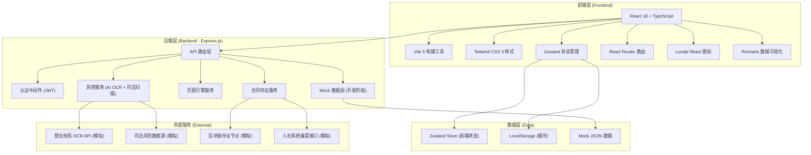
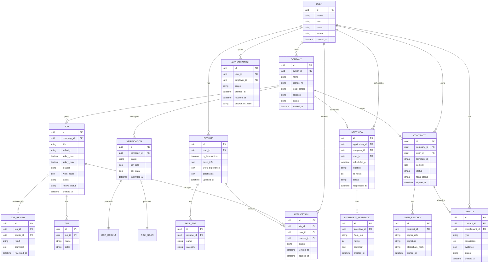

## 1. 架构设计



## 2. 技术选型说明

- **前端框架**：React@18 + TypeScript - 组件化开发，类型安全，生态成熟
- **构建工具**：Vite - 开发热更新快，生产构建优化
- **样式方案**：Tailwind CSS@3 - 原子化CSS，快速构建UI，响应式友好
- **状态管理**：Zustand - 轻量级状态管理，API简洁，支持持久化
- **路由方案**：React Router DOM@6 - 官方路由，支持嵌套路由和动态路由
- **图标库**：Lucide React - 线性图标，风格统一，按需加载
- **数据可视化**：Recharts - React原生图表库，支持折线图/饼图/柱状图/漏斗图
- **后端框架**：Express@4 - Node.js轻量级Web框架，API开发快速
- **后端语言**：TypeScript (ESM) - 前后端类型复用一致
- **数据库**：开发阶段采用Mock JSON数据，生产可替换为PostgreSQL

## 3. 目录结构

```
may-89284/
├── .trae/
│   └── documents/          # 项目文档
├── src/                    # 前端源代码
│   ├── components/         # 可复用组件
│   │   ├── layout/         # 布局组件（侧边栏、顶栏、导航）
│   │   ├── ui/             # 基础UI组件（按钮、卡片、表单）
│   │   └── business/       # 业务组件（岗位卡片、人才卡片等）
│   ├── pages/              # 页面组件
│   │   ├── home/           # 平台首页
│   │   ├── employer/       # B端雇主模块
│   │   │   ├── Dashboard.tsx
│   │   │   ├── Verification.tsx
│   │   │   ├── JobManagement.tsx
│   │   │   ├── TalentPool.tsx
│   │   │   ├── Interview.tsx
│   │   │   └── Analytics.tsx
│   │   ├── jobseeker/      # C端求职者模块
│   │   │   ├── Home.tsx
│   │   │   ├── Resume.tsx
│   │   │   ├── Applications.tsx
│   │   │   ├── Interview.tsx
│   │   │   └── Authorization.tsx
│   │   ├── admin/          # 风控审核后台
│   │   │   ├── ReviewDashboard.tsx
│   │   │   ├── CompanyReview.tsx
│   │   │   └── JobReview.tsx
│   │   └── contract/       # 合同与争议中心
│   │       ├── Templates.tsx
│   │       ├── Signing.tsx
│   │       ├── Dispute.tsx
│   │       └── Record.tsx
│   ├── hooks/              # 自定义 Hooks
│   ├── utils/              # 工具函数
│   ├── store/              # Zustand 状态管理
│   ├── types/              # TypeScript 类型定义
│   ├── mock/               # 前端 Mock 数据
│   ├── App.tsx
│   ├── main.tsx
│   └── index.css
├── api/                    # 后端源代码
│   ├── routes/             # API 路由
│   ├── middleware/         # 中间件
│   ├── services/           # 业务逻辑服务
│   ├── mock/               # Mock 数据
│   └── index.ts
├── shared/                 # 前后端共享类型
├── index.html
├── package.json
├── tsconfig.json
├── vite.config.ts
├── tailwind.config.js
└── postcss.config.js
```

## 4. 路由定义

| 路由路径 | 页面名称 | 角色权限 | 用途说明 |
|----------|----------|----------|----------|
| `/` | 平台首页 | 公开 | 角色入口、平台数据、热门岗位 |
| `/employer/dashboard` | 雇主仪表盘 | B端雇主 | 核心数据概览、招聘指标 |
| `/employer/verification` | 企业资质核验 | B端雇主 | 营业执照OCR、司法风险扫描 |
| `/employer/jobs` | 岗位管理 | B端雇主 | 岗位列表、发布、编辑、上下架 |
| `/employer/jobs/create` | 发布新岗位 | B端雇主 | JD模板选择、表单填写 |
| `/employer/talent` | 人才库 | B端雇主 | 人才搜索、智能打标、筛选 |
| `/employer/interview` | 面试邀约 | B端雇主 | 邀约管理、响应状态、面试反馈 |
| `/employer/analytics` | 招聘分析 | B端雇主 | 渠道归因、转化率漏斗、ROI |
| `/jobseeker/home` | 求职者首页 | C端求职者 | 智能岗位推荐、搜索 |
| `/jobseeker/resume` | 简历管理 | C端求职者 | 简历编辑、脱敏设置 |
| `/jobseeker/applications` | 投递记录 | C端求职者 | 投递状态追踪 |
| `/jobseeker/interview` | 面试管理 | C端求职者 | 邀约响应、时效倒计时 |
| `/jobseeker/authorization` | 授权管理 | C端求职者 | 背景调查授权链 |
| `/admin/review` | 审核仪表盘 | 平台管理员 | AI核验概览、待审统计 |
| `/admin/review/company` | 企业资质审核 | 平台管理员 | 企业资质人工复审 |
| `/admin/review/job` | 岗位内容审核 | 平台管理员 | 岗位合规性人工复审 |
| `/contract/templates` | 合同模板库 | B/C端 | 劳务合同模板浏览选择 |
| `/contract/sign/:id` | 合同签署 | B/C端 | 电子签约、存证流程 |
| `/contract/records` | 合同备案 | B/C端 | 签约记录、人社备案状态 |
| `/contract/dispute` | 争议调解 | B/C端 | 纠纷提交、调解进度 |

## 5. 数据模型

### 5.1 ER 图



### 5.2 核心类型定义

```typescript
// 共享类型定义 (shared/types.ts)

export type UserRole = 'employer' | 'jobseeker' | 'admin';

export interface User {
  id: string;
  phone: string;
  role: UserRole;
  name: string;
  avatar?: string;
  createdAt: string;
}

export interface Company {
  id: string;
  ownerId: string;
  name: string;
  licenseNo: string;
  legalPerson: string;
  address: string;
  status: 'pending' | 'verified' | 'rejected';
  verifiedAt?: string;
}

export type VerificationStatus = 'pending_ocr' | 'ocr_done' | 'scanning' | 'risk_detected' | 'pending_review' | 'approved' | 'rejected';

export interface VerificationRecord {
  id: string;
  companyId: string;
  status: VerificationStatus;
  ocrData?: OCRResult;
  riskData?: RiskScanResult;
  submittedAt: string;
}

export interface OCRResult {
  companyName: string;
  licenseNo: string;
  legalPerson: string;
  registeredCapital: string;
  establishmentDate: string;
  businessScope: string;
  confidence: number;
}

export interface RiskScanResult {
  level: 'none' | 'low' | 'medium' | 'high';
  lawsuitCount: number;
  executionCount: number;
  dishonestCount: number;
  administrativePenaltyCount: number;
  details: RiskItem[];
}

export interface RiskItem {
  type: string;
  title: string;
  date: string;
  amount?: string;
  status: string;
}

export interface Job {
  id: string;
  companyId: string;
  title: string;
  industry: 'restaurant' | 'retail' | 'housekeeping' | 'logistics' | 'security' | 'other';
  salaryMin: number;
  salaryMax: number;
  salaryType: 'hourly' | 'daily' | 'monthly';
  location: string;
  longitude: number;
  latitude: number;
  workHours: WorkHours[];
  description: string;
  requirements: string[];
  benefits: string[];
  status: 'draft' | 'published' | 'offline';
  reviewStatus: 'pending' | 'approved' | 'rejected';
  tags: string[];
  createdAt: string;
}

export interface WorkHours {
  day: number;
  startTime: string;
  endTime: string;
}

export interface Resume {
  id: string;
  userId: string;
  isDesensitized: boolean;
  basicInfo: BasicInfo;
  workExperience: WorkExperience[];
  certificates: Certificate[];
  preferences: JobPreferences;
  updatedAt: string;
}

export interface BasicInfo {
  name: string;
  phone: string;
  idCard?: string;
  gender?: 'male' | 'female';
  age?: number;
  education?: string;
  location?: string;
  avatar?: string;
}

export interface WorkExperience {
  id: string;
  companyName: string;
  position: string;
  startDate: string;
  endDate?: string;
  description: string;
}

export interface Certificate {
  id: string;
  name: string;
  issuer: string;
  issueDate: string;
  expiryDate?: string;
  imageUrl?: string;
}

export interface JobPreferences {
  industries: string[];
  salaryMin?: number;
  salaryMax?: number;
  commuteRadius: number;
  workHours: WorkHours[];
  tags: string[];
}

export type ApplicationStatus = 'applied' | 'viewed' | 'interviewing' | 'accepted' | 'rejected';

export interface Application {
  id: string;
  jobId: string;
  userId: string;
  resumeId: string;
  status: ApplicationStatus;
  viewedAt?: string;
  appliedAt: string;
  job?: Job;
}

export type InterviewStatus = 'pending' | 'accepted' | 'rejected' | 'expired' | 'completed' | 'cancelled';

export interface Interview {
  id: string;
  applicationId: string;
  companyId: string;
  userId: string;
  scheduledAt: string;
  location: string;
  contactPerson: string;
  contactPhone: string;
  ttlHours: number;
  status: InterviewStatus;
  respondedAt?: string;
  notes?: string;
}

export interface Authorization {
  id: string;
  userId: string;
  employerId: string;
  employerName: string;
  scope: string[];
  grantedAt: string;
  revokedAt?: string;
  blockchainHash: string;
}

export type ContractStatus = 'draft' | 'pending_sign' | 'signed' | 'terminated';
export type FilingStatus = 'not_filed' | 'filing' | 'filed' | 'failed';

export interface Contract {
  id: string;
  companyId: string;
  userId: string;
  templateId: string;
  templateName: string;
  content: string;
  status: ContractStatus;
  filingStatus: FilingStatus;
  signedAt?: string;
  filingAt?: string;
  createdAt: string;
}

export interface SignRecord {
  id: string;
  contractId: string;
  signerRole: 'employer' | 'jobseeker';
  signerName: string;
  signature: string;
  blockchainHash: string;
  signedAt: string;
}

export interface Dispute {
  id: string;
  contractId: string;
  complainantId: string;
  complainantRole: 'employer' | 'jobseeker';
  type: 'salary' | 'working_hours' | 'termination' | 'other';
  description: string;
  evidence: EvidenceItem[];
  status: 'submitted' | 'mediating' | 'resolved' | 'escalated';
  mediatorId?: string;
  createdAt: string;
}

export interface EvidenceItem {
  id: string;
  type: 'text' | 'image' | 'document' | 'chat';
  title: string;
  url?: string;
  content?: string;
}

export interface AnalyticsData {
  totalApplications: number;
  totalInterviews: number;
  totalHires: number;
  interviewRate: number;
  hireRate: number;
  channelData: ChannelMetric[];
  funnelData: FunnelStep[];
}

export interface ChannelMetric {
  channel: string;
  views: number;
  applications: number;
  interviews: number;
  hires: number;
  costPerHire: number;
}

export interface FunnelStep {
  step: string;
  count: number;
  rate: number;
}

export interface MatchResult {
  jobId: string;
  job: Job;
  matchScore: number;
  matchReasons: string[];
}
```

## 6. API 接口定义

### 6.1 认证接口

```
POST   /api/auth/login          # 手机号登录
POST   /api/auth/logout         # 退出登录
GET    /api/auth/me             # 获取当前用户信息
```

### 6.2 雇主端接口

```
POST   /api/employer/company              # 创建企业信息
GET    /api/employer/company              # 获取企业信息
PUT    /api/employer/company              # 更新企业信息
POST   /api/employer/verification/ocr     # 上传营业执照OCR
POST   /api/employer/verification/scan    # 发起司法风险扫描
GET    /api/employer/verification/status  # 获取核验状态

POST   /api/employer/jobs                 # 创建岗位
GET    /api/employer/jobs                 # 岗位列表
GET    /api/employer/jobs/:id             # 岗位详情
PUT    /api/employer/jobs/:id             # 更新岗位
PATCH  /api/employer/jobs/:id/status      # 上下架岗位

GET    /api/employer/talent               # 人才库搜索
GET    /api/employer/talent/:id           # 人才详情
POST   /api/employer/talent/:id/contact   # 申请查看完整联系方式

GET    /api/employer/applications         # 收到的投递
POST   /api/employer/interview            # 发起面试邀约
GET    /api/employer/interview            # 面试邀约列表
POST   /api/employer/interview/:id/feedback # 面试反馈

GET    /api/employer/analytics            # 招聘数据分析
```

### 6.3 求职者端接口

```
POST   /api/jobseeker/resume              # 创建/更新简历
GET    /api/jobseeker/resume              # 获取简历
PATCH  /api/jobseeker/resume/desensitize  # 切换脱敏状态

GET    /api/jobseeker/jobs                # 岗位搜索/推荐
GET    /api/jobseeker/jobs/:id            # 岗位详情
POST   /api/jobseeker/applications        # 投递简历
GET    /api/jobseeker/applications        # 投递记录

GET    /api/jobseeker/interview           # 面试邀约列表
POST   /api/jobseeker/interview/:id/respond # 响应邀约

GET    /api/jobseeker/authorization       # 授权列表
POST   /api/jobseeker/authorization       # 授予授权
DELETE /api/jobseeker/authorization/:id   # 撤销授权
```

### 6.4 风控审核接口

```
GET    /api/admin/review/dashboard        # 审核仪表盘
GET    /api/admin/review/companies        # 企业待审列表
POST   /api/admin/review/companies/:id    # 企业审核
GET    /api/admin/review/jobs             # 岗位待审列表
POST   /api/admin/review/jobs/:id         # 岗位审核
```

### 6.5 合同与争议接口

```
GET    /api/contract/templates            # 合同模板列表
GET    /api/contract/templates/:id        # 模板详情
POST   /api/contract/generate             # 生成合同
GET    /api/contract/:id                  # 合同详情
POST   /api/contract/:id/sign             # 签署合同
GET    /api/contract                      # 我的合同列表
GET    /api/contract/:id/filing           # 人社备案状态

POST   /api/dispute                       # 提交争议
GET    /api/dispute                       # 争议列表
GET    /api/dispute/:id                   # 争议详情
POST   /api/dispute/:id/message           # 发送调解消息
```
