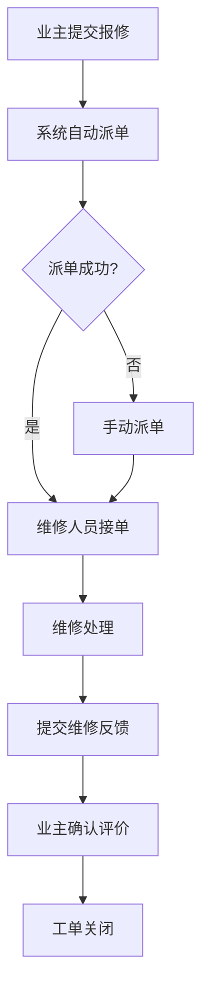
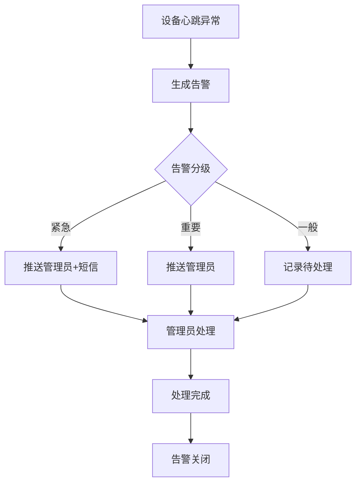

## 1. 产品概述

面向物业与业主的社区数字治理工作台，以门禁通行为核心入口，串联设备管理、报事报修、邻里社交、物业缴费、公告推送等社区治理全链路，构建街道→社区→物业→楼栋长的四级组织架构与精细化权限体系，实现社区服务响应时效可量化、设备告警可分级响应的数字化治理闭环。

- 核心用户：物业管理人员、业主/住户、业委会成员、街道/社区管理员
- 产品价值：提升社区治理效率、缩短服务响应时间、实现设备与人员的数字化管控

## 2. 核心功能

### 2.1 用户角色

| 角色 | 注册方式 | 核心权限 |
|------|----------|----------|
| 街道/社区管理员 | 后台分配 | 查看辖区所有社区数据、统计报表、组织架构管理 |
| 物业管理员 | 后台分配 | 门禁设备管理、公告编辑发布、工单派发、费用管理、邻里圈审核 |
| 业委会成员 | 认证注册 | 查看财务流水、物业费收支、公告查看、提交诉求 |
| 楼栋长 | 认证注册 | 本楼栋公告推送、住户信息查看、协助报修 |
| 业主/住户 | 自助注册 | 门禁开锁、提交报修、邻里圈发布、物业费缴纳、查看公告 |

### 2.2 功能模块

1. **工作台首页**：数据概览卡片（今日通行/待处理工单/设备告警/物业费收缴率）、快捷入口、最新公告、待办事项
2. **门禁通行**：四模开锁面板、通行记录查询、访客通行码
3. **设备管理**：设备列表与状态、心跳检测看板、离线缓存管理、固件OTA升级
4. **报事报修**：工单提交（拍照上传）、工单列表与状态流转、自动派单、维修反馈、业主评价
5. **邻里圈**：内容发布（图文）、实名审核列表、互动管理
6. **物业缴费**：费用账单列表、在线缴纳、电子票据生成与下载
7. **公告管理**：公告编辑发布、定向推送（按楼栋/单元/角色）、公告列表
8. **组织架构**：四级组织树（街道→社区→物业→楼栋长）、成员管理
9. **权限管理**：角色权限矩阵配置、权限分配
10. **设备告警**：告警分级（紧急/重要/一般）、告警列表与处理状态、响应时效统计
11. **统计报表**：社区服务响应时效、工单完成率、设备在线率、物业费收缴率

### 2.3 页面详情

| 页面名称 | 模块名称 | 功能描述 |
|----------|----------|----------|
| 工作台首页 | 数据概览卡片 | 今日通行人次、待处理工单数、设备告警数、物业费收缴率四张卡片，点击可跳转详情 |
| 工作台首页 | 快捷入口 | 门禁通行、报事报修、公告管理、物业缴费四个快捷入口图标 |
| 工作台首页 | 最新公告 | 展示最近3条公告，支持按楼栋/角色筛选 |
| 工作台首页 | 待办事项 | 按优先级展示待处理工单和未处理告警 |
| 门禁通行 | 四模开锁面板 | 蓝牙/NFC/二维码/人脸识别四个开锁模式切换，每种模式有独立交互界面 |
| 门禁通行 | 通行记录 | 按时间/人员/设备筛选的通行日志表格，支持导出 |
| 门禁通行 | 访客通行码 | 生成限时访客二维码，可设置有效期和通行次数 |
| 设备管理 | 设备列表 | 展示所有门禁设备，含在线状态、位置、固件版本、最后心跳时间 |
| 设备管理 | 心跳检测看板 | 实时展示设备在线率环形图、异常设备列表 |
| 设备管理 | 固件OTA | 选择设备推送固件升级，显示升级进度和结果 |
| 设备管理 | 离线缓存管理 | 查看离线设备缓存的通行记录，支持手动同步 |
| 报事报修 | 工单提交 | 表单含分类选择、描述、拍照上传（最多3张）、紧急程度 |
| 报事报修 | 工单列表 | 按状态（待派单/处理中/待反馈/已完成）筛选，列表含工单号/分类/状态/时间 |
| 报事报修 | 工单详情 | 状态时间线、照片查看、派单信息、维修反馈、业主评价星级 |
| 报事报修 | 自动派单规则 | 按工单分类和楼栋自动匹配维修人员 |
| 邻里圈 | 内容发布 | 图文编辑器，支持图片上传，实名标识 |
| 邻里圈 | 内容列表 | 瀑布流展示，含作者实名信息、点赞评论数 |
| 邻里圈 | 审核管理 | 待审核内容列表，支持通过/驳回操作 |
| 物业缴费 | 费用账单 | 按月/季度展示物业费、水电费等账单列表，含缴费状态 |
| 物业缴费 | 在线缴纳 | 选择账单支付，模拟支付流程 |
| 物业缴费 | 电子票据 | 已缴费账单生成电子票据，支持下载打印 |
| 公告管理 | 公告编辑 | 富文本编辑，支持定向推送（按楼栋/单元/角色选择） |
| 公告管理 | 公告列表 | 按时间/状态/类型筛选，含推送范围和阅读率 |
| 组织架构 | 组织树 | 四级树形结构（街道→社区→物业→楼栋长），支持展开折叠和搜索 |
| 组织架构 | 成员管理 | 选中的组织节点下成员列表，支持添加/编辑/删除 |
| 权限管理 | 权限矩阵 | 角色与功能模块的交叉矩阵表格，勾选式配置 |
| 权限管理 | 角色管理 | 角色列表，支持新增/编辑角色及其权限 |
| 设备告警 | 告警列表 | 按级别/状态/时间筛选，紧急告警红色标记 |
| 设备告警 | 告警处理 | 告警详情、处理记录、响应时效倒计时 |
| 设备告警 | 告警统计 | 按级别/类型/时间的告警分布图表 |
| 统计报表 | 服务响应时效 | 工单平均响应时间、超时率趋势图 |
| 统计报表 | 工单完成率 | 按分类/时间维度的完成率柱状图 |
| 统计报表 | 设备在线率 | 在线率趋势折线图 |
| 统计报表 | 物业费收缴率 | 按月/季度收缴率及趋势 |

## 3. 核心流程

### 门禁通行流程
业主选择开锁模式（蓝牙/NFC/二维码/人脸）→ 系统验证身份与权限 → 门禁设备执行开锁 → 记录通行日志 → 如设备离线则缓存到本地 → 设备恢复在线后自动同步

### 报事报修工单流程
业主提交报修（含拍照）→ 系统按分类和楼栋自动派单 → 维修人员接单处理 → 提交维修反馈 → 业主确认并评价 → 工单关闭

### 设备告警响应流程
设备心跳超时/异常 → 系统自动生成告警 → 按规则分级（紧急/重要/一般）→ 紧急告警推送至物业管理员 → 管理员处理并记录 → 告警关闭

## 4. 用户界面设计

### 4.1 设计风格

- **主色调**：深蓝灰(#1E293B)为底，翠绿(#10B981)为强调色，传达安全、可靠、科技感
- **辅助色**：琥珀色(#F59E0B)用于告警/提醒，红色(#EF4444)用于紧急状态，蓝色(#3B82F6)用于信息链接
- **按钮风格**：圆角8px，主按钮实心填充，次按钮描边风格
- **字体**：思源黑体/Noto Sans SC，标题16-20px，正文14px，辅助文字12px
- **布局风格**：左侧固定导航栏+顶部信息栏+右侧主内容区，卡片式内容组织
- **图标风格**：线性图标（Lucide），2px描边，统一20px尺寸
- **整体风格**：专业政务风，简洁清晰，数据密度适中，强调信息层级

### 4.2 页面设计概览

| 页面名称 | 模块名称 | UI元素 |
|----------|----------|--------|
| 工作台首页 | 数据概览卡片 | 四张带图标的统计卡片，数字大字号突出，同比环比小字标注 |
| 工作台首页 | 快捷入口 | 2x2网格图标入口，悬浮微动效 |
| 工作台首页 | 最新公告 | 列表卡片，左侧色条标识类型，右侧时间标签 |
| 工作台首页 | 待办事项 | 列表，左侧紧急程度色点，右侧操作按钮 |
| 门禁通行 | 四模开锁面板 | 四个模式切换标签页，蓝牙配对动画、二维码倒计时、NFC触碰动画、人脸框动画 |
| 门禁通行 | 通行记录 | 表格，行悬浮高亮，状态标签彩色胶囊 |
| 设备管理 | 设备列表 | 表格+顶部筛选条，在线状态绿色圆点/离线红色圆点 |
| 设备管理 | 心跳检测看板 | 环形进度图+异常设备警示卡片 |
| 报事报修 | 工单提交 | 分步表单，照片上传区带拖拽虚线框 |
| 报事报修 | 工单列表 | 看板视图（四列：待派单/处理中/待反馈/已完成），支持拖拽 |
| 报事报修 | 工单详情 | 左侧状态时间线+右侧信息面板 |
| 邻里圈 | 内容列表 | 瀑布流卡片，图片区域+文字区域+互动栏 |
| 邻里圈 | 审核管理 | 左侧待审核列表+右侧内容预览 |
| 物业缴费 | 费用账单 | 账单卡片列表，缴费状态标签，金额大字突出 |
| 物业缴费 | 电子票据 | 票据模板样式，含二维码和印章效果 |
| 公告管理 | 公告编辑 | 富文本编辑器+右侧推送范围配置面板 |
| 公告管理 | 公告列表 | 表格，推送范围标签组，阅读率进度条 |
| 组织架构 | 组织树 | 左侧树形导航+右侧成员列表，节点含人数气泡 |
| 权限管理 | 权限矩阵 | 交叉矩阵表格，勾选框，行头角色列头功能 |
| 设备告警 | 告警列表 | 列表，左侧级别色条（红/橙/蓝），响应倒计时 |
| 统计报表 | 图表区 | 柱状图+折线图+环形图组合，时间范围选择器 |

### 4.3 响应式设计

- 桌面优先设计，最小支持1280px宽度
- 侧边栏在1024px以下可折叠为图标模式
- 表格在窄屏下支持横向滚动
- 卡片网格自适应列数（4列→2列→1列）

### 4.4 无3D场景
