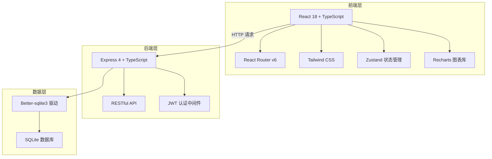
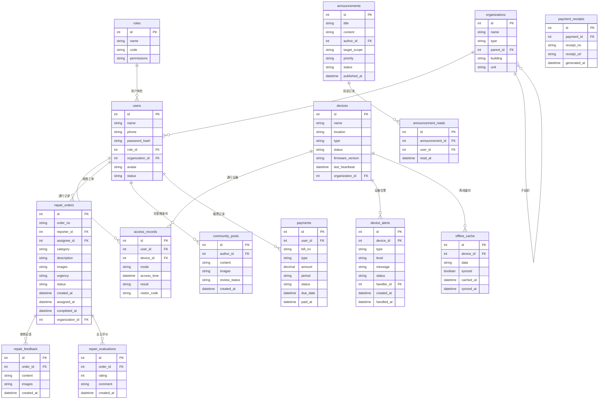

## 1. 架构设计



## 2. 技术说明

- **前端**：React@18 + TypeScript + Tailwind CSS@3 + Vite
- **初始化工具**：vite-init（react-express-ts 模板）
- **状态管理**：Zustand
- **路由**：React Router v6
- **图表**：Recharts
- **图标**：Lucide React
- **后端**：Express@4 + TypeScript（ESM 模式）
- **数据库**：SQLite（better-sqlite3）
- **认证**：JWT（jsonwebtken）
- **文件上传**：Multer

## 3. 路由定义

| 路由 | 用途 |
|------|------|
| `/` | 工作台首页，数据概览与快捷入口 |
| `/access` | 门禁通行，四模开锁与通行记录 |
| `/access/records` | 通行记录详情 |
| `/access/visitor` | 访客通行码管理 |
| `/devices` | 设备管理列表 |
| `/devices/heartbeat` | 心跳检测看板 |
| `/devices/ota` | 固件OTA升级 |
| `/devices/offline` | 离线缓存管理 |
| `/repairs` | 报事报修工单列表 |
| `/repairs/create` | 新建报修工单 |
| `/repairs/:id` | 工单详情 |
| `/community` | 邻里圈内容列表 |
| `/community/review` | 邻里圈审核管理 |
| `/payments` | 物业缴费账单列表 |
| `/payments/:id/receipt` | 电子票据 |
| `/announcements` | 公告列表 |
| `/announcements/create` | 发布公告 |
| `/announcements/:id/edit` | 编辑公告 |
| `/organization` | 组织架构树 |
| `/permissions` | 权限管理矩阵 |
| `/alerts` | 设备告警列表 |
| `/alerts/:id` | 告警处理详情 |
| `/reports` | 统计报表 |
| `/login` | 登录页 |

## 4. API 定义

### 认证相关
```
POST   /api/auth/login          # 用户登录
GET    /api/auth/me             # 获取当前用户信息
```

### 门禁通行
```
GET    /api/access/records      # 通行记录列表
POST   /api/access/unlock       # 请求开锁
POST   /api/access/visitor      # 生成访客码
GET    /api/access/visitor      # 访客码列表
```

### 设备管理
```
GET    /api/devices             # 设备列表
GET    /api/devices/:id         # 设备详情
PUT    /api/devices/:id         # 更新设备信息
GET    /api/devices/heartbeat   # 心跳状态概览
POST   /api/devices/:id/ota     # 推送OTA升级
GET    /api/devices/offline     # 离线缓存记录
POST   /api/devices/offline/sync # 同步离线缓存
```

### 报事报修
```
GET    /api/repairs             # 工单列表
POST   /api/repairs             # 创建工单
GET    /api/repairs/:id         # 工单详情
PUT    /api/repairs/:id/dispatch # 派单
PUT    /api/repairs/:id/feedback # 维修反馈
POST   /api/repairs/:id/evaluate # 业主评价
```

### 邻里圈
```
GET    /api/community/posts     # 内容列表
POST   /api/community/posts     # 发布内容
PUT    /api/community/posts/:id/review # 审核内容
GET    /api/community/review    # 待审核列表
```

### 物业缴费
```
GET    /api/payments            # 账单列表
POST   /api/payments/:id/pay    # 缴纳费用
GET    /api/payments/:id/receipt # 获取电子票据
```

### 公告管理
```
GET    /api/announcements       # 公告列表
POST   /api/announcements       # 发布公告
PUT    /api/announcements/:id   # 编辑公告
DELETE /api/announcements/:id   # 删除公告
```

### 组织架构
```
GET    /api/organization/tree   # 组织架构树
POST   /api/organization/members # 添加成员
PUT    /api/organization/members/:id # 编辑成员
DELETE /api/organization/members/:id # 删除成员
```

### 权限管理
```
GET    /api/permissions/roles   # 角色列表
POST   /api/permissions/roles   # 创建角色
PUT    /api/permissions/roles/:id # 编辑角色权限
GET    /api/permissions/matrix  # 权限矩阵
```

### 设备告警
```
GET    /api/alerts              # 告警列表
GET    /api/alerts/:id          # 告警详情
PUT    /api/alerts/:id/handle   # 处理告警
GET    /api/alerts/stats        # 告警统计
```

### 统计报表
```
GET    /api/reports/response    # 服务响应时效
GET    /api/reports/completion  # 工单完成率
GET    /api/reports/device-online # 设备在线率
GET    /api/reports/payment     # 物业费收缴率
```

## 5. 服务端架构图


## 6. 数据模型

### 6.1 数据模型定义



### 6.2 数据定义语言

```sql
CREATE TABLE organizations (
    id INTEGER PRIMARY KEY AUTOINCREMENT,
    name TEXT NOT NULL,
    type TEXT NOT NULL CHECK(type IN ('street', 'community', 'property', 'building')),
    parent_id INTEGER REFERENCES organizations(id),
    building TEXT,
    unit TEXT,
    created_at DATETIME DEFAULT CURRENT_TIMESTAMP
);

CREATE TABLE roles (
    id INTEGER PRIMARY KEY AUTOINCREMENT,
    name TEXT NOT NULL,
    code TEXT NOT NULL UNIQUE,
    permissions TEXT NOT NULL DEFAULT '{}'
);

CREATE TABLE users (
    id INTEGER PRIMARY KEY AUTOINCREMENT,
    name TEXT NOT NULL,
    phone TEXT NOT NULL UNIQUE,
    password_hash TEXT NOT NULL,
    role_id INTEGER REFERENCES roles(id),
    organization_id INTEGER REFERENCES organizations(id),
    avatar TEXT,
    status TEXT NOT NULL DEFAULT 'active' CHECK(status IN ('active', 'disabled')),
    created_at DATETIME DEFAULT CURRENT_TIMESTAMP
);

CREATE TABLE devices (
    id INTEGER PRIMARY KEY AUTOINCREMENT,
    name TEXT NOT NULL,
    location TEXT NOT NULL,
    type TEXT NOT NULL CHECK(type IN ('gate', 'door', 'elevator', 'parking')),
    status TEXT NOT NULL DEFAULT 'online' CHECK(status IN ('online', 'offline', 'maintenance')),
    firmware_version TEXT NOT NULL DEFAULT '1.0.0',
    last_heartbeat DATETIME DEFAULT CURRENT_TIMESTAMP,
    organization_id INTEGER REFERENCES organizations(id),
    created_at DATETIME DEFAULT CURRENT_TIMESTAMP
);

CREATE TABLE access_records (
    id INTEGER PRIMARY KEY AUTOINCREMENT,
    user_id INTEGER REFERENCES users(id),
    device_id INTEGER REFERENCES devices(id),
    mode TEXT NOT NULL CHECK(mode IN ('bluetooth', 'nfc', 'qrcode', 'face')),
    access_time DATETIME DEFAULT CURRENT_TIMESTAMP,
    result TEXT NOT NULL CHECK(result IN ('success', 'denied', 'error')),
    visitor_code TEXT
);

CREATE TABLE repair_orders (
    id INTEGER PRIMARY KEY AUTOINCREMENT,
    order_no TEXT NOT NULL UNIQUE,
    reporter_id INTEGER REFERENCES users(id),
    assignee_id INTEGER REFERENCES users(id),
    category TEXT NOT NULL,
    description TEXT NOT NULL,
    images TEXT DEFAULT '[]',
    urgency TEXT NOT NULL CHECK(urgency IN ('low', 'medium', 'high', 'urgent')),
    status TEXT NOT NULL DEFAULT 'pending' CHECK(status IN ('pending', 'assigned', 'processing', 'feedback', 'completed', 'closed')),
    created_at DATETIME DEFAULT CURRENT_TIMESTAMP,
    assigned_at DATETIME,
    completed_at DATETIME,
    organization_id INTEGER REFERENCES organizations(id)
);

CREATE TABLE repair_feedback (
    id INTEGER PRIMARY KEY AUTOINCREMENT,
    order_id INTEGER REFERENCES repair_orders(id),
    content TEXT NOT NULL,
    images TEXT DEFAULT '[]',
    created_at DATETIME DEFAULT CURRENT_TIMESTAMP
);

CREATE TABLE repair_evaluations (
    id INTEGER PRIMARY KEY AUTOINCREMENT,
    order_id INTEGER REFERENCES repair_orders(id),
    rating INTEGER NOT NULL CHECK(rating BETWEEN 1 AND 5),
    comment TEXT,
    created_at DATETIME DEFAULT CURRENT_TIMESTAMP
);

CREATE TABLE community_posts (
    id INTEGER PRIMARY KEY AUTOINCREMENT,
    author_id INTEGER REFERENCES users(id),
    content TEXT NOT NULL,
    images TEXT DEFAULT '[]',
    review_status TEXT NOT NULL DEFAULT 'pending' CHECK(review_status IN ('pending', 'approved', 'rejected')),
    likes INTEGER DEFAULT 0,
    created_at DATETIME DEFAULT CURRENT_TIMESTAMP
);

CREATE TABLE payments (
    id INTEGER PRIMARY KEY AUTOINCREMENT,
    user_id INTEGER REFERENCES users(id),
    bill_no TEXT NOT NULL UNIQUE,
    type TEXT NOT NULL CHECK(type IN ('property_fee', 'water', 'electricity', 'parking', 'other')),
    amount DECIMAL(10,2) NOT NULL,
    period TEXT NOT NULL,
    status TEXT NOT NULL DEFAULT 'unpaid' CHECK(status IN ('unpaid', 'paid', 'overdue')),
    due_date DATETIME NOT NULL,
    paid_at DATETIME,
    created_at DATETIME DEFAULT CURRENT_TIMESTAMP
);

CREATE TABLE payment_receipts (
    id INTEGER PRIMARY KEY AUTOINCREMENT,
    payment_id INTEGER REFERENCES payments(id),
    receipt_no TEXT NOT NULL UNIQUE,
    receipt_url TEXT,
    generated_at DATETIME DEFAULT CURRENT_TIMESTAMP
);

CREATE TABLE announcements (
    id INTEGER PRIMARY KEY AUTOINCREMENT,
    title TEXT NOT NULL,
    content TEXT NOT NULL,
    author_id INTEGER REFERENCES users(id),
    target_scope TEXT NOT NULL DEFAULT '{}',
    priority TEXT NOT NULL DEFAULT 'normal' CHECK(priority IN ('urgent', 'high', 'normal', 'low')),
    status TEXT NOT NULL DEFAULT 'draft' CHECK(status IN ('draft', 'published', 'archived')),
    published_at DATETIME,
    created_at DATETIME DEFAULT CURRENT_TIMESTAMP
);

CREATE TABLE announcement_reads (
    id INTEGER PRIMARY KEY AUTOINCREMENT,
    announcement_id INTEGER REFERENCES announcements(id),
    user_id INTEGER REFERENCES users(id),
    read_at DATETIME DEFAULT CURRENT_TIMESTAMP,
    UNIQUE(announcement_id, user_id)
);

CREATE TABLE device_alerts (
    id INTEGER PRIMARY KEY AUTOINCREMENT,
    device_id INTEGER REFERENCES devices(id),
    type TEXT NOT NULL,
    level TEXT NOT NULL CHECK(level IN ('critical', 'important', 'normal')),
    message TEXT NOT NULL,
    status TEXT NOT NULL DEFAULT 'active' CHECK(status IN ('active', 'processing', 'resolved')),
    handler_id INTEGER REFERENCES users(id),
    created_at DATETIME DEFAULT CURRENT_TIMESTAMP,
    handled_at DATETIME
);

CREATE TABLE offline_cache (
    id INTEGER PRIMARY KEY AUTOINCREMENT,
    device_id INTEGER REFERENCES devices(id),
    data TEXT NOT NULL,
    synced INTEGER DEFAULT 0,
    cached_at DATETIME DEFAULT CURRENT_TIMESTAMP,
    synced_at DATETIME
);

CREATE INDEX idx_access_records_user ON access_records(user_id);
CREATE INDEX idx_access_records_device ON access_records(device_id);
CREATE INDEX idx_access_records_time ON access_records(access_time);
CREATE INDEX idx_repair_orders_status ON repair_orders(status);
CREATE INDEX idx_repair_orders_reporter ON repair_orders(reporter_id);
CREATE INDEX idx_community_posts_status ON community_posts(review_status);
CREATE INDEX idx_payments_user_status ON payments(user_id, status);
CREATE INDEX idx_device_alerts_status ON device_alerts(status);
CREATE INDEX idx_device_alerts_level ON device_alerts(level);
```
